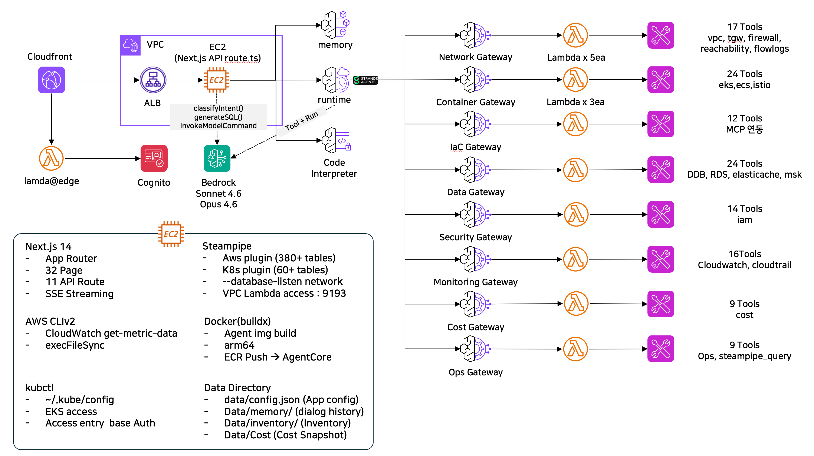
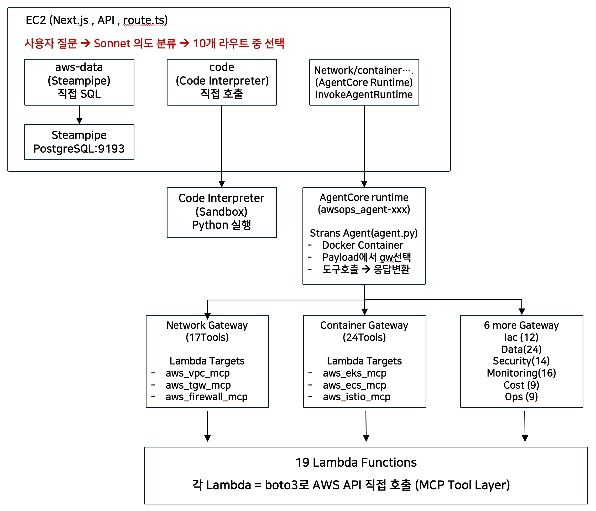

# AWSops 대시보드 v1.7.0

> Steampipe, Next.js 14, Amazon Bedrock AgentCore 기반 AWS + Kubernetes 운영 대시보드

실시간 AWS/K8s 리소스 모니터링, 네트워크 트러블슈팅, CIS 컴플라이언스 스캔, AI 기반 분석을 단일 대시보드에서 제공합니다.

**현황**: 36 페이지 · 50 라우트 · 25 쿼리 파일 · 13 API 라우트 · 125 MCP 도구 (8 Gateway) · 17 컴포넌트

---

## 아키텍처



```
┌──────────────────────────────────────────────────────────────────────────────┐
│                              Internet                                        │
└─────────────────────────────────┬────────────────────────────────────────────┘
                                  │
                                  v
┌──────────────────────────────────────────────────────────────────────────────┐
│  CloudFront (HTTPS)                                                          │
│  ┌─ Lambda@Edge (us-east-1) ─────────────────────────────────────────────┐  │
│  │  JWT cookie verification -> Cognito Hosted UI redirect or pass through│  │
│  └───────────────────────────────────────────────────────────────────────┘  │
│  /awsops*       -> ALB:3000 (Dashboard)                                     │
│  /*             -> ALB:80   (VSCode)                                        │
│  Security: X-Custom-Secret header                                           │
└─────────────────────────────────┬────────────────────────────────────────────┘
                                  │
                                  v
┌──────────────────────────────────────────────────────────────────────────────┐
│  ALB (Internet-facing) — SG: CloudFront Prefix List (port 80-3000)           │
│  Port 80 -> VSCode (8888)  |  Port 3000 -> Dashboard (3000)                 │
└─────────────────────────────────┬────────────────────────────────────────────┘
                                  │
                                  v
┌──────────────────────────────────────────────────────────────────────────────┐
│  EC2 (t4g.2xlarge, Private Subnet) — All services on single instance        │
│                                       모든 서비스가 단일 인스턴스에서 실행     │
│                                                                              │
│  ┌─────────────────┐  ┌──────────────────┐  ┌────────────────────────────┐  │
│  │  Next.js :3000  │  │  Steampipe :9193 │  │  VSCode :8888             │  │
│  │  (36 Pages)     │──│  (Embedded PG)   │  │  (code-server)            │  │
│  │  (13 APIs)      │  │  aws / k8s / trivy│  │                           │  │
│  └─────────────────┘  └──────────────────┘  └────────────────────────────┘  │
│  ┌─────────────────┐  ┌──────────────────────────────────────────────────┐  │
│  │  Powerpipe      │  │  Docker (빌드 전용, 실행은 AgentCore 서비스)   │  │
│  │  CIS Benchmark  │  │  awsops-agent 이미지 빌드 → ECR 푸시          │  │
│  └─────────────────┘  └──────────────────────────────────────────────────┘  │
└──────────────────────────────────────────────────────────────────────────────┘
                                  │
                                  v
┌──────────────────────────────────────────────────────────────────────────────┐
│  Amazon Bedrock AgentCore (ap-northeast-2)                                   │
│                                                                              │
│  ┌─────────────┐  ┌──────────────────┐  ┌────────────────────────────────┐  │
│  │  1 Runtime   │  │  8 Gateways     │  │  19 Lambda Targets            │  │
│  │  (Strands)   │──│  125 MCP Tools  │──│  (boto3, read-only)           │  │
│  └─────────────┘  └──────────────────┘  └────────────────────────────────┘  │
│  ┌─────────────────────────────────┐                                        │
│  │  Code Interpreter (Python)      │                                        │
│  └─────────────────────────────────┘                                        │
└──────────────────────────────────────────────────────────────────────────────┘
```

---

## 기능

### 대시보드 페이지 (35개) / Dashboard Pages (35 pages)

| Category | Page | Path | Features / 기능 |
|----------|------|------|-----------------|
| **Overview** | Dashboard | `/awsops` | 18 StatsCards, Live Resources, Charts, Warnings |
| | AI Assistant | `/awsops/ai` | Claude Sonnet/Opus 4.6, SSE streaming, multi-route |
| | AgentCore | `/awsops/agentcore` | Runtime status, 8 Gateways, 125 tools |
| | Bedrock | `/awsops/bedrock` | Model usage, token costs, prompt caching, Account vs AWSops |
| | Accounts | /awsops/accounts | Multi-account management, target account CRUD (admin only) |
| **Compute** | EC2 | `/awsops/ec2` | Instances + detail panel |
| | Lambda | `/awsops/lambda` | Functions, runtimes, memory/timeout |
| | ECS | `/awsops/ecs` | Clusters, services, tasks |
| | ECR | `/awsops/ecr` | Repositories, images, scan results |
| | EKS Overview | `/awsops/k8s` | Clusters, nodes, pod summary |
| | EKS Pods | `/awsops/k8s/pods` | Pod list, status, restart counts |
| | EKS Nodes | `/awsops/k8s/nodes` | Node list, capacity, conditions |
| | EKS Deployments | `/awsops/k8s/deployments` | Deployment list, replicas |
| | EKS Services | `/awsops/k8s/services` | Service list, types, endpoints |
| | EKS Explorer | `/awsops/k8s/explorer` | K9s-style terminal UI |
| | ECS Container Cost | `/awsops/container-cost` | Fargate pricing, Container Insights metrics |
| | EKS Container Cost | `/awsops/eks-container-cost` | OpenCost (CPU/Mem/Net/Storage/GPU) + request-based fallback |
| **Network & CDN** | VPC / Network | `/awsops/vpc` | VPCs, Subnets, SGs, Route Tables, TGW, ELB, NAT, IGW + Resource Map |
| | CloudFront | `/awsops/cloudfront-cdn` | Distributions, origins, behaviors |
| | WAF | `/awsops/waf` | Web ACLs, rules, metrics |
| | Topology | `/awsops/topology` | Infra Map + Graph / K8s Map (React Flow) |
| **Storage & DB** | EBS | `/awsops/ebs` | Volumes, Snapshots, encryption, EC2 attachment mapping |
| | S3 | `/awsops/s3` | Buckets, TreeMap, search, IAM analysis |
| | RDS | `/awsops/rds` | Instances, SG chaining, metrics |
| | DynamoDB | `/awsops/dynamodb` | Tables, capacity, indexes |
| | ElastiCache | `/awsops/elasticache` | Clusters, SG, metrics |
| **Monitoring** | Monitoring | `/awsops/monitoring` | CPU, Memory, Network, Disk I/O (date range) |
| | CloudWatch | `/awsops/cloudwatch` | Alarms, state history |
| | CloudTrail | `/awsops/cloudtrail` | Trails, events (read/write) |
| | Cost Explorer | `/awsops/cost` | Period/service filter, daily/monthly breakdown, MSP auto-detect |
| | Resource Inventory | `/awsops/inventory` | Resource count trends, cost impact estimation |
| **Security** | IAM | `/awsops/iam` | Users, roles, trust policies |
| | Security | `/awsops/security` | Public S3, Open SGs, Unencrypted EBS, CVE |
| | CIS Compliance | `/awsops/compliance` | CIS v1.5~v4.0 benchmarks (431 controls) |

---

## AI 어시스턴트

### 10단계 라우트 분류

The AI classifier analyzes user questions and routes them to 1-3 optimal gateways in parallel, then synthesizes the results.
AI 분류기가 사용자 질문을 분석하여 1~3개의 최적 게이트웨이로 병렬 라우팅한 후 결과를 통합합니다.

```
User Question / 사용자 질문
    |
    |-- "Run code", "calculate"  --> Code --> Bedrock + Code Interpreter (Python sandbox)
    |
    |-- VPC, TGW, VPN, ENI      --> Network --> AgentCore Runtime (17 tools)
    |
    |-- EKS, ECS, Istio         --> Container --> AgentCore Runtime (24 tools)
    |
    |-- CDK, Terraform, CFn     --> IaC --> AgentCore Runtime (12 tools)
    |
    |-- DynamoDB, RDS, Cache    --> Data --> AgentCore Runtime (24 tools)
    |
    |-- IAM, SG, compliance     --> Security --> AgentCore Runtime (14 tools)
    |
    |-- CloudWatch, alarms, logs --> Monitoring --> AgentCore Runtime (16 tools)
    |
    |-- Cost, budget, savings   --> Cost --> AgentCore Runtime (9 tools)
    |
    |-- EC2, S3, Lambda list    --> AWS Data --> Steampipe SQL + Bedrock analysis
    |
    |-- General questions       --> General --> Ops Gateway (9 tools) + Bedrock fallback
```

### 모델
- **Claude Sonnet 4.6** (`global.anthropic.claude-sonnet-4-6`) — Fast responses / 빠른 응답 (default)
- **Claude Opus 4.6** (`global.anthropic.claude-opus-4-6-v1`) — Deep analysis / 심층 분석

### 8 AgentCore Gateways (125 MCP Tools)

| Gateway | Lambda Targets | Tools | Key Capabilities / 주요 기능 |
|---------|---------------|-------|------------------------------|
| **Network** | network-mcp, reachability, flowmonitor | 17 | VPC, TGW, VPN, ENI, Reachability Analyzer, Flow Logs |
| **Container** | eks-mcp, ecs-mcp, istio-mcp | 24 | EKS cluster/node/pod, ECS service/task, Istio mesh |
| **IaC** | iac-mcp, terraform-mcp | 12 | CloudFormation validate, CDK docs, Terraform modules |
| **Data** | dynamodb-mcp, rds-mcp, valkey-mcp, msk-mcp | 24 | DynamoDB query, RDS Data API, ElastiCache, MSK Kafka |
| **Security** | iam-mcp | 14 | IAM users/roles/policies, policy simulation, MFA |
| **Monitoring** | cloudwatch-mcp, cloudtrail-mcp | 16 | Metrics, alarms, Log Insights, CloudTrail events |
| **Cost** | cost-mcp | 9 | Cost Explorer, Pricing, Budgets, forecasts |
| **Ops** | knowledge, core-mcp, steampipe-query | 9 | AWS docs, CLI execution, Steampipe SQL |
| **Total** | **19 Targets** | **125** | |

### 주요 AI 기능
- **Multi-route**: Classifier returns 1-3 routes, parallel gateway calls + synthesis / 1~3개 라우트 병렬 호출 + 결과 통합
- **SSE streaming**: Real-time response delivery / 실시간 응답 전달
- **Code Interpreter**: Python sandbox for calculations and visualizations / 계산 및 시각화용 Python 샌드박스
- **Conversation history**: Context-aware follow-up questions / 대화 히스토리 기반 맥락 유지

---

## 데이터 흐름



```
┌──────────┐     ┌─────────────────┐     ┌──────────────────────────────┐
│ Browser  │     │ Next.js :3000   │     │ Steampipe (Embedded PG)     │
│          │────>│ POST /awsops/   │────>│ :9193                        │
│ 34 Pages │     │  api/steampipe  │     │                              │
│ Charts   │     │ batchQuery()    │     │ |- aws (380+ tables)  -> AWS API
│ Tables   │<────│ 3 sequential    │<────│ |- k8s (60+ tables)   -> K8s API
│          │     │ 5min TTL cache  │     │ |- trivy              -> CVE DB
└──────────┘     └─────────────────┘     └──────────────────────────────┘
```

| Path / 경로 | Data Source / 데이터 소스 | Response Time / 응답 시간 |
|------|-----------|----------|
| Dashboard pages | Steampipe pg Pool -> AWS API | ~2s (instant with cache) |
| AI (AWS resources) | Steampipe + Bedrock Sonnet 4.6 | ~5s |
| AI (network analysis) | AgentCore -> Gateway MCP -> Lambda | ~30-60s |
| AI (code execution) | Bedrock + Code Interpreter | ~10s |
| CIS Compliance | Powerpipe -> Steampipe -> AWS API | ~3-5min |
| Data Analytics | DynamoDB/RDS/ElastiCache/MSK -> Data Gateway | ~10-30s |
| Topology graph | Steampipe -> React Flow | ~2s |

---

## 스크린샷

### Dashboard / 대시보드


### AI Assistant / AI 어시스턴트


### EC2 Instances / EC2 인스턴스


### EKS Overview / EKS 개요


### Cost Explorer / 비용 분석


---

## 빠른 시작

### 사전 요구사항
- AWS Account (Admin access)
- EC2 Instance (Amazon Linux 2023, t4g.2xlarge+)
- AWS credentials configured
- kubectl + kubeconfig (for K8s features / K8s 기능용)

### 설치 (10단계)

```bash
# Step 0: Deploy CDK infrastructure (run from local machine)
# CDK 인프라 배포 (로컬 머신에서 실행)
export VSCODE_PASSWORD='YourPassword'
bash scripts/00-deploy-infra.sh
#   -> cdk bootstrap + cdk deploy AwsopsStack
#   -> VPC, EC2, ALB, CloudFront, SSM Endpoints

# Connect to EC2 via SSM / SSM으로 EC2 접속
aws ssm start-session --target <instance-id>

# Step 1-3: Install dashboard (inside EC2)
# 대시보드 설치 (EC2 내부)
cd /home/ec2-user/awsops
bash scripts/install-all.sh        # 01->02->03->10 auto execution

# Step 4: EKS access setup (optional)
# EKS 접근 설정 (선택사항)
bash scripts/04-setup-eks-access.sh

# Step 5: Cognito authentication
# Cognito 인증 설정
bash scripts/05-setup-cognito.sh

# Step 6: AgentCore AI (batch or individual)
# AgentCore AI (일괄 또는 개별 실행)
bash scripts/06-setup-agentcore.sh           # 6a->6b->6c->6d->6e batch
  # Or run individually / 또는 개별 실행:
  # bash scripts/06a-setup-agentcore-runtime.sh      # Runtime
  # bash scripts/06b-setup-agentcore-gateway.sh      # Gateway
  # bash scripts/06c-setup-agentcore-tools.sh        # Lambda + MCP (19 Lambdas, 8 Gateways)
  # bash scripts/06d-setup-agentcore-interpreter.sh  # Code Interpreter
  # bash scripts/06e-setup-agentcore-config.sh       # Runtime config

# Step 7: Lambda@Edge -> CloudFront integration
# Lambda@Edge -> CloudFront 연동
bash scripts/07-setup-cloudfront-auth.sh
```

### 운영

```bash
bash scripts/08-start-all.sh    # Start + status + URLs
bash scripts/09-stop-all.sh     # Stop all services
bash scripts/10-verify.sh       # Health check
```

---

## 프로젝트 구조

```
awsops/
├── src/
│   ├── app/                      # 35 pages + 13 API routes
│   │   ├── page.tsx              # Dashboard home (18 StatsCards)
│   │   ├── ai/                   # AI Assistant (SSE streaming)
│   │   ├── ec2/                  # EC2 instances
│   │   ├── lambda/               # Lambda functions
│   │   ├── ecs/                  # ECS clusters/services
│   │   ├── ecr/                  # ECR repositories
│   │   ├── k8s/                  # EKS (overview, pods, nodes, deployments, services, explorer)
│   │   ├── vpc/                  # VPC/Network (VPCs, Subnets, SGs, TGW, ELB, NAT, IGW)
│   │   ├── cloudfront-cdn/       # CloudFront distributions
│   │   ├── waf/                  # WAF Web ACLs
│   │   ├── topology/             # Infra Map + K8s Map (React Flow)
│   │   ├── ebs/                  # EBS volumes/snapshots (encryption, attachments)
│   │   ├── s3/                   # S3 buckets (TreeMap, IAM)
│   │   ├── rds/                  # RDS instances (SG chaining)
│   │   ├── dynamodb/             # DynamoDB tables
│   │   ├── elasticache/          # ElastiCache clusters
│   │   ├── monitoring/           # CPU/Memory/Network/Disk (date range)
│   │   ├── cloudwatch/           # CloudWatch alarms
│   │   ├── cloudtrail/           # CloudTrail events
│   │   ├── opensearch/            # OpenSearch 도메인 (domains, encryption, VPC, CW metrics)
│   │   ├── msk/                  # MSK Kafka 클러스터 (brokers, CW metrics: CPU/Memory/Net)
│   │   ├── container-cost/       # ECS Container Cost (Fargate pricing)
│   │   ├── eks-container-cost/  # EKS Container Cost (OpenCost + request-based)
│   │   ├── cost/                 # Cost Explorer (period/service, MSP auto-detect)
│   │   ├── inventory/            # Resource Inventory (count trends, cost impact)
│   │   ├── iam/                  # IAM users/roles
│   │   ├── security/             # Security findings
│   │   ├── compliance/           # CIS v1.5~v4.0 benchmarks
│   │   └── api/                  # 13 API routes (ai, steampipe, auth, msk, rds, elasticache, opensearch, agentcore, code, benchmark, container-cost, eks-container-cost, bedrock-metrics)
│   ├── components/               # 17 shared components (Sidebar, Charts, Table, K8s, AccountSelector, AccountBadge)
│   ├── contexts/                # AccountContext (multi-account state)
│   ├── lib/steampipe.ts          # pg Pool (NOT CLI) — max 5, 120s timeout, 5min cache
│   ├── lib/resource-inventory.ts  # 리소스 인벤토리 스냅샷 (resource snapshots)
│   ├── lib/cost-snapshot.ts      # Cost 데이터 스냅샷 (cost data fallback)
│   ├── lib/app-config.ts         # 앱 설정 (app config: costEnabled)
│   ├── lib/queries/              # 25 SQL query files (ec2, ebs, msk, opensearch, vpc, s3, rds, k8s, container-cost, eks-container-cost, bedrock...)
│   └── types/aws.ts              # TypeScript type definitions
├── agent/                        # Strands Agent 소스 (EC2에서 빌드 → ECR → AgentCore에서 실행)
│   ├── agent.py                  # Main entrypoint with dynamic gateway selection
│   ├── streamable_http_sigv4.py  # MCP StreamableHTTP with SigV4
│   ├── Dockerfile                # Python 3.11-slim, arm64 (EC2에서 빌드, AgentCore Runtime에서 실행)
│   └── lambda/                   # 19 Lambda source files + create_targets.py
├── powerpipe/                    # CIS Benchmark mod
├── infra-cdk/                    # CDK TypeScript (AwsopsStack, CognitoStack)
│   └── lib/
│       ├── awsops-stack.ts       # VPC, EC2, ALB, CloudFront
│       └── cognito-stack.ts      # Cognito User Pool, Lambda@Edge
├── scripts/                      # 17 install/ops scripts
│   ├── 00-deploy-infra.sh        # Step 0: CDK infrastructure
│   ├── 01-install-base.sh        # Step 1: Steampipe + Powerpipe
│   ├── 02-setup-nextjs.sh        # Step 2: Next.js setup
│   ├── 03-build-deploy.sh        # Step 3: Production build
│   ├── 04-setup-eks-access.sh    # Step 4: EKS access entry
│   ├── 05-setup-cognito.sh       # Step 5: Cognito auth
│   ├── 06-setup-agentcore.sh     # Step 6: Wrapper (6a->6b->6c->6d->6e)
│   ├── 06a~06e-setup-agentcore-* # Step 6a-6e: AgentCore (split)
│   ├── 06e-setup-agentcore-memory.sh  # Step 6e: Memory Store (365-day retention)
│   ├── 06f-setup-opencost.sh           # Step 6f: Prometheus + OpenCost (EKS cost)
│   ├── 07-setup-cloudfront-auth.sh # Step 7: Lambda@Edge
│   ├── 11-setup-multi-account.sh  # Step 11: Multi-account setup
│   ├── 08-start-all.sh           # Start all services
│   ├── 09-stop-all.sh            # Stop all services
│   ├── 10-verify.sh              # Health check
│   ├── install-all.sh            # Auto: 01->02->03->10
│   └── ARCHITECTURE.md           # Full architecture documentation
├── docs/                         # Guides + Troubleshooting
│   ├── INSTALL_GUIDE.md
│   ├── TROUBLESHOOTING.md
│   └── decisions/                # Architecture Decision Records (ADR)
├── .kiro/rules.md                # Kiro vibe-coding rules
└── .amazonq/rules.md             # Amazon Q rules
```

---

## 기술 스택

| Layer | Technology |
|-------|-----------|
| Frontend | Next.js 14 (App Router), TypeScript, Tailwind CSS (dark navy theme), Recharts, React Flow |
| Backend | Node.js 20, pg (PostgreSQL client), node-cache |
| Data | Steampipe (embedded PostgreSQL, 380+ AWS tables, 60+ K8s tables), Powerpipe |
| AI | Amazon Bedrock (Claude Sonnet/Opus 4.6, ap-northeast-2 global.*), AgentCore Runtime (Strands), 8 AgentCore Gateways (MCP), Code Interpreter |
| Auth | Amazon Cognito (User Pool + Hosted UI), Lambda@Edge (JWT, Python 3.12) |
| IaC | CDK TypeScript (`infra-cdk/`) — AwsopsStack, CognitoStack |
| Container | Docker (arm64), ECR |
| Serverless | 19 Lambda functions (Python 3.12, boto3) |

---

## 사용된 AWS 서비스

| Service | Region | Purpose / 용도 |
|---------|--------|----------------|
| EC2 (t4g.2xlarge) | ap-northeast-2 | All services hosting / 전체 서비스 호스팅 |
| ALB | ap-northeast-2 | Load balancer / 로드밸런서 |
| CloudFront | Global | CDN + HTTPS |
| Cognito | ap-northeast-2 | User authentication / 사용자 인증 |
| Lambda@Edge | us-east-1 | CloudFront auth / CloudFront 인증 |
| Lambda (x19) | ap-northeast-2 | MCP tools (Network, Container, IaC, Data, Security, Monitoring, Cost, Ops) |
| AgentCore Runtime | ap-northeast-2 | Strands AI Agent |
| AgentCore Gateway (x8) | ap-northeast-2 | MCP tool routing / MCP 도구 라우팅 |
| AgentCore Code Interpreter | ap-northeast-2 | Python Sandbox |
| Bedrock (Sonnet/Opus 4.6) | ap-northeast-2 | AI models (global.* cross-region inference) |
| ECR | ap-northeast-2 | Agent Docker image |
| DynamoDB | ap-northeast-2 | Table data queries |
| ElastiCache | ap-northeast-2 | Redis/Memcached cluster monitoring |
| MSK | ap-northeast-2 | Kafka cluster monitoring |
| SSM | ap-northeast-2 | EC2 access |
| CDK (CloudFormation) | ap-northeast-2 | Infrastructure deployment (AwsopsStack) |
| OpenCost + Prometheus | EKS cluster | Pod-level cost analysis (CPU/Mem/Net/Storage/GPU) |

---

## 인증

| Method | Component |
|--------|-----------|
| CloudFront -> Lambda@Edge | JWT cookie (1h TTL) |
| Cognito Hosted UI | OAuth2 Authorization Code |
| ALB | X-Custom-Secret header |
| AgentCore Gateway | IAM Role |

---

## 알려진 이슈 및 해결법

See [docs/TROUBLESHOOTING.md](docs/TROUBLESHOOTING.md) for details.
자세한 내용은 [docs/TROUBLESHOOTING.md](docs/TROUBLESHOOTING.md) 참조.

| Issue / 이슈 | Solution / 해결법 |
|-------|---------|
| SCP blocks IAM/Lambda hydrate | `ignore_error_codes` + remove affected columns |
| Steampipe CLI slow (4s/query) | Use pg Pool (0.006s/query) |
| basePath not applied to fetch | Add `/awsops` prefix to all fetch URLs |
| CloudTrail >60s timeout | Event tab lazy-load |
| AgentCore arm64 only | `docker buildx --platform linux/arm64` |
| PostgreSQL separate install? | Not needed -- embedded in Steampipe |
| CloudFront CachePolicy TTL=0 + Header | Use managed `CACHING_DISABLED` |
| ALB SG rule limit (CF prefix 120+) | Single rule with port range 80-3000 |
| Gateway Target CLI inlinePayload error | Use Python/boto3 (`mcp.lambda` structure) |
| Code Interpreter name hyphens | Underscores only (`[a-zA-Z][a-zA-Z0-9_]`) |
| Istio resource queries | Use Steampipe K8s CRD tables (`kubernetes_custom_resource`) |
| VPC Lambda Steampipe access | Place Lambda in VPC + allow SG inbound |

---

## 문서

- [ARCHITECTURE.md](scripts/ARCHITECTURE.md) — 전체 아키텍처 상세
- [INSTALL_GUIDE.md](docs/INSTALL_GUIDE.md) — 설치 가이드
- [TROUBLESHOOTING.md](docs/TROUBLESHOOTING.md) — 알려진 이슈 + 해결법
- [CHANGELOG.md](CHANGELOG.md) — 변경 이력

---

# AWSops Dashboard v1.7.0 (English)

> AWS + Kubernetes Operations Dashboard — Steampipe, Next.js 14, Amazon Bedrock AgentCore

Real-time AWS/K8s resource monitoring, network troubleshooting, CIS compliance scanning, and AI-powered analysis in a single dashboard.

**Stats**: 36 pages · 50 routes · 25 query files · 13 API routes · 125 MCP tools (8 Gateways) · 17 components

## Documentation

- [ARCHITECTURE.md](scripts/ARCHITECTURE.md) — Full architecture details
- [INSTALL_GUIDE.md](docs/INSTALL_GUIDE.md) — Installation guide
- [TROUBLESHOOTING.md](docs/TROUBLESHOOTING.md) — Known issues + solutions
- [CHANGELOG.md](CHANGELOG.md) — Changelog

---

## License

Apache-2.0
