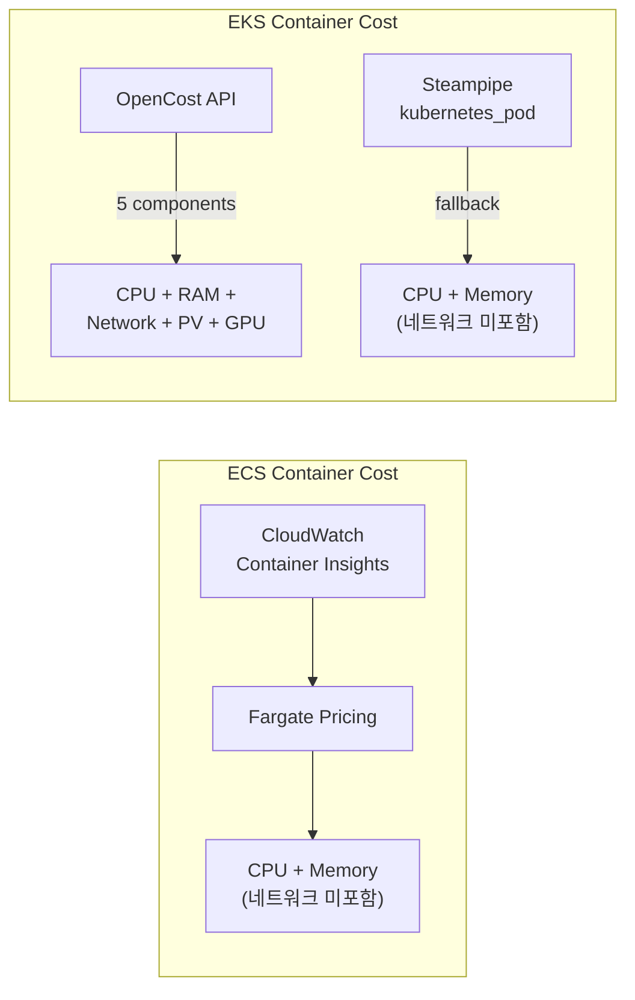
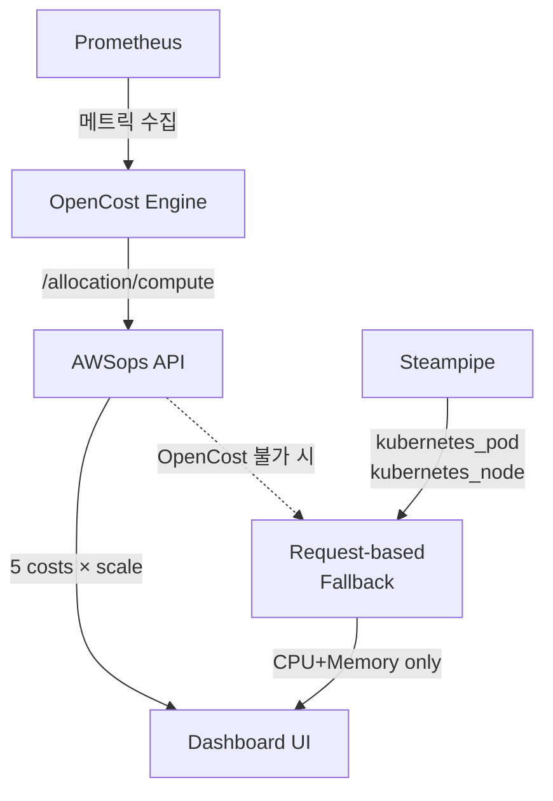
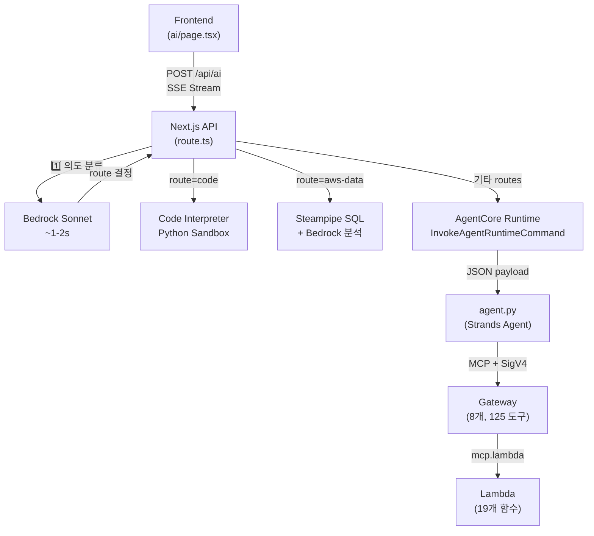
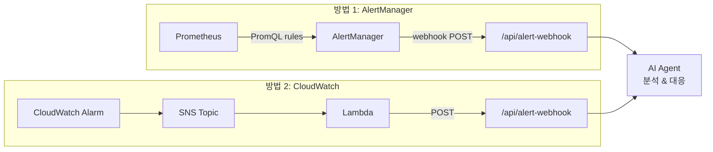

# 아키텍처 Deep Dive

AWSops 내부 동작 원리에 대한 심화 기술 FAQ입니다.

<details>
<summary>네트워크 비용(networkCost)은 어떻게 산출되나요?</summary>

네트워크 비용 산출 방식은 **ECS**와 **EKS**에서 다릅니다.



### ECS 컨테이너: 네트워크 비용 미포함

ECS 컨테이너 비용(`/api/container-cost`)은 **CPU + Memory**만 계산합니다:

```
CPU 비용 = (CPU Units / 1024) × $0.04048/시간 × 시간
Memory 비용 = (Memory MB / 1024) × $0.004445/시간 × 시간
총 비용 = CPU 비용 + Memory 비용
```

CloudWatch Container Insights에서 `CpuUtilized`, `MemoryUtilized` 메트릭을 수집하고, Fargate 가격을 적용합니다. 네트워크 전송량(`NetworkRxBytes`/`NetworkTxBytes`)은 수집하지만 비용 계산에는 반영하지 않습니다.

### EKS 컨테이너: OpenCost 모드에서만 네트워크 비용 포함

**OpenCost 모드** (`data/config.json`에 `opencostEndpoint` 설정 시):

```typescript
// src/app/api/eks-container-cost/route.ts
const res = await fetch(
  `${opencostEndpoint}/allocation/compute?window=${window}&aggregate=namespace,pod`
);

// OpenCost가 반환하는 5가지 비용 항목
const cpuCost = (alloc.cpuCost || 0) * scale;
const memCost = (alloc.ramCost || 0) * scale;
const networkCost = (alloc.networkCost || 0) * scale;   // 네트워크 비용
const pvCost = (alloc.pvCost || 0) * scale;              // PV(EBS) 비용
const gpuCost = (alloc.gpuCost || 0) * scale;            // GPU 비용
```

**네트워크 비용 산출 원리 (OpenCost 내부)**:

1. **CNI 기반 트래픽 추적**: OpenCost는 Kubernetes CNI(Container Network Interface)를 통해 Pod별 네트워크 트래픽을 추적합니다
2. **Cross-AZ 전송만 과금**: 같은 AZ 내 전송은 무료, Cross-AZ 전송에만 AWS 데이터 전송 요금 적용
3. **일일 비용 스케일링**: OpenCost는 조회 윈도우(예: 1시간) 동안의 비용을 반환하므로, 24시간으로 스케일링합니다:

```typescript
const minutes = alloc.minutes || 60;
const scale = (24 * 60) / minutes;  // 1시간 데이터를 24시간으로 환산
const networkCostDaily = (alloc.networkCost || 0) * scale;
```

**Request-based 폴백 모드** (OpenCost 미설치 시):

네트워크 비용을 계산하지 않습니다. CPU/Memory 요청량 기반으로만 비용을 추정합니다.

### UI 표시

네트워크 비용 컬럼은 OpenCost 모드에서만 표시됩니다:

```typescript
// src/app/eks-container-cost/page.tsx
...(data?.dataSource === 'opencost' ? [
  { key: 'networkCostDaily', label: 'Network' },
  { key: 'pvCostDaily', label: 'Storage' },
  { key: 'gpuCostDaily', label: 'GPU' },
] : []),
```

</details>

<details>
<summary>OpenCost로 Pod 비용은 어떻게 산출하나요?</summary>

EKS Pod 비용 산출에는 두 가지 모드가 있습니다.

### 모드 1: OpenCost API (권장)

OpenCost는 Prometheus 메트릭을 기반으로 **실제 사용량** 기반 비용을 계산합니다.

**데이터 흐름**:



**API 호출**:
```typescript
// src/app/api/eks-container-cost/route.ts
const res = await fetch(
  `${opencostEndpoint}/allocation/compute?window=1d&aggregate=namespace,pod`
);
```

**5가지 비용 항목**:

| 항목 | 설명 | 산출 기준 |
|------|------|----------|
| `cpuCost` | CPU 사용 비용 | 실제 CPU 사용량 × AWS 가격 |
| `ramCost` | 메모리 사용 비용 | 실제 메모리 사용량 × AWS 가격 |
| `networkCost` | 네트워크 전송 비용 | Cross-AZ 전송량 × 데이터 전송 가격 |
| `pvCost` | PersistentVolume 비용 | PVC → EBS 볼륨 매핑 |
| `gpuCost` | GPU 사용 비용 | GPU 할당 시간 × GPU 가격 |

**효율성 지표**: OpenCost는 CPU/Memory 효율성도 제공합니다:
```typescript
cpuEfficiency: alloc.cpuEfficiency,    // 실제 사용량 / 요청량
ramEfficiency: alloc.ramEfficiency,    // 실제 사용량 / 요청량
```

### 모드 2: Request-based 추정 (폴백)

OpenCost가 설치되지 않은 환경에서 Steampipe의 `kubernetes_pod`, `kubernetes_node` 테이블로 비용을 추정합니다.

**핵심 알고리즘: 50% CPU + 50% Memory 가중치**

```typescript
// src/app/api/eks-container-cost/route.ts
// 1. Pod의 resource requests 파싱
const cpuReq = parseCpu(container.requests?.cpu);      // "500m" → 0.5
const memReqMB = parseMemoryMB(container.requests?.memory); // "512Mi" → 512

// 2. 노드 대비 비율 계산
const cpuRatio = cpuReq / node.allocCpu;     // Pod CPU / Node CPU
const memRatio = memReqMB / node.allocMemMB; // Pod Memory / Node Memory

// 3. 노드 비용을 50:50으로 분배
const cpuCostDaily = cpuRatio * node.hourlyRate * 24 * 0.5;
const memCostDaily = memRatio * node.hourlyRate * 24 * 0.5;
const totalCostDaily = cpuCostDaily + memCostDaily;
```

**EC2 가격표** (ap-northeast-2 온디맨드):
```typescript
const EC2_PRICING: Record<string, number> = {
  'm5.large': 0.118, 'm5.xlarge': 0.236,
  'm6g.large': 0.0998, 'c5.xlarge': 0.196,
  'r5.large': 0.152, 't3.large': 0.104,
  // ... 인스턴스 타입별 시간당 가격
};
const DEFAULT_HOURLY_RATE = 0.236; // 매칭 실패 시 m5.xlarge 기준
```

### 두 모드 비교

| 항목 | OpenCost | Request-based |
|------|----------|---------------|
| CPU | 실제 사용량 기반 | 요청량 비율 기반 |
| Memory | 실제 사용량 기반 | 요청량 비율 기반 |
| Network | Cross-AZ 전송 추적 | **미포함** |
| Storage | PVC → EBS 매핑 | **미포함** |
| GPU | GPU 시간 추적 | **미포함** |
| 정확도 | 높음 (실측치) | 추정치 (요청 기반) |
| 필수 설치 | Prometheus + OpenCost | 없음 (Steampipe만) |

### OpenCost 설치

```bash
# scripts/06f-setup-opencost.sh 실행
bash scripts/06f-setup-opencost.sh

# 설치 내용: Metrics Server → Prometheus → OpenCost
# 설치 후 data/config.json에 엔드포인트 추가:
# { "opencostEndpoint": "http://localhost:9003" }
```

</details>

<details>
<summary>Agent 간 통신 구조와 FTTT 개선 방법은?</summary>

### 전체 통신 흐름



### 각 단계별 통신 방식

**1단계: Frontend → Next.js API (SSE)**
```typescript
// Frontend: fetch with ReadableStream
const res = await fetch('/awsops/api/ai', {
  method: 'POST',
  body: JSON.stringify({ messages, stream: true }),
});

// API: SSE 이벤트 전송
send('status', { step: 'classifying', message: '질문 분석 중...' });
send('status', { step: 'agentcore', message: '도구 실행 중...' });
send('done', { content, usedTools, route });
```

**2단계: API → AgentCore Runtime (AWS SDK)**
```typescript
// 90초 타임아웃, JSON payload에 gateway 이름 포함
const command = new InvokeAgentRuntimeCommand({
  agentRuntimeArn: config.agentRuntimeArn,
  payload: JSON.stringify({ messages: recentMessages, gateway }),
});
const response = await agentCoreClient.send(command);
```

**3단계: AgentCore → Gateway (MCP + SigV4)**
```python
# agent.py: SigV4 서명된 HTTP로 Gateway 연결
def create_gateway_transport(gateway_url):
    return streamablehttp_client_with_sigv4(
        url=gateway_url,
        credentials=credentials,
        service="bedrock-agentcore",
        region=GATEWAY_REGION,
    )

# MCP 프로토콜로 도구 목록 조회 후 실행
mcp_client = MCPClient(lambda: create_gateway_transport(url))
tools = get_all_tools(mcp_client)  # list_tools with pagination
agent = Agent(model=model, tools=tools)
response = agent(user_input)
```

**4단계: Gateway → Lambda (MCP Lambda Protocol)**
Gateway는 `mcp.lambda` 프로토콜로 Lambda를 호출합니다. Lambda 함수는 실제 AWS API를 실행하고 결과를 반환합니다.

### FTTT (Time To First Token) 구성 요소

FTTT는 사용자가 질문 후 **첫 번째 응답 텍스트가 화면에 표시되기까지**의 시간입니다.

| 단계 | 소요 시간 | 설명 |
|------|----------|------|
| 의도 분류 | 1-2초 | Bedrock Sonnet으로 라우트 결정 |
| AgentCore Cold Start | 10-30초 | 컨테이너 최초 시작 (Warm 시 0초) |
| 도구 디스커버리 | 1-3초 | `list_tools_sync()` 페이지네이션 |
| 모델 추론 | 2-5초 | Strands Agent의 LLM 호출 |
| 도구 실행 | 2-30초 | Lambda 함수 실행 (API 호출 포함) |
| **총 FTTT (Cold)** | **~15-60초** | |
| **총 FTTT (Warm)** | **~5-15초** | |

### FTTT 개선 방법

**1. Cold Start 제거 (가장 큰 효과)**
```bash
# AgentCore Runtime에 최소 인스턴스 설정
# 항상 1개 이상의 Warm 컨테이너 유지
aws bedrock-agentcore update-agent-runtime \
  --agent-runtime-id $RUNTIME_ID \
  --min-instances 1
```

**2. 의도 분류 캐싱**
```typescript
// 유사한 질문 패턴에 대해 분류 결과 캐시
// 예: "EC2 목록" → 항상 "aws-data" 라우트
const classificationCache = new Map<string, string[]>();
```

**3. Gateway 도구 목록 캐싱**
```python
# agent.py에서 list_tools 결과를 메모리 캐시
# 매 요청마다 도구 목록을 재조회하지 않음
TOOL_CACHE: dict[str, list] = {}
TOOL_CACHE_TTL = 300  # 5분
```

**4. 멀티 라우트 병렬 실행 (이미 구현됨)**
```typescript
// 여러 라우트가 분류된 경우 동시 실행
// 예: ["security", "cost"] → 두 Gateway 동시 호출
const results = await Promise.all(
  routes.map(route => invokeAgentCore(messages, route))
);
```

**5. Keepalive로 CloudFront 타임아웃 방지 (이미 구현됨)**
```typescript
// 15초마다 SSE 이벤트 전송 → CloudFront 60초 타임아웃 방지
const keepaliveInterval = setInterval(() => {
  send('status', { message: `도구 실행 중... (${count * 15}s)` });
}, 15000);
```

**6. 스트리밍 응답 개선 (향후)**
현재는 AgentCore의 전체 응답을 받은 후 `done` 이벤트로 전송합니다. AgentCore가 토큰 단위 스트리밍을 지원하면 FTTT를 크게 단축할 수 있습니다.

</details>

<details>
<summary>AlertManager로 Agent를 자동 트리거하려면 어떻게 하나요?</summary>

### 현재 상태

현재 AWSops에서 AlertManager는 **비활성화** 상태입니다:

```bash
# scripts/06f-setup-opencost.sh
helm install prometheus prometheus-community/prometheus \
  --set alertmanager.enabled=false   # ← 명시적 비활성화
```

Prometheus는 OpenCost의 메트릭 수집용으로만 설치되어 있습니다.

단, **CloudWatch 알람 도구**는 이미 존재합니다:
- `get_active_alarms`: ALARM 상태인 알람 조회
- `get_alarm_history`: 알람 상태 변경 이력
- `get_recommended_metric_alarms`: 권장 알람 설정

### 구현 방법 1: AlertManager Webhook (Prometheus 기반)

**Step 1. AlertManager 활성화**

`scripts/06f-setup-opencost.sh` 수정:
```bash
helm upgrade prometheus prometheus-community/prometheus \
  --set alertmanager.enabled=true
```

**Step 2. 웹훅 API 엔드포인트 생성**

```typescript
// src/app/api/alert-webhook/route.ts (신규 생성)
import { NextRequest, NextResponse } from 'next/server';

interface AlertManagerPayload {
  alerts: Array<{
    status: 'firing' | 'resolved';
    labels: Record<string, string>;
    annotations: Record<string, string>;
    startsAt: string;
    endsAt: string;
  }>;
}

export async function POST(request: NextRequest) {
  const payload: AlertManagerPayload = await request.json();

  // AlertManager 형식 → AI 메시지 변환
  const alertSummary = payload.alerts.map(alert => {
    const severity = alert.labels.severity || 'warning';
    const name = alert.labels.alertname;
    const description = alert.annotations.description || '';
    return `[${severity.toUpperCase()}] ${name}: ${description}`;
  }).join('\n');

  const aiMessage = {
    messages: [{
      role: 'user',
      content: `다음 알림이 발생했습니다. 원인을 분석하고 해결 방법을 제안해주세요:\n\n${alertSummary}`
    }],
    stream: false,
  };

  // 내부 AI API 호출
  const aiResponse = await fetch(`http://localhost:3000/awsops/api/ai`, {
    method: 'POST',
    headers: { 'Content-Type': 'application/json' },
    body: JSON.stringify(aiMessage),
  });

  const analysis = await aiResponse.json();

  // 분석 결과 저장 또는 알림 전송 (Slack, SNS 등)
  console.log('AI Analysis:', analysis);

  return NextResponse.json({ status: 'processed', analysis });
}
```

**Step 3. AlertManager 설정**

```yaml
# alertmanager-config.yaml
global:
  resolve_timeout: 5m

route:
  receiver: 'awsops-ai'
  group_wait: 30s
  group_interval: 5m
  repeat_interval: 1h

receivers:
  - name: 'awsops-ai'
    webhook_configs:
      - url: 'http://<EC2-Private-IP>:3000/awsops/api/alert-webhook'
        send_resolved: true
```

**Step 4. Prometheus 알림 규칙 정의**

```yaml
# prometheus-rules.yaml
groups:
  - name: kubernetes
    rules:
      - alert: PodCrashLooping
        expr: rate(kube_pod_container_status_restarts_total[15m]) > 0
        for: 5m
        labels:
          severity: critical
        annotations:
          description: "Pod {{ $labels.pod }} in {{ $labels.namespace }} is crash looping"

      - alert: HighCPUUsage
        expr: sum(rate(container_cpu_usage_seconds_total[5m])) by (pod) > 0.9
        for: 10m
        labels:
          severity: warning
        annotations:
          description: "Pod {{ $labels.pod }} CPU usage > 90% for 10 minutes"
```

### 구현 방법 2: CloudWatch Alarms → SNS → Lambda (AWS 네이티브)

Prometheus 대신 AWS 서비스만으로 구현하는 방법입니다:



**Lambda 함수 (Python)**:
```python
import json
import urllib3

def handler(event, context):
    # SNS 메시지 파싱
    sns_message = json.loads(event['Records'][0]['Sns']['Message'])
    alarm_name = sns_message['AlarmName']
    reason = sns_message['NewStateReason']

    # AWSops AI API 호출
    http = urllib3.PoolManager()
    response = http.request('POST',
        'http://<EC2-IP>:3000/awsops/api/alert-webhook',
        body=json.dumps({
            'alerts': [{
                'status': 'firing',
                'labels': {'alertname': alarm_name, 'severity': 'critical'},
                'annotations': {'description': reason},
            }]
        }),
        headers={'Content-Type': 'application/json'}
    )
    return {'statusCode': 200}
```

### 두 방법 비교

| 항목 | AlertManager | CloudWatch + SNS |
|------|-------------|-----------------|
| 메트릭 소스 | Prometheus (K8s 중심) | CloudWatch (AWS 전체) |
| 알림 규칙 | PromQL | CloudWatch Metric Math |
| 추가 설치 | AlertManager 활성화 | Lambda 1개 생성 |
| 적합 환경 | EKS Pod/Node 모니터링 | AWS 서비스 전반 모니터링 |
| 비용 | 무료 (오픈소스) | Lambda/SNS 호출 비용 |

:::tip 권장 구성
EKS 클러스터 모니터링이 주 목적이면 **AlertManager**, AWS 서비스 전체를 커버하려면 **CloudWatch + SNS**를 사용하세요. 두 방법을 동시에 사용하면 Kubernetes와 AWS 양쪽 알림을 모두 AI Agent로 분석할 수 있습니다.
:::

</details>
