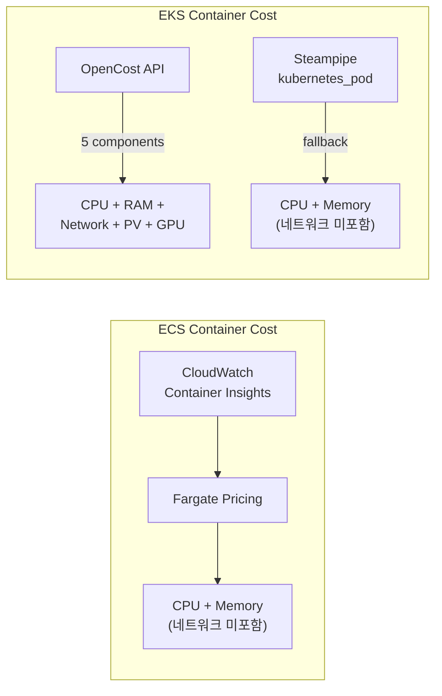
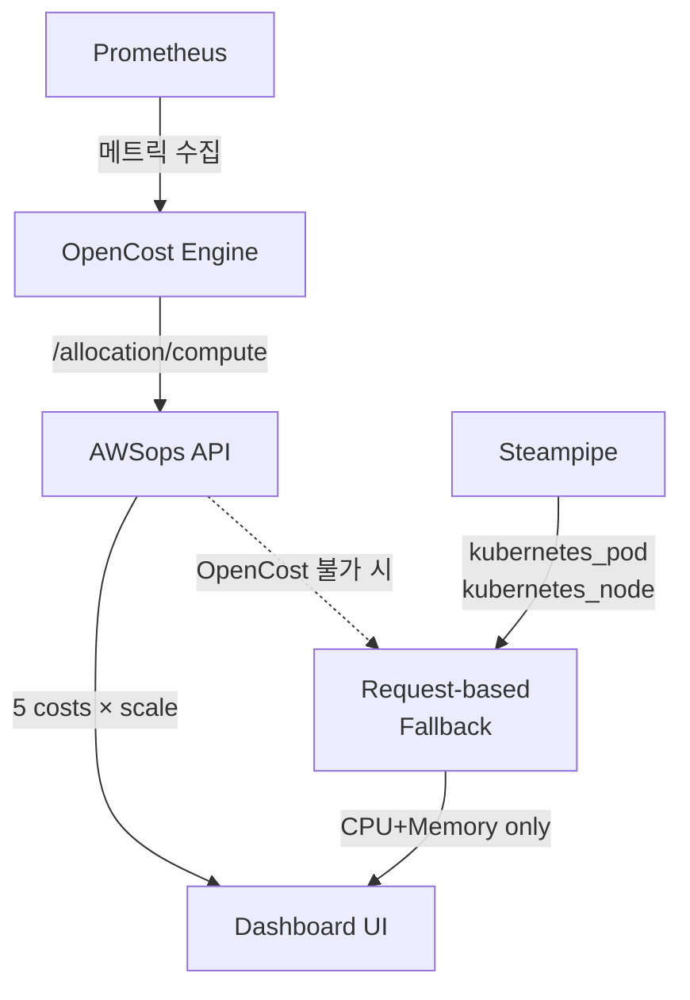
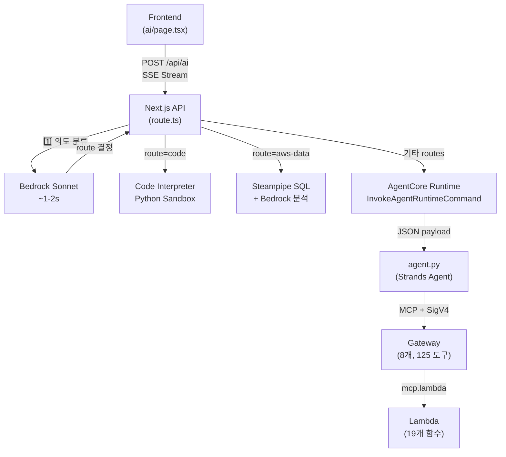
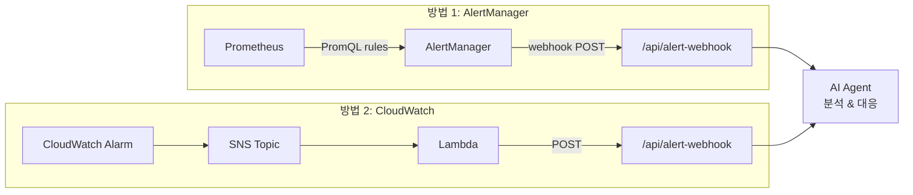
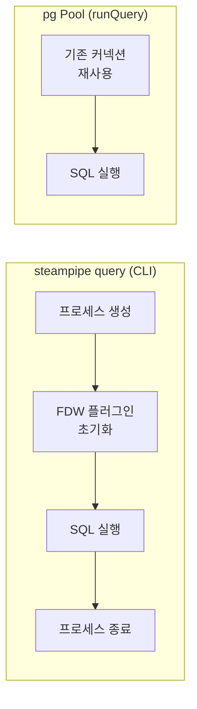
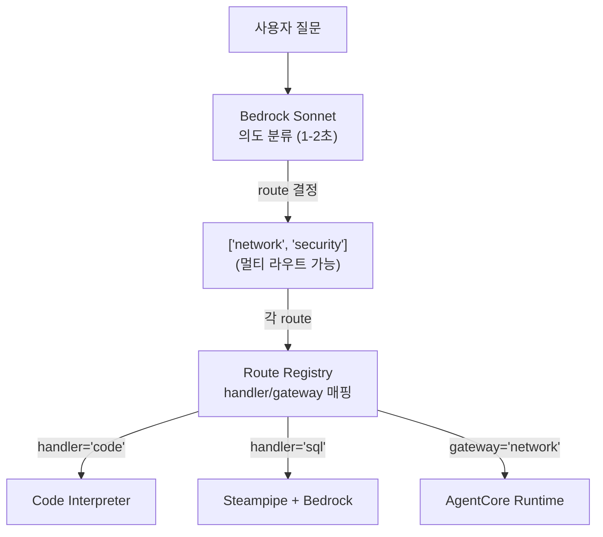
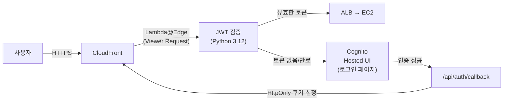
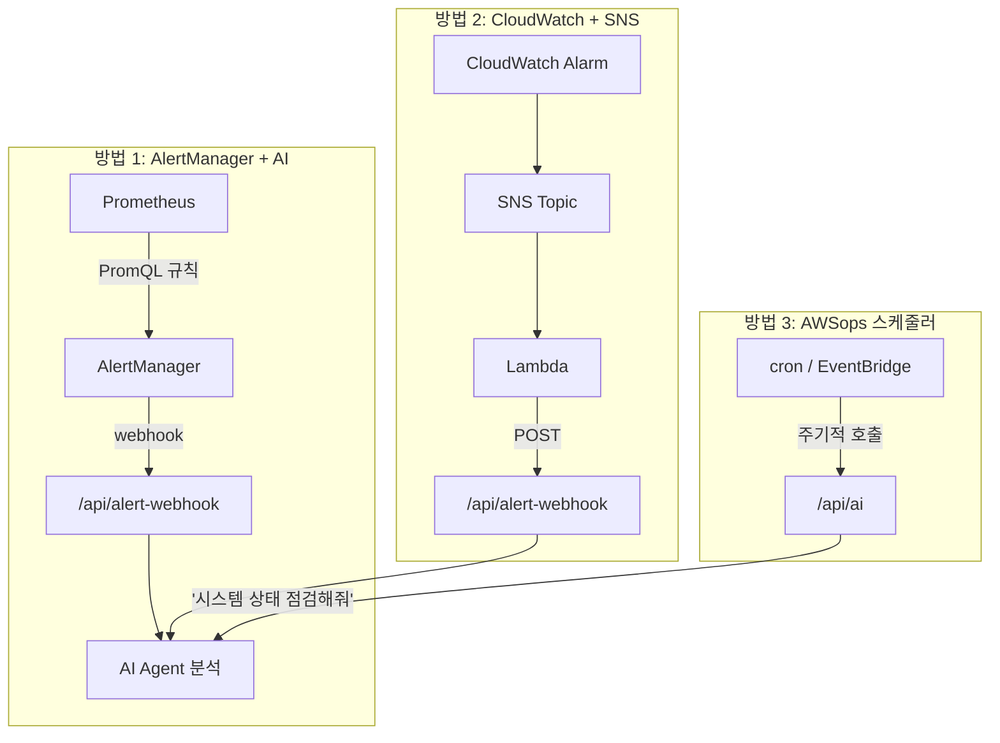
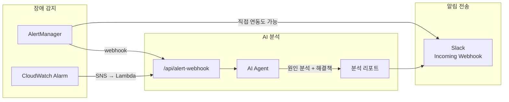

# 아키텍처 Deep Dive

AWSops 내부 동작 원리에 대한 심화 기술 FAQ입니다.

<details>
<summary>네트워크 비용(networkCost)은 어떻게 산출되나요?</summary>

네트워크 비용 산출 방식은 **ECS**와 **EKS**에서 다릅니다.



### ECS 컨테이너: 네트워크 비용 미포함

ECS 컨테이너 비용(`/api/container-cost`)은 **CPU + Memory**만 계산합니다:

```
CPU 비용 = (CPU Units / 1024) × $0.04048/시간 × 시간
Memory 비용 = (Memory MB / 1024) × $0.004445/시간 × 시간
총 비용 = CPU 비용 + Memory 비용
```

CloudWatch Container Insights에서 `CpuUtilized`, `MemoryUtilized` 메트릭을 수집하고, Fargate 가격을 적용합니다. 네트워크 전송량(`NetworkRxBytes`/`NetworkTxBytes`)은 수집하지만 비용 계산에는 반영하지 않습니다.

### EKS 컨테이너: OpenCost 모드에서만 네트워크 비용 포함

**OpenCost 모드** (`data/config.json`에 `opencostEndpoint` 설정 시):

```typescript
// src/app/api/eks-container-cost/route.ts
const res = await fetch(
  `${opencostEndpoint}/allocation/compute?window=${window}&aggregate=namespace,pod`
);

// OpenCost가 반환하는 5가지 비용 항목
const cpuCost = (alloc.cpuCost || 0) * scale;
const memCost = (alloc.ramCost || 0) * scale;
const networkCost = (alloc.networkCost || 0) * scale;   // 네트워크 비용
const pvCost = (alloc.pvCost || 0) * scale;              // PV(EBS) 비용
const gpuCost = (alloc.gpuCost || 0) * scale;            // GPU 비용
```

**네트워크 비용 산출 원리 (OpenCost 내부)**:

1. **CNI 기반 트래픽 추적**: OpenCost는 Kubernetes CNI(Container Network Interface)를 통해 Pod별 네트워크 트래픽을 추적합니다
2. **Cross-AZ 전송만 과금**: 같은 AZ 내 전송은 무료, Cross-AZ 전송에만 AWS 데이터 전송 요금 적용
3. **일일 비용 스케일링**: OpenCost는 조회 윈도우(예: 1시간) 동안의 비용을 반환하므로, 24시간으로 스케일링합니다:

```typescript
const minutes = alloc.minutes || 60;
const scale = (24 * 60) / minutes;  // 1시간 데이터를 24시간으로 환산
const networkCostDaily = (alloc.networkCost || 0) * scale;
```

**Request-based 폴백 모드** (OpenCost 미설치 시):

네트워크 비용을 계산하지 않습니다. CPU/Memory 요청량 기반으로만 비용을 추정합니다.

### UI 표시

네트워크 비용 컬럼은 OpenCost 모드에서만 표시됩니다:

```typescript
// src/app/eks-container-cost/page.tsx
...(data?.dataSource === 'opencost' ? [
  { key: 'networkCostDaily', label: 'Network' },
  { key: 'pvCostDaily', label: 'Storage' },
  { key: 'gpuCostDaily', label: 'GPU' },
] : []),
```

</details>

<details>
<summary>OpenCost로 Pod 비용은 어떻게 산출하나요?</summary>

EKS Pod 비용 산출에는 두 가지 모드가 있습니다.

### 모드 1: OpenCost API (권장)

OpenCost는 Prometheus 메트릭을 기반으로 **실제 사용량** 기반 비용을 계산합니다.

**데이터 흐름**:



**API 호출**:
```typescript
// src/app/api/eks-container-cost/route.ts
const res = await fetch(
  `${opencostEndpoint}/allocation/compute?window=1d&aggregate=namespace,pod`
);
```

**5가지 비용 항목**:

| 항목 | 설명 | 산출 기준 |
|------|------|----------|
| `cpuCost` | CPU 사용 비용 | 실제 CPU 사용량 × AWS 가격 |
| `ramCost` | 메모리 사용 비용 | 실제 메모리 사용량 × AWS 가격 |
| `networkCost` | 네트워크 전송 비용 | Cross-AZ 전송량 × 데이터 전송 가격 |
| `pvCost` | PersistentVolume 비용 | PVC → EBS 볼륨 매핑 |
| `gpuCost` | GPU 사용 비용 | GPU 할당 시간 × GPU 가격 |

**효율성 지표**: OpenCost는 CPU/Memory 효율성도 제공합니다:
```typescript
cpuEfficiency: alloc.cpuEfficiency,    // 실제 사용량 / 요청량
ramEfficiency: alloc.ramEfficiency,    // 실제 사용량 / 요청량
```

### 모드 2: Request-based 추정 (폴백)

OpenCost가 설치되지 않은 환경에서 Steampipe의 `kubernetes_pod`, `kubernetes_node` 테이블로 비용을 추정합니다.

**핵심 알고리즘: 50% CPU + 50% Memory 가중치**

```typescript
// src/app/api/eks-container-cost/route.ts
// 1. Pod의 resource requests 파싱
const cpuReq = parseCpu(container.requests?.cpu);      // "500m" → 0.5
const memReqMB = parseMemoryMB(container.requests?.memory); // "512Mi" → 512

// 2. 노드 대비 비율 계산
const cpuRatio = cpuReq / node.allocCpu;     // Pod CPU / Node CPU
const memRatio = memReqMB / node.allocMemMB; // Pod Memory / Node Memory

// 3. 노드 비용을 50:50으로 분배
const cpuCostDaily = cpuRatio * node.hourlyRate * 24 * 0.5;
const memCostDaily = memRatio * node.hourlyRate * 24 * 0.5;
const totalCostDaily = cpuCostDaily + memCostDaily;
```

**EC2 가격표** (ap-northeast-2 온디맨드):
```typescript
const EC2_PRICING: Record<string, number> = {
  'm5.large': 0.118, 'm5.xlarge': 0.236,
  'm6g.large': 0.0998, 'c5.xlarge': 0.196,
  'r5.large': 0.152, 't3.large': 0.104,
  // ... 인스턴스 타입별 시간당 가격
};
const DEFAULT_HOURLY_RATE = 0.236; // 매칭 실패 시 m5.xlarge 기준
```

### 두 모드 비교

| 항목 | OpenCost | Request-based |
|------|----------|---------------|
| CPU | 실제 사용량 기반 | 요청량 비율 기반 |
| Memory | 실제 사용량 기반 | 요청량 비율 기반 |
| Network | Cross-AZ 전송 추적 | **미포함** |
| Storage | PVC → EBS 매핑 | **미포함** |
| GPU | GPU 시간 추적 | **미포함** |
| 정확도 | 높음 (실측치) | 추정치 (요청 기반) |
| 필수 설치 | Prometheus + OpenCost | 없음 (Steampipe만) |

### OpenCost 설치

```bash
# scripts/06f-setup-opencost.sh 실행
bash scripts/06f-setup-opencost.sh

# 설치 내용: Metrics Server → Prometheus → OpenCost
# 설치 후 data/config.json에 엔드포인트 추가:
# { "opencostEndpoint": "http://localhost:9003" }
```

</details>

<details>
<summary>Agent 간 통신 구조와 FTTT 개선 방법은?</summary>

### 전체 통신 흐름



### 각 단계별 통신 방식

**1단계: Frontend → Next.js API (SSE)**
```typescript
// Frontend: fetch with ReadableStream
const res = await fetch('/awsops/api/ai', {
  method: 'POST',
  body: JSON.stringify({ messages, stream: true }),
});

// API: SSE 이벤트 전송
send('status', { step: 'classifying', message: '질문 분석 중...' });
send('status', { step: 'agentcore', message: '도구 실행 중...' });
send('done', { content, usedTools, route });
```

**2단계: API → AgentCore Runtime (AWS SDK)**
```typescript
// 90초 타임아웃, JSON payload에 gateway 이름 포함
const command = new InvokeAgentRuntimeCommand({
  agentRuntimeArn: config.agentRuntimeArn,
  payload: JSON.stringify({ messages: recentMessages, gateway }),
});
const response = await agentCoreClient.send(command);
```

**3단계: AgentCore → Gateway (MCP + SigV4)**
```python
# agent.py: SigV4 서명된 HTTP로 Gateway 연결
def create_gateway_transport(gateway_url):
    return streamablehttp_client_with_sigv4(
        url=gateway_url,
        credentials=credentials,
        service="bedrock-agentcore",
        region=GATEWAY_REGION,
    )

# MCP 프로토콜로 도구 목록 조회 후 실행
mcp_client = MCPClient(lambda: create_gateway_transport(url))
tools = get_all_tools(mcp_client)  # list_tools with pagination
agent = Agent(model=model, tools=tools)
response = agent(user_input)
```

**4단계: Gateway → Lambda (MCP Lambda Protocol)**
Gateway는 `mcp.lambda` 프로토콜로 Lambda를 호출합니다. Lambda 함수는 실제 AWS API를 실행하고 결과를 반환합니다.

### FTTT (Time To First Token) 구성 요소

FTTT는 사용자가 질문 후 **첫 번째 응답 텍스트가 화면에 표시되기까지**의 시간입니다.

| 단계 | 소요 시간 | 설명 |
|------|----------|------|
| 의도 분류 | 1-2초 | Bedrock Sonnet으로 라우트 결정 |
| AgentCore Cold Start | 10-30초 | 컨테이너 최초 시작 (Warm 시 0초) |
| 도구 디스커버리 | 1-3초 | `list_tools_sync()` 페이지네이션 |
| 모델 추론 | 2-5초 | Strands Agent의 LLM 호출 |
| 도구 실행 | 2-30초 | Lambda 함수 실행 (API 호출 포함) |
| **총 FTTT (Cold)** | **~15-60초** | |
| **총 FTTT (Warm)** | **~5-15초** | |

### FTTT 개선 방법

**1. Cold Start 제거 (가장 큰 효과)**
```bash
# AgentCore Runtime에 최소 인스턴스 설정
# 항상 1개 이상의 Warm 컨테이너 유지
aws bedrock-agentcore update-agent-runtime \
  --agent-runtime-id $RUNTIME_ID \
  --min-instances 1
```

**2. 의도 분류 캐싱**
```typescript
// 유사한 질문 패턴에 대해 분류 결과 캐시
// 예: "EC2 목록" → 항상 "aws-data" 라우트
const classificationCache = new Map<string, string[]>();
```

**3. Gateway 도구 목록 캐싱**
```python
# agent.py에서 list_tools 결과를 메모리 캐시
# 매 요청마다 도구 목록을 재조회하지 않음
TOOL_CACHE: dict[str, list] = {}
TOOL_CACHE_TTL = 300  # 5분
```

**4. 멀티 라우트 병렬 실행 (이미 구현됨)**
```typescript
// 여러 라우트가 분류된 경우 동시 실행
// 예: ["security", "cost"] → 두 Gateway 동시 호출
const results = await Promise.all(
  routes.map(route => invokeAgentCore(messages, route))
);
```

**5. Keepalive로 CloudFront 타임아웃 방지 (이미 구현됨)**
```typescript
// 15초마다 SSE 이벤트 전송 → CloudFront 60초 타임아웃 방지
const keepaliveInterval = setInterval(() => {
  send('status', { message: `도구 실행 중... (${count * 15}s)` });
}, 15000);
```

**6. 3가지 스트리밍 모드 (구현 완료)**

AWSops는 경로별로 최적화된 3가지 스트리밍 모드를 제공합니다:

| 모드 | 적용 경로 | 방식 | 지연 |
|------|----------|------|------|
| **Real Streaming** | 멀티 라우트 합성 | `ConverseStreamCommand` (Bedrock Converse API) | 토큰 단위 즉시 전송 |
| **Simulated Streaming** | 단일 Gateway 응답 | `simulateStreaming()` (50자/15ms 청킹) | 타이핑 효과 |
| **Direct Streaming** | Bedrock Direct (aws-data) | `InvokeModelWithResponseStreamCommand` | 토큰 단위 즉시 전송 |

```typescript
// 멀티 라우트 합성: Converse Stream API로 실시간 스트리밍
async function synthesizeResponsesStreaming(results, send) {
  const command = new ConverseStreamCommand({
    modelId: 'anthropic.claude-sonnet-4-6-20250514-v1:0',
    messages: [{ role: 'user', content: [{ text: synthesisPrompt }] }],
  });
  const response = await bedrockClient.send(command);
  for await (const event of response.stream) {
    if (event.contentBlockDelta?.delta?.text) {
      send('chunk', { delta: event.contentBlockDelta.delta.text });
    }
  }
}

// 단일 Gateway 응답: 타이핑 효과 시뮬레이션
async function simulateStreaming(content, send) {
  const CHUNK_SIZE = 50, CHUNK_DELAY_MS = 15;
  for (let i = 0; i < content.length; i += CHUNK_SIZE) {
    send('chunk', { delta: content.slice(i, i + CHUNK_SIZE) });
    await new Promise(r => setTimeout(r, CHUNK_DELAY_MS));
  }
}
```

:::info 왜 3가지 모드인가?
- **AgentCore Gateway**는 전체 응답을 한 번에 반환하므로 simulateStreaming으로 타이핑 효과 제공
- **멀티 라우트 합성**은 여러 Gateway 결과를 Bedrock이 통합하므로 Converse API의 네이티브 스트리밍 활용
- **Bedrock Direct**는 원래부터 토큰 스트리밍을 지원
:::

</details>

<details>
<summary>AlertManager로 Agent를 자동 트리거하려면 어떻게 하나요?</summary>

### 현재 상태

현재 AWSops에서 AlertManager는 **비활성화** 상태입니다:

```bash
# scripts/06f-setup-opencost.sh
helm install prometheus prometheus-community/prometheus \
  --set alertmanager.enabled=false   # ← 명시적 비활성화
```

Prometheus는 OpenCost의 메트릭 수집용으로만 설치되어 있습니다.

단, **CloudWatch 알람 도구**는 이미 존재합니다:
- `get_active_alarms`: ALARM 상태인 알람 조회
- `get_alarm_history`: 알람 상태 변경 이력
- `get_recommended_metric_alarms`: 권장 알람 설정

### 구현 방법 1: AlertManager Webhook (Prometheus 기반)

**Step 1. AlertManager 활성화**

`scripts/06f-setup-opencost.sh` 수정:
```bash
helm upgrade prometheus prometheus-community/prometheus \
  --set alertmanager.enabled=true
```

**Step 2. 웹훅 API 엔드포인트 생성**

```typescript
// src/app/api/alert-webhook/route.ts (신규 생성)
import { NextRequest, NextResponse } from 'next/server';

interface AlertManagerPayload {
  alerts: Array<{
    status: 'firing' | 'resolved';
    labels: Record<string, string>;
    annotations: Record<string, string>;
    startsAt: string;
    endsAt: string;
  }>;
}

export async function POST(request: NextRequest) {
  const payload: AlertManagerPayload = await request.json();

  // AlertManager 형식 → AI 메시지 변환
  const alertSummary = payload.alerts.map(alert => {
    const severity = alert.labels.severity || 'warning';
    const name = alert.labels.alertname;
    const description = alert.annotations.description || '';
    return `[${severity.toUpperCase()}] ${name}: ${description}`;
  }).join('\n');

  const aiMessage = {
    messages: [{
      role: 'user',
      content: `다음 알림이 발생했습니다. 원인을 분석하고 해결 방법을 제안해주세요:\n\n${alertSummary}`
    }],
    stream: false,
  };

  // 내부 AI API 호출
  const aiResponse = await fetch(`http://localhost:3000/awsops/api/ai`, {
    method: 'POST',
    headers: { 'Content-Type': 'application/json' },
    body: JSON.stringify(aiMessage),
  });

  const analysis = await aiResponse.json();

  // 분석 결과 저장 또는 알림 전송 (Slack, SNS 등)
  console.log('AI Analysis:', analysis);

  return NextResponse.json({ status: 'processed', analysis });
}
```

**Step 3. AlertManager 설정**

```yaml
# alertmanager-config.yaml
global:
  resolve_timeout: 5m

route:
  receiver: 'awsops-ai'
  group_wait: 30s
  group_interval: 5m
  repeat_interval: 1h

receivers:
  - name: 'awsops-ai'
    webhook_configs:
      - url: 'http://<EC2-Private-IP>:3000/awsops/api/alert-webhook'
        send_resolved: true
```

**Step 4. Prometheus 알림 규칙 정의**

```yaml
# prometheus-rules.yaml
groups:
  - name: kubernetes
    rules:
      - alert: PodCrashLooping
        expr: rate(kube_pod_container_status_restarts_total[15m]) > 0
        for: 5m
        labels:
          severity: critical
        annotations:
          description: "Pod {{ $labels.pod }} in {{ $labels.namespace }} is crash looping"

      - alert: HighCPUUsage
        expr: sum(rate(container_cpu_usage_seconds_total[5m])) by (pod) > 0.9
        for: 10m
        labels:
          severity: warning
        annotations:
          description: "Pod {{ $labels.pod }} CPU usage > 90% for 10 minutes"
```

### 구현 방법 2: CloudWatch Alarms → SNS → Lambda (AWS 네이티브)

Prometheus 대신 AWS 서비스만으로 구현하는 방법입니다:



**Lambda 함수 (Python)**:
```python
import json
import urllib3

def handler(event, context):
    # SNS 메시지 파싱
    sns_message = json.loads(event['Records'][0]['Sns']['Message'])
    alarm_name = sns_message['AlarmName']
    reason = sns_message['NewStateReason']

    # AWSops AI API 호출
    http = urllib3.PoolManager()
    response = http.request('POST',
        'http://<EC2-IP>:3000/awsops/api/alert-webhook',
        body=json.dumps({
            'alerts': [{
                'status': 'firing',
                'labels': {'alertname': alarm_name, 'severity': 'critical'},
                'annotations': {'description': reason},
            }]
        }),
        headers={'Content-Type': 'application/json'}
    )
    return {'statusCode': 200}
```

### 두 방법 비교

| 항목 | AlertManager | CloudWatch + SNS |
|------|-------------|-----------------|
| 메트릭 소스 | Prometheus (K8s 중심) | CloudWatch (AWS 전체) |
| 알림 규칙 | PromQL | CloudWatch Metric Math |
| 추가 설치 | AlertManager 활성화 | Lambda 1개 생성 |
| 적합 환경 | EKS Pod/Node 모니터링 | AWS 서비스 전반 모니터링 |
| 비용 | 무료 (오픈소스) | Lambda/SNS 호출 비용 |

:::tip 권장 구성
EKS 클러스터 모니터링이 주 목적이면 **AlertManager**, AWS 서비스 전체를 커버하려면 **CloudWatch + SNS**를 사용하세요. 두 방법을 동시에 사용하면 Kubernetes와 AWS 양쪽 알림을 모두 AI Agent로 분석할 수 있습니다.
:::

</details>

<details>
<summary>Steampipe pg Pool이 CLI보다 660배 빠른 이유는?</summary>

### CLI vs pg Pool 비교



### 벤치마크

| 방식 | `SELECT COUNT(*) FROM aws_ec2_instance` | 비고 |
|------|----------------------------------------|------|
| `steampipe query "SQL"` CLI | ~3,300ms | 매번 프로세스 생성 + FDW 초기화 |
| pg Pool `runQuery()` | ~5ms (캐시 히트), ~200ms (캐시 미스) | 커넥션 풀 재사용 |
| **성능 차이** | **~660배** (캐시 히트 기준) | |

### CLI가 느린 이유

1. **프로세스 생성 오버헤드**: 매번 `steampipe` 바이너리를 실행
2. **FDW 초기화**: Foreign Data Wrapper 플러그인을 매번 로드
3. **커넥션 설정**: 매번 PostgreSQL 커넥션을 새로 생성
4. **결과 직렬화**: JSON/텍스트로 변환 후 stdout에 출력

### pg Pool이 빠른 이유

```typescript
// src/lib/steampipe.ts
const pool = new Pool({
  host: '127.0.0.1',
  port: 9193,
  max: 5,                     // 커넥션 5개 유지
  statement_timeout: 120000,   // 2분 타임아웃
});
```

1. **커넥션 재사용**: 5개 커넥션을 Pool에서 관리, 매번 새로 만들지 않음
2. **node-cache**: 동일 쿼리 결과를 5분간 메모리 캐시
3. **Steampipe 서비스 모드**: `steampipe service start`로 FDW가 항상 로드된 상태
4. **바이너리 오버헤드 없음**: Node.js 프로세스 내에서 직접 PostgreSQL 프로토콜 통신

### 배치 쿼리

대시보드 홈에서 20개 이상의 쿼리를 실행할 때는 `batchQuery()`를 사용합니다:

```typescript
// 5개씩 순차 실행 (Steampipe FDW 동시 요청 제한 고려)
const results = await batchQuery(queries, 5);
```

</details>

<details>
<summary>AI 의도 분류(Intent Classification)는 어떻게 동작하나요?</summary>

### Route Registry 패턴

AWSops의 AI 라우팅은 **Route Registry**를 단일 소스로 사용합니다.

```typescript
// src/app/api/ai/route.ts
const ROUTE_REGISTRY: Record<string, RouteConfig> = {
  code:      { handler: 'code', display: 'Code Interpreter', tools: [...], examples: [...] },
  network:   { gateway: 'network', display: 'Network Gateway (17 tools)', tools: [...] },
  container: { gateway: 'container', display: 'Container Gateway (24 tools)', tools: [...] },
  iac:       { gateway: 'iac', tools: [...] },
  data:      { gateway: 'data', tools: [...] },
  security:  { gateway: 'security', tools: [...] },
  monitoring:{ gateway: 'monitoring', tools: [...] },
  cost:      { gateway: 'cost', tools: [...] },
  'aws-data':{ handler: 'sql', display: 'Steampipe + Bedrock', tools: [...] },
  general:   { gateway: 'ops', tools: [...] },
};
```

### 분류 흐름



### 분류 우선순위

Sonnet이 질문을 분석할 때 Route Registry의 `tools`와 `examples`를 참고합니다:

| 우선순위 | 라우트 | 판단 기준 |
|----------|--------|----------|
| 1 | code | "코드 실행", "Python", "계산", "시각화" |
| 2 | network | "연결 안 됨", "VPC", "Security Group", "TGW" |
| 3 | container | "Pod", "EKS", "ECS", "Istio" |
| 4~8 | iac~cost | 각 도메인 키워드 |
| 9 | aws-data | "목록", "몇 개", "상태", "현황" (리스팅/조회) |
| 10 | general | 위에 해당하지 않는 질문 |

### 멀티 라우트

하나의 질문이 여러 라우트에 해당하면 **동시 실행**:

```typescript
// 예: "보안 그룹 점검하고 비용 영향도 분석해줘" → ["security", "cost"]
const results = await Promise.all(
  routes.map(route => invokeHandler(messages, route))
);
// 결과를 합쳐서 하나의 응답으로 반환
```

</details>

<details>
<summary>Cognito + Lambda@Edge 인증 흐름은 어떻게 되나요?</summary>

### 전체 흐름



### 각 단계 상세

**1. Lambda@Edge (us-east-1)**
- CloudFront의 **Viewer Request** 이벤트에 연결
- 모든 요청에서 `awsops_token` 쿠키의 JWT를 검증
- JWT 서명, 만료 시간, issuer 확인
- 유효하면 요청을 Origin(EC2)으로 전달
- 무효하면 Cognito Hosted UI로 리다이렉트

**2. Cognito User Pool**
- 사용자 관리 (회원가입, 로그인, MFA)
- OAuth 2.0 / OIDC 표준 지원
- Hosted UI로 로그인 페이지 제공

**3. EC2에서 사용자 식별**

```typescript
// src/lib/auth-utils.ts
export function getUserFromRequest(request: NextRequest): UserInfo {
  // awsops_token 쿠키에서 JWT payload만 디코딩
  // 서명 재검증 불필요 (Lambda@Edge에서 이미 검증됨)
  const payload = JSON.parse(Buffer.from(parts[1], 'base64').toString());
  return {
    email: payload.email || payload['cognito:username'],
    sub: payload.sub,  // Cognito 고유 사용자 ID
  };
}
```

### HttpOnly 쿠키 방식

| 항목 | 설명 |
|------|------|
| **쿠키 이름** | `awsops_token` |
| **HttpOnly** | `true` — JavaScript에서 접근 불가 (XSS 방어) |
| **Secure** | `true` — HTTPS에서만 전송 |
| **로그아웃** | `POST /api/auth` — 서버 사이드에서 쿠키 삭제 |

### 왜 HttpOnly 쿠키?

- `document.cookie`로 토큰 탈취 불가 (XSS 방어)
- 브라우저가 자동으로 쿠키를 전송하므로 클라이언트 코드에서 토큰 관리 불필요
- 단점: `document.cookie`로 삭제할 수 없어 로그아웃은 서버 사이드 API 필요

</details>

<details>
<summary>Prometheus가 설치되어 있는데 다른 용도로도 활용할 수 있나요?</summary>

### 현재 설치 상태

`scripts/06f-setup-opencost.sh`로 설치된 Prometheus 구성:

```bash
helm install prometheus prometheus-community/prometheus \
  --namespace opencost \
  --set server.persistentVolume.enabled=false \
  --set alertmanager.enabled=false \          # AlertManager 비활성화
  --set prometheus-node-exporter.enabled=true \  # Node 메트릭 수집
  --set prometheus-pushgateway.enabled=false
```

| 컴포넌트 | 상태 | 설명 |
|---------|------|------|
| Prometheus Server | 활성 | 메트릭 수집/저장/쿼리 |
| Node Exporter | 활성 | 노드 CPU/메모리/디스크/네트워크 |
| AlertManager | **비활성** | 알림 라우팅 (활성화 가능) |
| PushGateway | 비활성 | 배치잡 메트릭 (필요 시 활성화) |

### 이미 수집 중인 메트릭

OpenCost + Node Exporter로 이미 풍부한 메트릭이 수집되고 있습니다:

| 메트릭 소스 | 수집 항목 |
|------------|----------|
| **kube-state-metrics** | Pod 상태, Deployment 상태, Node 조건, 리소스 요청/제한 |
| **Node Exporter** | CPU 사용률, 메모리, 디스크 I/O, 네트워크 트래픽 |
| **kubelet/cAdvisor** | 컨테이너별 CPU/메모리 사용량 |
| **OpenCost** | Pod/Namespace별 비용 할당 |

### 추가 활용 방법

**1. PromQL 직접 쿼리 (즉시 가능)**

```bash
# Prometheus 포트 포워딩
kubectl port-forward -n opencost svc/prometheus-server 9090:80

# PromQL 예시
# 노드별 CPU 사용률
100 - (avg by(instance)(rate(node_cpu_seconds_total{mode="idle"}[5m])) * 100)

# Pod 메모리 사용량 Top 10
topk(10, container_memory_working_set_bytes{container!=""})

# 5분간 OOMKill 발생한 Pod
kube_pod_container_status_last_terminated_reason{reason="OOMKilled"}
```

**2. Grafana 연동 (추가 설치 필요)**

```bash
helm install grafana grafana/grafana \
  --namespace opencost \
  --set datasources."datasources\.yaml".apiVersion=1 \
  --set datasources."datasources\.yaml".datasources[0].name=Prometheus \
  --set datasources."datasources\.yaml".datasources[0].type=prometheus \
  --set datasources."datasources\.yaml".datasources[0].url=http://prometheus-server.opencost:80
```

**3. 커스텀 메트릭 수집**

애플리케이션에서 `/metrics` 엔드포인트를 노출하면 Prometheus가 자동으로 수집합니다 (ServiceMonitor 또는 annotations 방식).

**4. AWSops 대시보드 확장**

Prometheus HTTP API를 호출하는 Next.js API 라우트를 추가하면 AWSops 대시보드에서 Prometheus 메트릭을 직접 표시할 수 있습니다:

```typescript
// 예: /api/prometheus/route.ts
const res = await fetch(
  `http://prometheus-server.opencost:80/api/v1/query?query=${encodeURIComponent(promql)}`
);
```

:::tip
Prometheus는 기본적으로 15일간 메트릭을 보관합니다. 장기 보관이 필요하면 `--storage.tsdb.retention.time=30d` 설정을 추가하세요.
:::

</details>

<details>
<summary>시스템 문제 시 자동으로 알림을 받으려면 어떻게 하나요?</summary>

AWSops 환경에서 자동 알림을 구성하는 3가지 방법입니다.

### 방법 비교



### 방법 1: AlertManager (EKS 모니터링)

현재 비활성화된 AlertManager를 활성화하면 Kubernetes 이벤트를 감지합니다:

```bash
# AlertManager 활성화
helm upgrade prometheus prometheus-community/prometheus \
  -n opencost --set alertmanager.enabled=true
```

**실용적인 트리거 시나리오:**

| 알림 | PromQL 규칙 | 심각도 |
|------|------------|--------|
| Pod 크래시 루프 | `rate(kube_pod_container_status_restarts_total[15m]) > 0` | critical |
| 노드 CPU 90%+ | `node_cpu_utilization > 0.9` (10분 지속) | warning |
| PVC 용량 85%+ | `kubelet_volume_stats_used_bytes / kubelet_volume_stats_capacity_bytes > 0.85` | warning |
| Pod Pending 5분+ | `kube_pod_status_phase{phase="Pending"} == 1` (5분 지속) | warning |
| OOMKill 발생 | `kube_pod_container_status_last_terminated_reason{reason="OOMKilled"}` | critical |

### 방법 2: CloudWatch Alarms (AWS 서비스 전체)

AWS 관리형 서비스(EC2, RDS, ALB 등)는 CloudWatch Alarm으로 감지:

```bash
# EC2 CPU 알람 예시
aws cloudwatch put-metric-alarm \
  --alarm-name "AWSops-EC2-HighCPU" \
  --metric-name CPUUtilization \
  --namespace AWS/EC2 \
  --statistic Average \
  --period 300 \
  --threshold 90 \
  --comparison-operator GreaterThanThreshold \
  --evaluation-periods 2 \
  --alarm-actions $SNS_TOPIC_ARN
```

### 방법 3: 주기적 AI 헬스체크 (가장 간단)

EventBridge 스케줄로 AI 어시스턴트에 주기적으로 점검을 요청:

```bash
# 매 시간 시스템 점검 (EventBridge → Lambda → AWSops AI API)
"시스템 전체 상태를 점검해줘.
 EC2, RDS, EKS 클러스터 상태를 확인하고
 이상이 있으면 요약해줘."
```

AI가 Steampipe로 리소스 상태를 조회하고, 이상을 감지하면 리포트를 생성합니다.

:::tip 권장 구성
**방법 1 + 방법 2** 조합을 권장합니다. EKS는 AlertManager로, AWS 서비스는 CloudWatch Alarm으로 감지하고, 두 경로 모두 AWSops AI로 분석 결과를 받으세요.
:::

</details>

<details>
<summary>Slack으로 자동 장애 리포트를 받을 수 있나요?</summary>

### 아키텍처



### 방법 1: AlertManager → Slack 직접 연동 (빠른 알림)

AlertManager가 Slack으로 직접 알림을 보냅니다 (AI 분석 없이 즉시):

```yaml
# alertmanager-config.yaml
receivers:
  - name: 'slack-alerts'
    slack_configs:
      - api_url: 'https://hooks.slack.com/services/T.../B.../xxx'
        channel: '#ops-alerts'
        title: '{{ .GroupLabels.alertname }}'
        text: >-
          *심각도:* {{ .CommonLabels.severity }}
          *설명:* {{ .CommonAnnotations.description }}
          *시작:* {{ .StartsAt }}
        send_resolved: true

route:
  receiver: 'slack-alerts'
  group_wait: 30s
  group_interval: 5m
```

### 방법 2: AI 분석 리포트 → Slack (심화 분석)

AWSops AI가 원인을 분석한 후 Slack으로 리포트를 전송합니다:

```typescript
// src/app/api/alert-webhook/route.ts (신규)
export async function POST(request: NextRequest) {
  const payload = await request.json();

  // 1. AI에게 분석 요청
  const aiResponse = await fetch('http://localhost:3000/awsops/api/ai', {
    method: 'POST',
    headers: { 'Content-Type': 'application/json' },
    body: JSON.stringify({
      messages: [{
        role: 'user',
        content: `다음 알림을 분석하고 원인과 해결 방법을 제시해줘:\n${alertSummary}`
      }],
      stream: false,
    }),
  });

  // 2. Slack으로 리포트 전송
  await fetch(SLACK_WEBHOOK_URL, {
    method: 'POST',
    body: JSON.stringify({
      blocks: [
        { type: 'header', text: { type: 'plain_text', text: '🚨 AWSops 장애 리포트' }},
        { type: 'section', text: { type: 'mrkdwn', text: `*알림:* ${alertName}` }},
        { type: 'section', text: { type: 'mrkdwn', text: `*AI 분석:*\n${aiAnalysis}` }},
        { type: 'section', text: { type: 'mrkdwn', text: `*권장 조치:*\n${recommendations}` }},
      ],
    }),
  });
}
```

### 방법 3: CloudWatch → SNS → Slack (Lambda 사용)

AWS 서비스 알림을 Slack으로 보내는 CloudWatch 경로:

```python
# alert-to-slack-lambda.py
import json, urllib3

SLACK_WEBHOOK = 'https://hooks.slack.com/services/T.../B.../xxx'
AWSOPS_WEBHOOK = 'http://<EC2-IP>:3000/awsops/api/alert-webhook'

def handler(event, context):
    sns_message = json.loads(event['Records'][0]['Sns']['Message'])

    # AWSops AI 분석 요청
    http = urllib3.PoolManager()
    ai_response = http.request('POST', AWSOPS_WEBHOOK,
        body=json.dumps({'alerts': [{'labels': {'alertname': sns_message['AlarmName']}}]}))

    # Slack 전송
    http.request('POST', SLACK_WEBHOOK,
        body=json.dumps({'text': f"*{sns_message['AlarmName']}*\n{ai_response.data.decode()}"}))
```

### Slack Incoming Webhook 설정

1. [Slack API](https://api.slack.com/apps) → 앱 생성
2. **Incoming Webhooks** 활성화
3. 워크스페이스에 설치, 채널 선택
4. Webhook URL 복사 → AlertManager 설정 또는 Lambda 환경변수에 저장

### 3가지 방법 비교

| 항목 | AlertManager 직접 | AI 분석 리포트 | CloudWatch + SNS |
|------|-------------------|---------------|-----------------|
| 알림 속도 | 즉시 (30초 이내) | 1-2분 (AI 분석 포함) | 1분 이내 |
| 분석 깊이 | 알림 내용만 | 원인 분석 + 해결책 | 알림 내용 + AI 분석 |
| 대상 | EKS/K8s 이벤트 | 모든 소스 | AWS 서비스 |
| 추가 구성 | AlertManager 활성화 | webhook API 구현 | Lambda 생성 |

:::tip 권장 구성
**AlertManager 직접 + AI 분석 리포트** 조합이 가장 효과적입니다:
- 즉시 알림: AlertManager → Slack (빠른 인지)
- 심화 분석: AlertManager → AI webhook → Slack (원인 분석 + 해결책)
- 두 메시지가 같은 Slack 채널에 도착하면 즉시 인지 + 분석을 동시에 받을 수 있습니다.
:::

</details>
