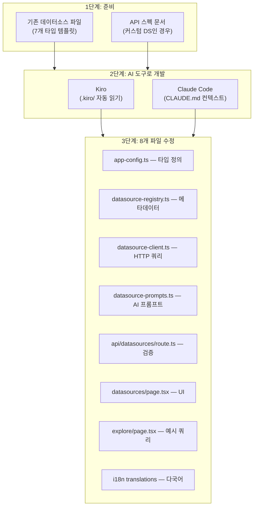

# 데이터소스 개발 FAQ

외부 데이터소스 타입 확장에 대한 질문과 답변입니다.

<details>
<summary>새로운 데이터소스 타입(예: Elasticsearch, InfluxDB)을 추가하려면 어떻게 해야 하나요?</summary>

AWSops는 현재 7가지 외부 데이터소스 타입을 지원합니다:

| 타입 | 쿼리 언어 | 용도 |
|------|----------|------|
| Prometheus | PromQL | 메트릭 모니터링 |
| Loki | LogQL | 로그 집계 |
| Tempo | TraceQL | 분산 트레이싱 |
| ClickHouse | SQL | 분석 DB |
| Jaeger | REST API | 분산 트레이싱 |
| Dynatrace | DQL | APM |
| Datadog | REST API | 모니터링 |

각 타입은 **8개 파일**에 걸친 일관된 패턴으로 구현되어 있으며, AI 코딩 도구(Kiro 또는 Claude Code)를 활용하면 기존 패턴을 자동으로 읽고 새 타입을 생성할 수 있습니다.



### 수정 대상 8개 파일

| # | 파일 | 추가 내용 | 템플릿 참조 |
|---|------|----------|------------|
| 1 | `src/lib/app-config.ts` | `DatasourceType` union에 타입 리터럴 추가 | 기존: `'prometheus' \| 'loki' \| ... \| 'datadog'` |
| 2 | `src/lib/datasource-registry.ts` | `DATASOURCE_TYPES`에 메타데이터 항목 추가 (label, icon, color, queryLanguage, healthEndpoint, defaultPort, placeholder, examples). `detectDatasourceType()`, `detectDatasourceTypes()`에 한/영 키워드 추가 | prometheus 블록을 복사하여 수정 |
| 3 | `src/lib/datasource-client.ts` | `queryNewType()` 함수 구현 + `QUERY_HANDLERS` 맵에 등록. `testConnection()`에 헬스체크 로직 추가 | `queryPrometheus()` 또는 `queryClickHouse()` 패턴 |
| 4 | `src/lib/datasource-prompts.ts` | AI 쿼리 생성용 시스템 프롬프트 추가 | 기존 PromQL/LogQL 프롬프트 참조 |
| 5 | `src/app/api/datasources/route.ts` | `VALID_TYPES` 배열에 새 타입 문자열 추가 | 단순 배열 추가 |
| 6 | `src/app/datasources/page.tsx` | `TYPE_ICONS`, `TYPE_COLORS`, `TYPE_BG_COLORS`, `TYPE_LABELS`, `TYPE_PLACEHOLDERS`에 항목 추가 | 기존 Record 항목 복사 |
| 7 | `src/app/datasources/explore/page.tsx` | `EXAMPLE_QUERIES`, `PLACEHOLDERS`, `TYPE_ICONS`, `AI_PLACEHOLDERS`에 항목 추가 | 기존 Record 항목 복사 |
| 8 | `src/lib/i18n/translations/{en,ko}.json` | 새 UI 문자열이 있으면 i18n 키 추가 | 기존 `datasources.*` 키 참조 |

:::info 핵심 패턴
모든 쿼리 함수는 `QueryResult` 인터페이스(`columns`, `rows`, `metadata`)를 반환해야 합니다. 이것이 UI와 AI 분석에서 공통으로 사용하는 정규화된 데이터 형식입니다.
:::

### Kiro로 추가하기

[Kiro](https://kiro.dev)는 프로젝트의 `.kiro/` 디렉토리를 자동으로 읽어 컨텍스트를 파악합니다:

- `.kiro/AGENT.md` — 프로젝트 아키텍처와 규칙
- `.kiro/steering/project-structure.md` — 디렉토리 구조, 데이터소스 파일 위치
- `.kiro/steering/coding-standards.md` — 코딩 컨벤션

**잘 알려진 데이터소스** (Elasticsearch, InfluxDB, Graphite 등)의 경우, 간단한 프롬프트만으로 충분합니다:

```
Elasticsearch를 새로운 데이터소스 타입으로 추가해줘.
기존 7개 데이터소스 타입의 패턴을 따라 8개 파일을 모두 수정해줘.
```

Kiro는 기존 파일들을 분석하고 일관된 패턴으로 Elasticsearch 지원을 생성합니다.

### Claude Code로 추가하기

Claude Code는 각 디렉토리의 `CLAUDE.md` 파일을 통해 프로젝트를 이해합니다:

- 루트 `CLAUDE.md` — 전체 아키텍처, 필수 규칙
- `src/lib/CLAUDE.md` — 라이브러리 모듈 상세 (datasource-registry.ts, datasource-client.ts 등)
- `src/app/CLAUDE.md` — 페이지 및 API 라우트 상세

**프롬프트 예시:**

```
InfluxDB(InfluxQL)를 새로운 데이터소스 타입으로 추가해줘.
기존 7개 타입의 패턴을 따라 8개 파일을 모두 수정해줘.
기본 포트는 8086, 헬스 엔드포인트는 /ping이야.
```

### 잘 알려지지 않은 데이터소스 추가하기

AI 도구가 API를 모르는 **사내 시스템**이나 **니치 모니터링 도구**의 경우, **API 스펙 문서를 함께 전달**해야 합니다.

#### 제공해야 할 정보

| 항목 | 설명 | 예시 |
|------|------|------|
| **헬스체크 엔드포인트** | 연결 테스트용 경로 | `GET /api/health` |
| **쿼리 API** | 데이터 조회 요청 형식 | `POST /api/v1/query` |
| **요청 본문** | 쿼리 파라미터 구조 | `{"query": "...", "from": "...", "to": "..."}` |
| **응답 형식** | 반환 데이터 구조 | `{"data": [{"timestamp": ..., "value": ...}]}` |
| **인증 방식** | 지원하는 인증 타입 | Bearer token, API key, Basic auth |

#### 프롬프트 예시 (OpenAPI 스펙 활용)

```
"CustomMetrics"를 새로운 데이터소스 타입으로 추가해줘.
기존 7개 타입의 패턴을 따라 8개 파일을 모두 수정해줘.

API 문서:
- 헬스체크: GET /api/health → 200 OK
- 쿼리: POST /api/v1/query
  Body: {"query": "metric_name", "from": "2024-01-01T00:00:00Z", "to": "2024-01-02T00:00:00Z", "step": "5m"}
  Response: {"status": "ok", "data": [{"timestamp": 1704067200, "value": 42.5, "labels": {"host": "web-1"}}]}
- 인증: Authorization 헤더에 Bearer token
- 기본 포트: 9090
```

:::tip OpenAPI 스펙 파일 활용
OpenAPI(Swagger) YAML/JSON 파일이 있다면 더 정확한 코드를 생성할 수 있습니다:

```
CustomMetrics를 데이터소스로 추가해줘.
API 스펙은 첨부한 openapi.yaml을 참고해줘.
```

Kiro에서는 프로젝트 내에 스펙 파일을 배치하면 자동으로 참조하고, Claude Code에서는 파일 경로를 프롬프트에 포함하면 됩니다.
:::

:::caution AI 라우팅 키워드 등록 필수
새 데이터소스를 추가할 때 `datasource-registry.ts`의 `detectDatasourceType()` 함수에 **한국어와 영어 키워드**를 모두 등록해야 합니다. 이 키워드가 없으면 AI 어시스턴트가 해당 데이터소스 관련 질문을 올바른 라우트로 분류하지 못합니다.
:::

### 검증 체크리스트

새 데이터소스 타입 추가 후 아래 항목을 확인하세요:

- [ ] TypeScript 컴파일 성공 (`npm run build`)
- [ ] Datasources 관리 페이지에서 타입 드롭다운에 새 타입 표시
- [ ] Connection Test 성공 (헬스 엔드포인트 응답 확인)
- [ ] 쿼리 실행 후 결과가 `QueryResult` 형식으로 정규화
- [ ] AI 쿼리 생성이 올바른 쿼리 언어로 동작
- [ ] Explore 페이지에서 예시 쿼리 표시
- [ ] 한국어/영어 i18n 문자열 모두 표시

</details>
