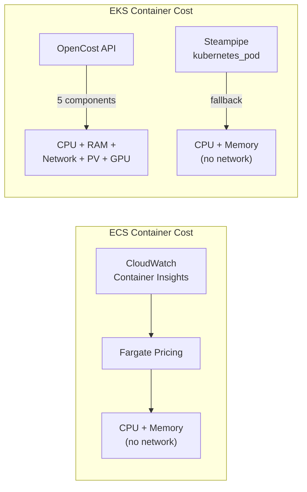
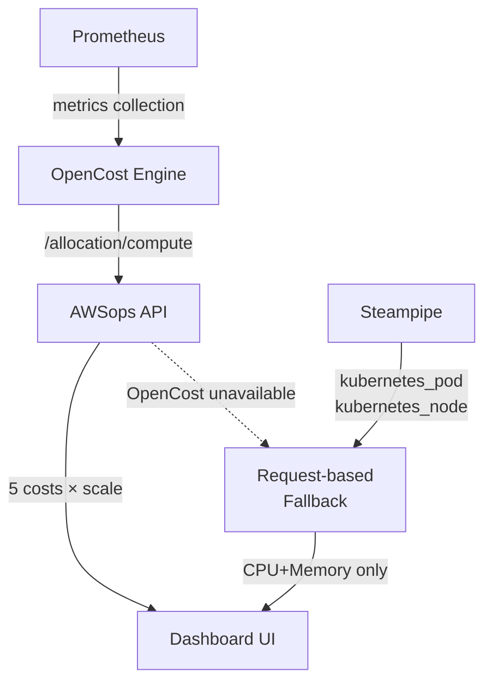
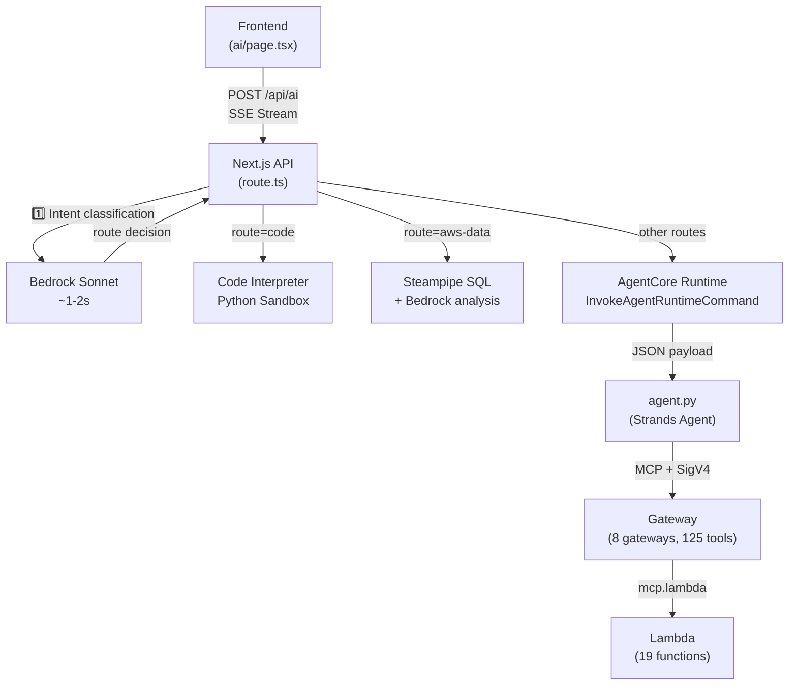
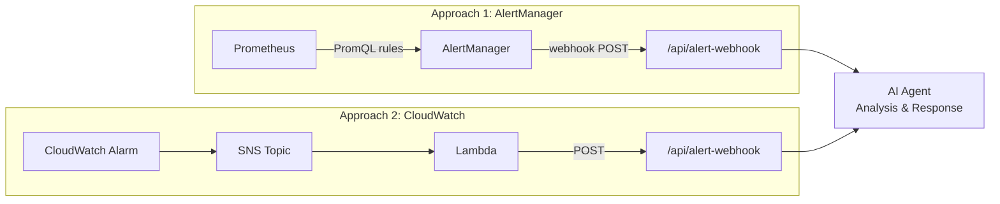

# Architecture Deep Dive

Advanced technical FAQ about AWSops internal architecture and design decisions.

<details>
<summary>How are network costs (networkCost) calculated?</summary>

Network cost calculation differs between **ECS** and **EKS**.



### ECS Containers: Network Cost Not Included

ECS container cost (`/api/container-cost`) only calculates **CPU + Memory**:

```
CPU Cost = (CPU Units / 1024) x $0.04048/hr x hours
Memory Cost = (Memory MB / 1024) x $0.004445/hr x hours
Total Cost = CPU Cost + Memory Cost
```

CloudWatch Container Insights collects `CpuUtilized` and `MemoryUtilized` metrics with Fargate pricing applied. Network transfer metrics (`NetworkRxBytes`/`NetworkTxBytes`) are collected but not reflected in cost calculation.

### EKS Containers: Network Cost Only in OpenCost Mode

**OpenCost Mode** (when `opencostEndpoint` is set in `data/config.json`):

```typescript
// src/app/api/eks-container-cost/route.ts
const res = await fetch(
  `${opencostEndpoint}/allocation/compute?window=${window}&aggregate=namespace,pod`
);

// 5 cost components from OpenCost
const cpuCost = (alloc.cpuCost || 0) * scale;
const memCost = (alloc.ramCost || 0) * scale;
const networkCost = (alloc.networkCost || 0) * scale;   // Network cost
const pvCost = (alloc.pvCost || 0) * scale;              // PV (EBS) cost
const gpuCost = (alloc.gpuCost || 0) * scale;            // GPU cost
```

**How OpenCost calculates network cost internally**:

1. **CNI-based traffic tracking**: OpenCost tracks per-pod network traffic via Kubernetes CNI (Container Network Interface)
2. **Only Cross-AZ transfers are charged**: Same-AZ transfers are free; Cross-AZ transfers incur AWS data transfer charges
3. **Daily cost scaling**: OpenCost returns cost for the query window (e.g., 1 hour), scaled to 24 hours:

```typescript
const minutes = alloc.minutes || 60;
const scale = (24 * 60) / minutes;  // Scale 1-hour data to 24 hours
const networkCostDaily = (alloc.networkCost || 0) * scale;
```

**Request-based fallback mode** (when OpenCost is not installed):

Network cost is not calculated. Cost is estimated based on CPU/Memory request ratios only.

### UI Display

The network cost column only appears in OpenCost mode:

```typescript
// src/app/eks-container-cost/page.tsx
...(data?.dataSource === 'opencost' ? [
  { key: 'networkCostDaily', label: 'Network' },
  { key: 'pvCostDaily', label: 'Storage' },
  { key: 'gpuCostDaily', label: 'GPU' },
] : []),
```

</details>

<details>
<summary>How does OpenCost calculate pod-level costs?</summary>

EKS pod cost calculation has two modes.

### Mode 1: OpenCost API (Recommended)

OpenCost calculates costs based on **actual usage** using Prometheus metrics.

**Data flow**:



**API call**:
```typescript
// src/app/api/eks-container-cost/route.ts
const res = await fetch(
  `${opencostEndpoint}/allocation/compute?window=1d&aggregate=namespace,pod`
);
```

**5 cost components**:

| Component | Description | Basis |
|-----------|-------------|-------|
| `cpuCost` | CPU usage cost | Actual CPU usage x AWS price |
| `ramCost` | Memory usage cost | Actual memory usage x AWS price |
| `networkCost` | Network transfer cost | Cross-AZ transfer x data transfer price |
| `pvCost` | PersistentVolume cost | PVC -> EBS volume mapping |
| `gpuCost` | GPU usage cost | GPU allocation time x GPU price |

**Efficiency metrics**: OpenCost also provides CPU/Memory efficiency:
```typescript
cpuEfficiency: alloc.cpuEfficiency,    // actual usage / requested
ramEfficiency: alloc.ramEfficiency,    // actual usage / requested
```

### Mode 2: Request-based Estimation (Fallback)

When OpenCost is not installed, costs are estimated using Steampipe's `kubernetes_pod` and `kubernetes_node` tables.

**Core algorithm: 50% CPU + 50% Memory weighting**

```typescript
// src/app/api/eks-container-cost/route.ts
// 1. Parse pod resource requests
const cpuReq = parseCpu(container.requests?.cpu);      // "500m" -> 0.5
const memReqMB = parseMemoryMB(container.requests?.memory); // "512Mi" -> 512

// 2. Calculate ratio against node capacity
const cpuRatio = cpuReq / node.allocCpu;     // Pod CPU / Node CPU
const memRatio = memReqMB / node.allocMemMB; // Pod Memory / Node Memory

// 3. Split node cost 50:50
const cpuCostDaily = cpuRatio * node.hourlyRate * 24 * 0.5;
const memCostDaily = memRatio * node.hourlyRate * 24 * 0.5;
const totalCostDaily = cpuCostDaily + memCostDaily;
```

**EC2 pricing table** (ap-northeast-2 on-demand):
```typescript
const EC2_PRICING: Record<string, number> = {
  'm5.large': 0.118, 'm5.xlarge': 0.236,
  'm6g.large': 0.0998, 'c5.xlarge': 0.196,
  'r5.large': 0.152, 't3.large': 0.104,
  // ... hourly rates per instance type
};
const DEFAULT_HOURLY_RATE = 0.236; // m5.xlarge fallback
```

### Comparison

| Aspect | OpenCost | Request-based |
|--------|----------|---------------|
| CPU | Actual usage based | Request ratio based |
| Memory | Actual usage based | Request ratio based |
| Network | Cross-AZ transfer tracking | **Not included** |
| Storage | PVC -> EBS mapping | **Not included** |
| GPU | GPU time tracking | **Not included** |
| Accuracy | High (actual metrics) | Estimate (request-based) |
| Requirements | Prometheus + OpenCost | None (Steampipe only) |

### Installing OpenCost

```bash
# Run scripts/06f-setup-opencost.sh
bash scripts/06f-setup-opencost.sh

# Installs: Metrics Server -> Prometheus -> OpenCost
# After install, add endpoint to data/config.json:
# { "opencostEndpoint": "http://localhost:9003" }
```

</details>

<details>
<summary>How does agent communication work, and how to improve FTTT?</summary>

### Full Communication Flow



### Communication at Each Stage

**Stage 1: Frontend -> Next.js API (SSE)**
```typescript
// Frontend: fetch with ReadableStream
const res = await fetch('/awsops/api/ai', {
  method: 'POST',
  body: JSON.stringify({ messages, stream: true }),
});

// API sends SSE events
send('status', { step: 'classifying', message: 'Analyzing question...' });
send('status', { step: 'agentcore', message: 'Running tools...' });
send('done', { content, usedTools, route });
```

**Stage 2: API -> AgentCore Runtime (AWS SDK)**
```typescript
// 90-second timeout, JSON payload includes gateway name
const command = new InvokeAgentRuntimeCommand({
  agentRuntimeArn: config.agentRuntimeArn,
  payload: JSON.stringify({ messages: recentMessages, gateway }),
});
const response = await agentCoreClient.send(command);
```

**Stage 3: AgentCore -> Gateway (MCP + SigV4)**
```python
# agent.py: SigV4-signed HTTP to Gateway
mcp_client = MCPClient(lambda: create_gateway_transport(url))
tools = get_all_tools(mcp_client)  # list_tools with pagination
agent = Agent(model=model, tools=tools)
response = agent(user_input)
```

**Stage 4: Gateway -> Lambda (MCP Lambda Protocol)**
Gateways invoke Lambda functions via `mcp.lambda` protocol with `credentialProviderConfigurations`.

### FTTT (Time To First Token) Breakdown

FTTT is the time from when a user submits a question until the **first response text appears** on screen.

| Stage | Duration | Description |
|-------|----------|-------------|
| Intent classification | 1-2s | Bedrock Sonnet determines route |
| AgentCore Cold Start | 10-30s | Initial container startup (0s when warm) |
| Tool discovery | 1-3s | `list_tools_sync()` pagination |
| Model inference | 2-5s | Strands Agent LLM call |
| Tool execution | 2-30s | Lambda execution (including API calls) |
| **Total FTTT (Cold)** | **~15-60s** | |
| **Total FTTT (Warm)** | **~5-15s** | |

### How to Improve FTTT

**1. Eliminate Cold Start (biggest impact)**
```bash
# Set minimum instances on AgentCore Runtime
aws bedrock-agentcore update-agent-runtime \
  --agent-runtime-id $RUNTIME_ID \
  --min-instances 1
```

**2. Cache intent classification**
```typescript
// Cache classification results for similar question patterns
const classificationCache = new Map<string, string[]>();
```

**3. Cache Gateway tool lists**
```python
# Cache list_tools results in memory
TOOL_CACHE: dict[str, list] = {}
TOOL_CACHE_TTL = 300  # 5 minutes
```

**4. Multi-route parallel execution (already implemented)**
```typescript
// When multiple routes are classified, execute simultaneously
const results = await Promise.all(
  routes.map(route => invokeAgentCore(messages, route))
);
```

**5. Keepalive to prevent CloudFront timeout (already implemented)**
```typescript
// Send SSE events every 15 seconds to prevent CloudFront 60s timeout
const keepaliveInterval = setInterval(() => {
  send('status', { message: `Running tools... (${count * 15}s)` });
}, 15000);
```

**6. Streaming response improvement (future)**
Currently, the full AgentCore response is received before sending a `done` event. Once AgentCore supports token-level streaming, FTTT can be significantly reduced.

</details>

<details>
<summary>How to auto-trigger agents from AlertManager?</summary>

### Current State

AlertManager is currently **disabled** in AWSops:

```bash
# scripts/06f-setup-opencost.sh
helm install prometheus prometheus-community/prometheus \
  --set alertmanager.enabled=false   # Explicitly disabled
```

Prometheus is installed only for OpenCost metric collection.

However, **CloudWatch alarm tools** already exist:
- `get_active_alarms`: Query alarms in ALARM state
- `get_alarm_history`: Get alarm state change history
- `get_recommended_metric_alarms`: Get recommended alarm thresholds

### Approach 1: AlertManager Webhook (Prometheus-based)

**Step 1. Enable AlertManager**

Modify `scripts/06f-setup-opencost.sh`:
```bash
helm upgrade prometheus prometheus-community/prometheus \
  --set alertmanager.enabled=true
```

**Step 2. Create webhook API endpoint**

```typescript
// src/app/api/alert-webhook/route.ts (new file)
import { NextRequest, NextResponse } from 'next/server';

interface AlertManagerPayload {
  alerts: Array<{
    status: 'firing' | 'resolved';
    labels: Record<string, string>;
    annotations: Record<string, string>;
    startsAt: string;
    endsAt: string;
  }>;
}

export async function POST(request: NextRequest) {
  const payload: AlertManagerPayload = await request.json();

  // Transform AlertManager format -> AI message
  const alertSummary = payload.alerts.map(alert => {
    const severity = alert.labels.severity || 'warning';
    const name = alert.labels.alertname;
    const description = alert.annotations.description || '';
    return `[${severity.toUpperCase()}] ${name}: ${description}`;
  }).join('\n');

  const aiMessage = {
    messages: [{
      role: 'user',
      content: `The following alerts have fired. Analyze the root cause and suggest remediation:\n\n${alertSummary}`
    }],
    stream: false,
  };

  // Call internal AI API
  const aiResponse = await fetch('http://localhost:3000/awsops/api/ai', {
    method: 'POST',
    headers: { 'Content-Type': 'application/json' },
    body: JSON.stringify(aiMessage),
  });

  const analysis = await aiResponse.json();
  return NextResponse.json({ status: 'processed', analysis });
}
```

**Step 3. Configure AlertManager**

```yaml
# alertmanager-config.yaml
global:
  resolve_timeout: 5m

route:
  receiver: 'awsops-ai'
  group_wait: 30s
  group_interval: 5m
  repeat_interval: 1h

receivers:
  - name: 'awsops-ai'
    webhook_configs:
      - url: 'http://<EC2-Private-IP>:3000/awsops/api/alert-webhook'
        send_resolved: true
```

**Step 4. Define Prometheus alerting rules**

```yaml
# prometheus-rules.yaml
groups:
  - name: kubernetes
    rules:
      - alert: PodCrashLooping
        expr: rate(kube_pod_container_status_restarts_total[15m]) > 0
        for: 5m
        labels:
          severity: critical
        annotations:
          description: "Pod {{ $labels.pod }} in {{ $labels.namespace }} is crash looping"

      - alert: HighCPUUsage
        expr: sum(rate(container_cpu_usage_seconds_total[5m])) by (pod) > 0.9
        for: 10m
        labels:
          severity: warning
        annotations:
          description: "Pod {{ $labels.pod }} CPU usage > 90% for 10 minutes"
```

### Approach 2: CloudWatch Alarms -> SNS -> Lambda (AWS Native)

An AWS-only approach without Prometheus:



**Lambda function (Python)**:
```python
import json
import urllib3

def handler(event, context):
    # Parse SNS message
    sns_message = json.loads(event['Records'][0]['Sns']['Message'])
    alarm_name = sns_message['AlarmName']
    reason = sns_message['NewStateReason']

    # Call AWSops AI API
    http = urllib3.PoolManager()
    response = http.request('POST',
        'http://<EC2-IP>:3000/awsops/api/alert-webhook',
        body=json.dumps({
            'alerts': [{
                'status': 'firing',
                'labels': {'alertname': alarm_name, 'severity': 'critical'},
                'annotations': {'description': reason},
            }]
        }),
        headers={'Content-Type': 'application/json'}
    )
    return {'statusCode': 200}
```

### Comparison

| Aspect | AlertManager | CloudWatch + SNS |
|--------|-------------|-----------------|
| Metric source | Prometheus (K8s focused) | CloudWatch (all AWS) |
| Alert rules | PromQL | CloudWatch Metric Math |
| Setup required | Enable AlertManager | Create 1 Lambda |
| Best for | EKS Pod/Node monitoring | All AWS services |
| Cost | Free (open source) | Lambda/SNS invocation costs |

:::tip Recommended Setup
Use **AlertManager** for EKS cluster monitoring and **CloudWatch + SNS** for broad AWS service coverage. Both can be used simultaneously to route all alerts through the AI agent.
:::

</details>
