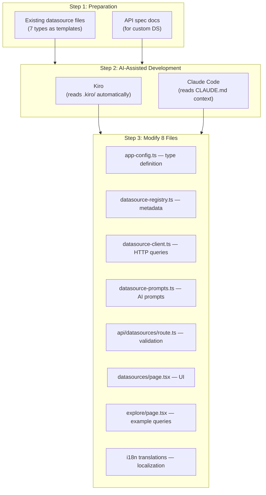

# Datasource Development FAQ

Questions and answers about extending AWSops with new external datasource types.

<details>
<summary>How do I add a new datasource type (e.g., Elasticsearch, InfluxDB)?</summary>

AWSops currently supports 7 external datasource types:

| Type | Query Language | Purpose |
|------|---------------|---------|
| Prometheus | PromQL | Metrics monitoring |
| Loki | LogQL | Log aggregation |
| Tempo | TraceQL | Distributed tracing |
| ClickHouse | SQL | Analytics DB |
| Jaeger | REST API | Distributed tracing |
| Dynatrace | DQL | APM |
| Datadog | REST API | Monitoring |

Each type is implemented across **8 files** following a consistent pattern. Using AI coding tools (Kiro or Claude Code), you can automatically read existing patterns and generate a new type.



### 8 Files to Modify

| # | File | What to Add | Template Reference |
|---|------|-------------|-------------------|
| 1 | `src/lib/app-config.ts` | Add type literal to `DatasourceType` union | Existing: `'prometheus' \| 'loki' \| ... \| 'datadog'` |
| 2 | `src/lib/datasource-registry.ts` | Add metadata entry to `DATASOURCE_TYPES` (label, icon, color, queryLanguage, healthEndpoint, defaultPort, placeholder, examples). Add Korean/English keywords to `detectDatasourceType()` and `detectDatasourceTypes()` | Copy the prometheus block and modify |
| 3 | `src/lib/datasource-client.ts` | Implement `queryNewType()` function + register in `QUERY_HANDLERS` map. Add health check logic to `testConnection()` | Follow `queryPrometheus()` or `queryClickHouse()` pattern |
| 4 | `src/lib/datasource-prompts.ts` | Add AI query generation system prompt | Reference existing PromQL/LogQL prompts |
| 5 | `src/app/api/datasources/route.ts` | Add new type string to `VALID_TYPES` array | Simple array addition |
| 6 | `src/app/datasources/page.tsx` | Add entries to `TYPE_ICONS`, `TYPE_COLORS`, `TYPE_BG_COLORS`, `TYPE_LABELS`, `TYPE_PLACEHOLDERS` | Copy existing Record entries |
| 7 | `src/app/datasources/explore/page.tsx` | Add entries to `EXAMPLE_QUERIES`, `PLACEHOLDERS`, `TYPE_ICONS`, `AI_PLACEHOLDERS` | Copy existing Record entries |
| 8 | `src/lib/i18n/translations/{en,ko}.json` | Add i18n keys for new UI strings | Reference existing `datasources.*` keys |

:::info Key Pattern
All query functions must return a `QueryResult` interface (`columns`, `rows`, `metadata`). This is the normalized data format used by both the UI and AI analysis.
:::

### Adding with Kiro

[Kiro](https://kiro.dev) automatically reads the `.kiro/` directory for project context:

- `.kiro/AGENT.md` — Project architecture and rules
- `.kiro/steering/project-structure.md` — Directory structure, datasource file locations
- `.kiro/steering/coding-standards.md` — Coding conventions

For **well-known datasources** (Elasticsearch, InfluxDB, Graphite, etc.), a simple prompt is sufficient:

```
Add Elasticsearch as a new datasource type.
Follow the pattern of the existing 7 datasource types across all 8 files.
```

Kiro will analyze the existing files and generate Elasticsearch support following the consistent pattern.

### Adding with Claude Code

Claude Code understands the project through `CLAUDE.md` files in each directory:

- Root `CLAUDE.md` — Overall architecture, critical rules
- `src/lib/CLAUDE.md` — Library module details (datasource-registry.ts, datasource-client.ts, etc.)
- `src/app/CLAUDE.md` — Page and API route details

**Example prompt:**

```
Add InfluxDB (InfluxQL) as a new datasource type.
Follow the pattern of the existing 7 types across all 8 files.
Default port is 8086, health endpoint is /ping.
```

### Adding Niche or Custom Datasources

For **internal systems** or **niche monitoring tools** whose APIs are unknown to AI tools, you must **provide API spec documentation** alongside your prompt.

#### Information to Provide

| Item | Description | Example |
|------|-------------|---------|
| **Health endpoint** | Path for connection testing | `GET /api/health` |
| **Query API** | Data retrieval request format | `POST /api/v1/query` |
| **Request body** | Query parameter structure | `{"query": "...", "from": "...", "to": "..."}` |
| **Response format** | Return data structure | `{"data": [{"timestamp": ..., "value": ...}]}` |
| **Authentication** | Supported auth type | Bearer token, API key, Basic auth |

#### Example Prompt (with API spec)

```
Add "CustomMetrics" as a new datasource type.
Follow the pattern of the existing 7 types across all 8 files.

API documentation:
- Health check: GET /api/health → 200 OK
- Query: POST /api/v1/query
  Body: {"query": "metric_name", "from": "2024-01-01T00:00:00Z", "to": "2024-01-02T00:00:00Z", "step": "5m"}
  Response: {"status": "ok", "data": [{"timestamp": 1704067200, "value": 42.5, "labels": {"host": "web-1"}}]}
- Auth: Bearer token in Authorization header
- Default port: 9090
```

:::tip Using OpenAPI Spec Files
If you have an OpenAPI (Swagger) YAML/JSON file, even more accurate code can be generated:

```
Add CustomMetrics as a datasource type.
Refer to the attached openapi.yaml for the API spec.
```

In Kiro, placing the spec file in the project allows automatic referencing. In Claude Code, include the file path in your prompt.
:::

:::caution AI Routing Keywords Required
When adding a new datasource, you must register both **Korean and English keywords** in the `detectDatasourceType()` function in `datasource-registry.ts`. Without these keywords, the AI assistant cannot route datasource-related questions to the correct handler.
:::

### Verification Checklist

After adding a new datasource type, verify the following:

- [ ] TypeScript compiles successfully (`npm run build`)
- [ ] New type appears in the type dropdown on the Datasources management page
- [ ] Connection Test succeeds (health endpoint responds)
- [ ] Query execution returns results normalized to `QueryResult` format
- [ ] AI query generation produces valid queries in the correct language
- [ ] Explore page displays example queries for the new type
- [ ] Both Korean and English i18n strings display correctly

</details>
