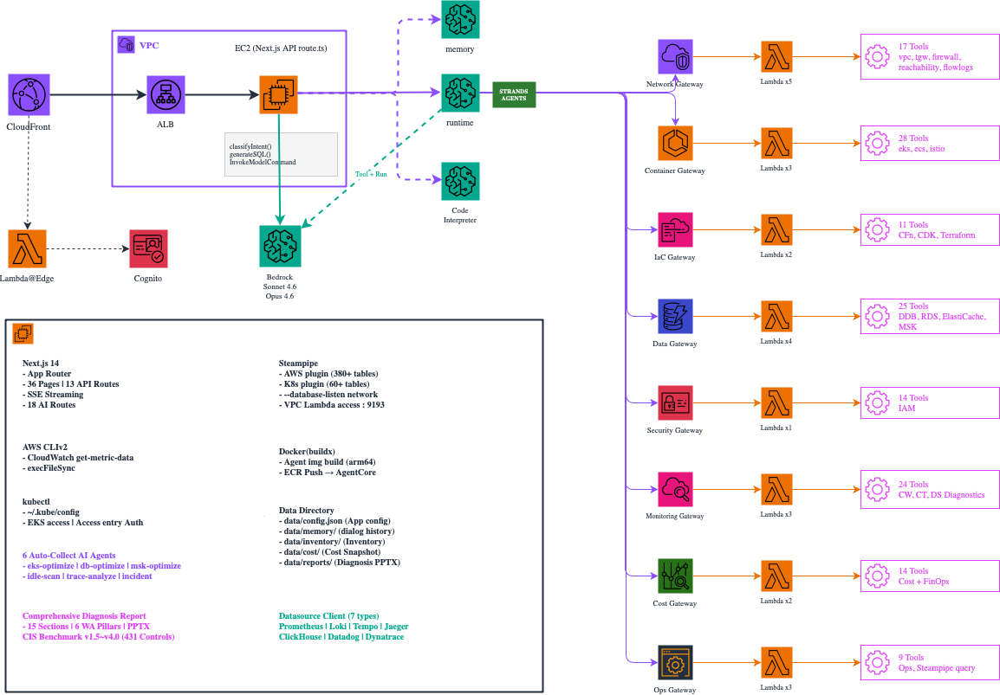

<!-- Slide 1: Block 2 Intro -->

@type: section
@transition: fade

# Architecture Deep Dive
## AWSops 기술 아키텍처

:::notes
{timing: 1min}
이제 AWSops가 어떻게 만들어졌는지, 기술 아키텍처를 상세히 살펴보겠습니다.
인프라부터 데이터 레이어, AI 엔진, 보안까지 순서대로 진행합니다.
Level 300 세션답게 내부 구현 디테일까지 다루겠습니다.
{cue: transition}
전체 아키텍처 다이어그램부터 보겠습니다.
:::

---

<!-- Slide 2: Overall Architecture Diagram -->

@type: content
@transition: slide

# Overall Architecture

:::html
<div style="background:#FFFFFF;border-radius:12px;padding:6px;margin-top:4px;width:100%;height:calc(100% - 12px);box-sizing:border-box;display:flex;align-items:center;justify-content:center;overflow:hidden;">
  
</div>
:::

:::notes
{timing: 3min}
전체 아키텍처는 4개 계층입니다.

클라이언트 브라우저에서 시작하여 CloudFront를 거칩니다. CloudFront에는 Lambda@Edge가 붙어있고, 여기서 Cognito JWT 토큰을 검증합니다. 인증되지 않은 요청은 여기서 차단됩니다.

{cue: pause}

인증을 통과하면 Internal ALB로 라우팅됩니다. ALB 뒤에는 Private Subnet의 EC2 인스턴스가 있고, Next.js 14 App Router가 실행됩니다. EC2는 t4g.2xlarge ARM 인스턴스를 사용합니다. Graviton 기반이라 x86 대비 20% 가격 절감이 있습니다.

데이터는 Steampipe의 내장 PostgreSQL에서 조회하고, AI 분석은 Bedrock AgentCore를 통해 처리합니다.

{cue: question}
중요한 포인트는, EC2에 Public IP가 없습니다. CloudFront + ALB를 통해서만 접근 가능하고, ALB의 Security Group은 CloudFront Managed Prefix List만 허용합니다.

{cue: transition}
CDK로 이 전체 인프라를 코드로 관리합니다.
:::

---

<!-- Slide 3: CDK Infrastructure -->

@type: content
@transition: slide

# CDK Infrastructure-as-Code

::: left

### `infra-cdk/` 구조

- **awsops-stack.ts** — VPC, EC2, ALB, CloudFront
- **cognito-stack.ts** — User Pool, Lambda@Edge
- `cdk deploy` 한 번에 전체 인프라 생성

### 네트워크 설계

- VPC — 기존 VPC 사용 또는 자동 생성
- EC2 — **Private Subnet** (Public IP 없음)
- ALB — Internal, CloudFront Prefix List만 허용
- CloudFront — **CACHING_DISABLED** (실시간 데이터)

:::

::: right

### EC2 인스턴스 설정

- **t4g.2xlarge** (8 vCPU, 32GB, ARM64)
- Steampipe + Next.js + Powerpipe 동시 실행
- IMDSv2 강제 (Hop Limit 2)
- SSM Session Manager 접근 (SSH 불필요)

### CloudFront 설정

- X-Custom-Secret 헤더로 ALB 원본 검증
- CACHING_DISABLED 정책 (실시간 데이터)
- Lambda@Edge Python 3.12 (us-east-1)

:::

:::notes
{timing: 2min}
인프라는 CDK 두 개의 스택으로 관리합니다.

awsops-stack.ts가 핵심인데, VPC, EC2, ALB, CloudFront를 하나의 스택으로 생성합니다. 기존 VPC가 있으면 파라미터로 전달해서 재사용할 수 있고, 없으면 자동으로 새 VPC를 만듭니다.

중요한 설계 결정이 CloudFront의 CACHING_DISABLED입니다. 일반적으로 CloudFront는 캐싱을 위해 사용하지만, AWSops는 실시간 데이터 대시보드라서 캐싱을 끄고, 순수하게 보안과 글로벌 엣지 접근을 위해 사용합니다.

{cue: transition}
이제 데이터 레이어를 보겠습니다.
:::

---

<!-- Slide 4: Data Layer — Steampipe -->

@type: content
@transition: slide

# Data Layer: Steampipe

:::html
<div>
<div class="tab-bar">
  <button class="tab-btn active" onclick="(function(b,i){var p=b.closest('.slide-body')||b.parentNode.parentNode;p.querySelectorAll('.tc').forEach(function(c,j){c.style.display=j===i?'block':'none'});p.querySelectorAll('.tab-btn').forEach(function(x){x.classList.remove('active')});b.classList.add('active')})(this,0)">Steampipe</button>
  <button class="tab-btn" onclick="(function(b,i){var p=b.closest('.slide-body')||b.parentNode.parentNode;p.querySelectorAll('.tc').forEach(function(c,j){c.style.display=j===i?'block':'none'});p.querySelectorAll('.tab-btn').forEach(function(x){x.classList.remove('active')});b.classList.add('active')})(this,1)">pg Pool & Cache</button>
  <button class="tab-btn" onclick="(function(b,i){var p=b.closest('.slide-body')||b.parentNode.parentNode;p.querySelectorAll('.tc').forEach(function(c,j){c.style.display=j===i?'block':'none'});p.querySelectorAll('.tab-btn').forEach(function(x){x.classList.remove('active')});b.classList.add('active')})(this,2)">Multi-Account</button>
  <button class="tab-btn" onclick="(function(b,i){var p=b.closest('.slide-body')||b.parentNode.parentNode;p.querySelectorAll('.tc').forEach(function(c,j){c.style.display=j===i?'block':'none'});p.querySelectorAll('.tab-btn').forEach(function(x){x.classList.remove('active')});b.classList.add('active')})(this,3)">660x Faster</button>
</div>
<div class="tc" style="display:block; margin-top:16px; color:#c0c8d4; font-size:15px; line-height:1.8;">
  <h3 style="color:#41B3FF; margin:0 0 12px;">Steampipe — SQL for Cloud APIs</h3>
  <ul style="padding-left:20px; margin:0;">
    <li><b>Embedded PostgreSQL</b> — 포트 9193, AWS API를 SQL 테이블로 변환</li>
    <li><b>380+ AWS Tables</b> — EC2, S3, RDS, Lambda, IAM, VPC, CloudFront, WAF</li>
    <li><b>60+ K8s Tables</b> — Pod, Deployment, Service, Node, RBAC, CRD</li>
    <li><b>FDW Plugin</b> — aws, kubernetes, trivy 플러그인 확장</li>
  </ul>
  <div style="margin-top:12px; padding:8px 12px; background:rgba(65,179,255,0.08); border-left:3px solid #41B3FF; font-size:14px; font-family:monospace;">
    SELECT * FROM aws_ec2_instance WHERE instance_state = 'running'
  </div>
</div>
<div class="tc" style="display:none; margin-top:16px; color:#c0c8d4; font-size:15px; line-height:1.8;">
  <h3 style="color:#f59e0b; margin:0 0 12px;">pg Pool — Connection & Cache</h3>
  <table style="width:100%; font-size:14px; border-collapse:collapse;">
    <tr style="border-bottom:1px solid rgba(255,255,255,0.1);"><td style="padding:8px; color:#41B3FF; font-weight:bold; width:35%;">max connections</td><td style="padding:8px;">5 (Steampipe 동시 연결 제한 준수)</td></tr>
    <tr style="border-bottom:1px solid rgba(255,255,255,0.1);"><td style="padding:8px; color:#41B3FF; font-weight:bold;">statement_timeout</td><td style="padding:8px;">120초 (장시간 쿼리 방지)</td></tr>
    <tr style="border-bottom:1px solid rgba(255,255,255,0.1);"><td style="padding:8px; color:#41B3FF; font-weight:bold;">batchQuery</td><td style="padding:8px;">5개 순차 실행 (동시 연결 풀 보호)</td></tr>
    <tr style="border-bottom:1px solid rgba(255,255,255,0.1);"><td style="padding:8px; color:#41B3FF; font-weight:bold;">node-cache TTL</td><td style="padding:8px;">5분 (메모리 캐시, accountId 접두사 키)</td></tr>
    <tr><td style="padding:8px; color:#41B3FF; font-weight:bold;">cache-warmer</td><td style="padding:8px;">4분 주기, 대시보드 23 + 모니터링 10 쿼리 프리워밍</td></tr>
  </table>
</div>
<div class="tc" style="display:none; margin-top:16px; color:#c0c8d4; font-size:15px; line-height:1.8;">
  <h3 style="color:#00ff88; margin:0 0 12px;">Multi-Account — Aggregator Pattern</h3>
  <ul style="padding-left:20px; margin:0;">
    <li><b><code>aws</code></b> — 모든 계정 통합 조회</li>
    <li><b><code>aws_{accountId}</code></b> — 개별 계정 조회</li>
    <li><b>buildSearchPath()</b> — 동적 search_path 생성</li>
    <li><b>config.json</b> — 코드 수정 없이 계정 추가/제거</li>
    <li><b>Per-Account Cache</b> — 계정별 캐시 키 분리</li>
  </ul>
  <div style="margin-top:12px; padding:8px 12px; background:rgba(0,255,136,0.08); border-left:3px solid #00ff88; font-size:14px; font-family:monospace;">
    SET search_path TO public, aws_123456789012, kubernetes;
  </div>
</div>
<div class="tc" style="display:none; margin-top:16px; color:#c0c8d4; font-size:15px; line-height:1.8;">
  <h3 style="color:#AD5CFF; margin:0 0 12px;">660x Faster — pg Pool vs CLI</h3>
  <div style="display:grid; grid-template-columns:1fr 1fr; gap:16px;">
    <div style="background:rgba(239,68,68,0.08); border:1px solid rgba(239,68,68,0.3); border-radius:8px; padding:16px;">
      <div style="color:#ef4444; font-weight:bold; font-size:16px; margin-bottom:8px;">Steampipe CLI ❌</div>
      <ul style="padding-left:16px; margin:0; font-size:13px;">
        <li>매번 프로세스 시작</li>
        <li>플러그인 로드</li>
        <li>연결 수립</li>
        <li>~660ms per query</li>
      </ul>
    </div>
    <div style="background:rgba(0,255,136,0.08); border:1px solid rgba(0,255,136,0.3); border-radius:8px; padding:16px;">
      <div style="color:#00ff88; font-weight:bold; font-size:16px; margin-bottom:8px;">pg Pool ✅</div>
      <ul style="padding-left:16px; margin:0; font-size:13px;">
        <li>이미 떠있는 PostgreSQL</li>
        <li>커넥션 풀 재사용</li>
        <li>SQL 직접 전송</li>
        <li>~1ms per query</li>
      </ul>
    </div>
  </div>
</div>
</div>
:::


:::notes
{timing: 3min}
데이터 레이어의 핵심은 Steampipe입니다.

Steampipe는 AWS API를 PostgreSQL 테이블로 변환하는 오픈소스 도구입니다. EC2 인스턴스 목록을 보려면 SELECT * FROM aws_ec2_instance 하면 됩니다. AWS CLI로 describe-instances를 호출하는 것보다 660배 빠릅니다.

{cue: pause}

왜 그렇게 빠르냐면, Steampipe CLI를 쓰면 매번 프로세스를 띄우고, 플러그인을 로드하고, 연결을 맺어야 합니다. 하지만 pg Pool로 직접 연결하면 이미 떠있는 PostgreSQL에 SQL을 보내기만 하면 됩니다. 이것이 아키텍처의 핵심 결정 중 하나였습니다.

멀티 어카운트는 Aggregator 패턴을 사용합니다. aws라는 연결명은 모든 계정을 통합 조회하고, aws_123456789012처럼 계정 ID를 붙이면 개별 계정만 조회합니다. buildSearchPath 함수가 search_path를 동적으로 생성합니다.

캐시는 node-cache로 5분 TTL을 적용합니다. 멀티 어카운트 환경에서는 캐시 키에 accountId를 접두사로 붙여서 계정별로 분리합니다.

{cue: transition}
다음은 AI 엔진입니다.
:::

---

<!-- Slide 5: AI Engine — Bedrock AgentCore -->

@type: content
@transition: slide

# AI Engine: Bedrock AgentCore

:::html
<div>
<div class="tab-bar">
  <button class="tab-btn active" onclick="(function(b,i){var p=b.closest('.slide-body')||b.parentNode.parentNode;p.querySelectorAll('.tc').forEach(function(c,j){c.style.display=j===i?'block':'none'});p.querySelectorAll('.tab-btn').forEach(function(x){x.classList.remove('active')});b.classList.add('active')})(this,0)">Runtime</button>
  <button class="tab-btn" onclick="(function(b,i){var p=b.closest('.slide-body')||b.parentNode.parentNode;p.querySelectorAll('.tc').forEach(function(c,j){c.style.display=j===i?'block':'none'});p.querySelectorAll('.tab-btn').forEach(function(x){x.classList.remove('active')});b.classList.add('active')})(this,1)">8 Gateways</button>
  <button class="tab-btn" onclick="(function(b,i){var p=b.closest('.slide-body')||b.parentNode.parentNode;p.querySelectorAll('.tc').forEach(function(c,j){c.style.display=j===i?'block':'none'});p.querySelectorAll('.tab-btn').forEach(function(x){x.classList.remove('active')});b.classList.add('active')})(this,2)">23 Lambda</button>
</div>
<div class="tc" style="display:block; margin-top:16px; color:#c0c8d4; font-size:15px; line-height:1.8;">
  <h3 style="color:#41B3FF; margin:0 0 12px;">AgentCore Runtime</h3>
  <ul style="padding-left:20px; margin:0;">
    <li><b>Strands Agent</b> — Python 에이전트 프레임워크</li>
    <li><b>Docker ARM64</b> — EC2에서 빌드, ECR → AgentCore 관리형 실행</li>
    <li><b>Bedrock Claude</b> — Sonnet 4.6 (분류) + Opus 4.6 (분석)</li>
    <li><b>Memory Store</b> — 365일 대화 이력 (사용자별 분리)</li>
    <li><b>Code Interpreter</b> — Python 샌드박스</li>
  </ul>
</div>
<div class="tc" style="display:none; margin-top:16px; color:#c0c8d4; font-size:14px; line-height:1.6;">
  <h3 style="color:#f59e0b; margin:0 0 12px;">8 MCP Gateways — 142 Tools</h3>
  <table style="width:100%; font-size:14px; border-collapse:collapse;">
    <tr style="border-bottom:1px solid rgba(255,255,255,0.15); color:#8b95a5;"><th style="padding:6px 8px; text-align:left;">Gateway</th><th style="padding:6px 8px;">Tools</th><th style="padding:6px 8px; text-align:left;">주요 기능</th></tr>
    <tr style="border-bottom:1px solid rgba(255,255,255,0.08);"><td style="padding:6px 8px; color:#41B3FF;">Network</td><td style="padding:6px 8px;">17</td><td style="padding:6px 8px;">VPC, TGW, Reachability</td></tr>
    <tr style="border-bottom:1px solid rgba(255,255,255,0.08);"><td style="padding:6px 8px; color:#ED7100;">Container</td><td style="padding:6px 8px;">28</td><td style="padding:6px 8px;">EKS, ECS, Istio</td></tr>
    <tr style="border-bottom:1px solid rgba(255,255,255,0.08);"><td style="padding:6px 8px; color:#E7157B;">IaC</td><td style="padding:6px 8px;">11</td><td style="padding:6px 8px;">CDK, CFn, Terraform</td></tr>
    <tr style="border-bottom:1px solid rgba(255,255,255,0.08);"><td style="padding:6px 8px; color:#3B48CC;">Data</td><td style="padding:6px 8px;">25</td><td style="padding:6px 8px;">DDB, RDS, ElastiCache, MSK</td></tr>
    <tr style="border-bottom:1px solid rgba(255,255,255,0.08);"><td style="padding:6px 8px; color:#DD344C;">Security</td><td style="padding:6px 8px;">14</td><td style="padding:6px 8px;">IAM</td></tr>
    <tr style="border-bottom:1px solid rgba(255,255,255,0.08);"><td style="padding:6px 8px; color:#E7157B;">Monitoring</td><td style="padding:6px 8px;">24</td><td style="padding:6px 8px;">CW, CT, DS Diagnostics</td></tr>
    <tr style="border-bottom:1px solid rgba(255,255,255,0.08);"><td style="padding:6px 8px; color:#277116;">Cost</td><td style="padding:6px 8px;">14</td><td style="padding:6px 8px;">Cost + FinOps</td></tr>
    <tr><td style="padding:6px 8px; color:#FF9900;">Ops</td><td style="padding:6px 8px;">9</td><td style="padding:6px 8px;">Docs, CLI, Steampipe</td></tr>
  </table>
</div>
<div class="tc" style="display:none; margin-top:16px; color:#c0c8d4; font-size:15px; line-height:1.8;">
  <h3 style="color:#00ff88; margin:0 0 12px;">23 Lambda Functions</h3>
  <ul style="padding-left:20px; margin:0;">
    <li><b>Cross-Account</b> — STS AssumeRole, 50분 캐싱</li>
    <li><b>Read-Only</b> — 모든 Lambda 읽기 전용</li>
    <li><b>VPC Lambda</b> — Steampipe 직접 접근 (pg8000)</li>
    <li><b>Python 3.12</b> — boto3 + cross_account.py 공통 모듈</li>
  </ul>
</div>
</div>
:::


:::notes
{timing: 3min}
AI 엔진의 핵심은 Bedrock AgentCore입니다.

AgentCore Runtime에서 Strands Agent가 실행됩니다. Python으로 작성된 에이전트가 Docker ARM64 이미지로 패키징되어 AgentCore 관리형 서비스에서 실행됩니다. EC2에서는 Docker 이미지를 빌드만 하고, 실제 실행은 AgentCore가 담당합니다.

{cue: pause}

8개의 MCP Gateway가 전문 영역별로 나뉘어 있습니다. Network Gateway는 VPC, TGW, VPN, Reachability Analyzer 등 17개 도구를 제공합니다. Container Gateway는 EKS, ECS, Istio 관련 24개 도구를 가지고 있습니다.

각 Gateway 뒤에는 19개의 Lambda 함수가 실제 작업을 수행합니다. 예를 들어 VPC Reachability Analyzer는 Lambda에서 Network Insights Path를 생성하고 분석 결과를 반환합니다.

총 142개의 도구가 이 구조를 통해 AI 에이전트에 제공됩니다.

{cue: transition}
이 142개의 도구를 어떻게 자동으로 선택하느냐가 다음 주제입니다.
:::

---

<!-- Slide 6: AI Route Classification -->

@type: content
@transition: slide

# AI Route Classification

:::html
<div>
<div class="tab-bar">
  <button class="tab-btn active" onclick="(function(b,i){var p=b.closest('.slide-body')||b.parentNode.parentNode;p.querySelectorAll('.tc').forEach(function(c,j){c.style.display=j===i?'block':'none'});p.querySelectorAll('.tab-btn').forEach(function(x){x.classList.remove('active')});b.classList.add('active')})(this,0)">분류 흐름</button>
  <button class="tab-btn" onclick="(function(b,i){var p=b.closest('.slide-body')||b.parentNode.parentNode;p.querySelectorAll('.tc').forEach(function(c,j){c.style.display=j===i?'block':'none'});p.querySelectorAll('.tab-btn').forEach(function(x){x.classList.remove('active')});b.classList.add('active')})(this,1)">5 Handlers</button>
  <button class="tab-btn" onclick="(function(b,i){var p=b.closest('.slide-body')||b.parentNode.parentNode;p.querySelectorAll('.tc').forEach(function(c,j){c.style.display=j===i?'block':'none'});p.querySelectorAll('.tab-btn').forEach(function(x){x.classList.remove('active')});b.classList.add('active')})(this,2)">6 Agents</button>
</div>
<div class="tc" style="display:block; margin-top:16px; color:#c0c8d4; font-size:15px; line-height:1.8;">
  <h3 style="color:#41B3FF; margin:0 0 12px;">분류 흐름 — ROUTE_REGISTRY</h3>
  <ol style="padding-left:20px; margin:0;">
    <li><b>User Question</b> — 자연어 질문 (한국어/영어)</li>
    <li><b>Sonnet 4.6 Classifier</b> — 18 Routes에서 1~3개 선택</li>
    <li><b>Handler Dispatch</b> — 5가지 핸들러로 실행</li>
    <li><b>SSE Streaming</b> — 실시간 응답 + Tool 사용 표시</li>
  </ol>
  <div style="margin-top:12px; padding:8px 12px; background:rgba(65,179,255,0.08); border-left:3px solid #41B3FF; font-size:14px;">
    <b>ROUTE_REGISTRY</b> 단일 소스 — 라우트 추가 시 분류/UI/매핑 자동 반영
  </div>
</div>
<div class="tc" style="display:none; margin-top:16px; color:#c0c8d4; font-size:14px; line-height:1.6;">
  <h3 style="color:#f59e0b; margin:0 0 12px;">5 Handler Types</h3>
  <table style="width:100%; font-size:14px; border-collapse:collapse;">
    <tr style="border-bottom:1px solid rgba(255,255,255,0.15); color:#8b95a5;"><th style="padding:6px 8px; text-align:left;">Handler</th><th style="padding:6px 8px; text-align:left;">동작</th></tr>
    <tr style="border-bottom:1px solid rgba(255,255,255,0.08);"><td style="padding:8px; color:#AD5CFF; font-family:monospace;">auto-collect</td><td style="padding:8px;">병렬 데이터 수집 + Bedrock 분석</td></tr>
    <tr style="border-bottom:1px solid rgba(255,255,255,0.08);"><td style="padding:8px; color:#41B3FF; font-family:monospace;">sql</td><td style="padding:8px;">Steampipe SQL 생성 → 실행</td></tr>
    <tr style="border-bottom:1px solid rgba(255,255,255,0.08);"><td style="padding:8px; color:#00E500; font-family:monospace;">datasource</td><td style="padding:8px;">PromQL / LogQL / TraceQL 생성</td></tr>
    <tr style="border-bottom:1px solid rgba(255,255,255,0.08);"><td style="padding:8px; color:#f59e0b; font-family:monospace;">code</td><td style="padding:8px;">Python Code Interpreter</td></tr>
    <tr><td style="padding:8px; color:#ED7100; font-family:monospace;">gateway</td><td style="padding:8px;">MCP Gateway 도구 호출 (142개)</td></tr>
  </table>
</div>
<div class="tc" style="display:none; margin-top:16px; color:#c0c8d4; font-size:15px; line-height:1.8;">
  <h3 style="color:#00ff88; margin:0 0 12px;">6 Auto-Collect Agents</h3>
  <ul style="padding-left:20px; margin:0;">
    <li><b>eks-optimize</b> — EKS container rightsizing (Prometheus + K8s + Cost)</li>
    <li><b>db-optimize</b> — RDS / ElastiCache / OpenSearch rightsizing</li>
    <li><b>msk-optimize</b> — MSK Kafka broker sizing</li>
    <li><b>idle-scan</b> — 유휴 리소스 스캔 (6 categories)</li>
    <li><b>trace-analyze</b> — Tempo/Jaeger 서비스 트레이스 분석</li>
    <li><b>incident</b> — 멀티소스 인시던트 분석</li>
  </ul>
  <div style="margin-top:12px; padding:8px 12px; background:rgba(0,255,136,0.08); border-left:3px solid #00ff88; font-size:14px;">
    4-Phase: <b>Detect</b> → <b>Collect</b> → <b>Format</b> → <b>Analyze</b>
  </div>
</div>
</div>
:::


:::notes
{timing: 3min}
AI 라우팅의 핵심은 ROUTE_REGISTRY라는 단일 소스입니다.

18개의 라우트가 등록되어 있고, 각 라우트에는 gateway, display name, description, tools, examples가 정의되어 있습니다. 새로운 도구를 추가하면 분류 프롬프트, UI 표시, 게이트웨이 매핑이 자동으로 업데이트됩니다.

{cue: pause}

분류 흐름을 보면, 사용자가 자연어로 질문하면 Sonnet 4.6 모델이 18개 라우트 중 1-3개를 선택합니다. 멀티 라우트도 지원합니다. 예를 들어 "VPC 보안그룹과 비용을 분석해줘"라고 하면 network과 cost 두 라우트가 선택됩니다.

핸들러 타입이 5가지 있습니다. auto-collect는 자동 데이터 수집 에이전트, sql은 Steampipe 직접 쿼리, datasource는 Prometheus 같은 외부 데이터소스, code는 Python 코드 인터프리터, gateway는 MCP Gateway 호출입니다.

{cue: transition}
auto-collect가 가장 흥미로운 부분입니다.
:::

---

<!-- Slide 7: Auto-Collect Agents -->

@type: content
@transition: slide

# Auto-Collect Agents

::: left

### 6 Collectors

| Agent | Target |
|-------|--------|
| **eks-optimize** | EKS rightsizing |
| **db-optimize** | RDS/ElastiCache/OpenSearch |
| **msk-optimize** | MSK Kafka brokers |
| **idle-scan** | Unused resources |
| **trace-analyze** | Distributed traces |
| **incident** | Multi-source incidents |

:::

::: right

### 4-Phase Architecture

1. **Detect** -- 데이터소스 자동 탐지
   - Prometheus, Loki, Tempo, CloudWatch
2. **Collect** -- 병렬 데이터 수집
   - PromQL + Steampipe SQL + CloudWatch
3. **Format** -- Bedrock 컨텍스트 포맷팅
   - `formatContext()` 메서드
4. **Analyze** -- Opus 4.6 심층 분석
   - `analysisPrompt` 시스템 프롬프트

### Collector Interface

```
interface Collector {
  collect(send, accountId?)
  formatContext(data)
  analysisPrompt: string
  displayName: string
}
```

:::

:::notes
{timing: 3min}
Auto-Collect Agent는 AWSops의 가장 강력한 기능입니다.

6개의 Collector가 있고, 모두 같은 인터페이스를 구현합니다. collect 메서드로 데이터를 수집하고, formatContext로 Bedrock에 전달할 컨텍스트를 만들고, analysisPrompt로 분석 프롬프트를 제공합니다.

{cue: pause}

4단계 아키텍처를 보면, 첫 번째 Detect 단계에서 사용 가능한 데이터소스를 자동 탐지합니다. Prometheus가 연결되어 있으면 PromQL을 사용하고, 없으면 CloudWatch와 Steampipe만으로 분석합니다. 이 Graceful Degradation이 핵심입니다.

예를 들어 eks-optimize는 Prometheus에서 CPU/Memory 사용량, CPU Throttling, Pod 재시작, HTTP 에러율을 수집하고, Steampipe에서 K8s 리소스 request/limit를 수집합니다. 없는 메트릭은 건너뜁니다. 이를 MetricCandidate 패턴이라고 합니다. 여러 PromQL 쿼리를 순서대로 시도하고, 첫 번째로 데이터가 반환되는 쿼리를 사용합니다.

{cue: transition}
데이터소스 통합을 좀 더 자세히 보겠습니다.
:::

---

<!-- Slide 8: Datasource Integration -->

@type: content
@transition: slide

# Datasource Integration

:::html
<div>
<div class="tab-bar">
  <button class="tab-btn active" onclick="(function(b,i){var p=b.closest('.slide-body')||b.parentNode.parentNode;p.querySelectorAll('.tc').forEach(function(c,j){c.style.display=j===i?'block':'none'});p.querySelectorAll('.tab-btn').forEach(function(x){x.classList.remove('active')});b.classList.add('active')})(this,0)">Metrics</button>
  <button class="tab-btn" onclick="(function(b,i){var p=b.closest('.slide-body')||b.parentNode.parentNode;p.querySelectorAll('.tc').forEach(function(c,j){c.style.display=j===i?'block':'none'});p.querySelectorAll('.tab-btn').forEach(function(x){x.classList.remove('active')});b.classList.add('active')})(this,1)">Logs</button>
  <button class="tab-btn" onclick="(function(b,i){var p=b.closest('.slide-body')||b.parentNode.parentNode;p.querySelectorAll('.tc').forEach(function(c,j){c.style.display=j===i?'block':'none'});p.querySelectorAll('.tab-btn').forEach(function(x){x.classList.remove('active')});b.classList.add('active')})(this,2)">Traces</button>
  <button class="tab-btn" onclick="(function(b,i){var p=b.closest('.slide-body')||b.parentNode.parentNode;p.querySelectorAll('.tc').forEach(function(c,j){c.style.display=j===i?'block':'none'});p.querySelectorAll('.tab-btn').forEach(function(x){x.classList.remove('active')});b.classList.add('active')})(this,3)">Unified Client</button>
</div>
<div class="tc" style="display:block; margin-top:16px; color:#c0c8d4; font-size:15px; line-height:1.8;">
  <h3 style="color:#E6522C; margin:0 0 12px;">Metrics</h3>
  <ul style="padding-left:20px; margin:0;">
    <li><b>Prometheus</b> — PromQL, auto-discovery, 9+ metric candidates</li>
    <li><b>Datadog</b> — Metrics Query API v2</li>
    <li><b>Dynatrace</b> — Entities & Metrics API v2</li>
  </ul>
  <div style="margin-top:12px; padding:8px 12px; background:rgba(230,82,44,0.08); border-left:3px solid #E6522C; font-size:14px; font-family:monospace;">
    rate(container_cpu_usage_seconds_total{container!=""}[5m])
  </div>
</div>
<div class="tc" style="display:none; margin-top:16px; color:#c0c8d4; font-size:15px; line-height:1.8;">
  <h3 style="color:#F9B716; margin:0 0 12px;">Logs</h3>
  <ul style="padding-left:20px; margin:0;">
    <li><b>Loki</b> — LogQL, 에러 로그 검색, 패턴 매칭</li>
    <li><b>ClickHouse</b> — SQL 데이터 분석, 대용량 로그 처리</li>
  </ul>
  <div style="margin-top:12px; padding:8px 12px; background:rgba(249,183,22,0.08); border-left:3px solid #F9B716; font-size:14px; font-family:monospace;">
    {level="error"} |= "timeout" | json
  </div>
</div>
<div class="tc" style="display:none; margin-top:16px; color:#c0c8d4; font-size:15px; line-height:1.8;">
  <h3 style="color:#6BAFBD; margin:0 0 12px;">Traces</h3>
  <ul style="padding-left:20px; margin:0;">
    <li><b>Tempo</b> — TraceQL, 분산 트레이스 검색</li>
    <li><b>Jaeger</b> — Service/Trace API, 서비스 의존성</li>
  </ul>
  <div style="margin-top:12px; padding:8px 12px; background:rgba(107,175,189,0.08); border-left:3px solid #6BAFBD; font-size:14px; font-family:monospace;">
    { status = error && duration > 500ms }
  </div>
</div>
<div class="tc" style="display:none; margin-top:16px; color:#c0c8d4; font-size:15px; line-height:1.8;">
  <h3 style="color:#AD5CFF; margin:0 0 12px;">Unified Datasource Client</h3>
  <ul style="padding-left:20px; margin:0;">
    <li><b>datasource-client.ts</b> — 7가지 타입 통합 인터페이스</li>
    <li><b>queryDatasource()</b> — 하나의 함수로 모든 DS 쿼리</li>
    <li><b>Auto-Discovery</b> — URL 등록 → 헬스체크 → 자동 감지</li>
    <li><b>60s Cache</b> — node-cache, configurable TTL</li>
    <li><b>SSRF 방지</b> — datasourceAllowedNetworks allowlist</li>
  </ul>
</div>
</div>
:::


:::notes
{timing: 2min}
AWSops는 7가지 외부 데이터소스를 지원합니다.

메트릭은 Prometheus, Datadog, Dynatrace. 로그는 Loki와 ClickHouse. 트레이스는 Tempo와 Jaeger입니다.

{cue: pause}

모든 데이터소스는 datasource-registry.ts에 메타데이터가 등록되어 있습니다. 쿼리 언어, 헬스체크 엔드포인트, 기본 포트, 예제 쿼리가 포함됩니다. datasource-client.ts가 통합 쿼리 인터페이스를 제공해서, queryDatasource 함수 하나로 어떤 데이터소스든 쿼리할 수 있습니다.

Auto-Discovery 기능이 있어서, data/config.json에 URL만 등록하면 헬스체크로 연결 가능 여부를 자동 감지합니다. 사용자 질문에서 키워드를 분석해서 적절한 데이터소스로 자동 라우팅합니다.

{cue: transition}
마지막으로 보안 아키텍처를 보겠습니다.
:::

---

<!-- Slide 9: Security Architecture -->

@type: content
@transition: slide

# Security Architecture

:::html
<div class="flow-h">
  <div class="flow-group bg-blue" data-fragment-index="1">
    <div class="flow-group-label">Authentication</div>
    <div class="icon-item"><span>Cognito User Pool</span></div>
    <div class="icon-item"><span>Lambda@Edge (Python)</span></div>
    <div class="flow-box">JWT Verification</div>
    <div class="flow-box">HttpOnly Cookie</div>
  </div>
  <div class="flow-arrow">&rarr;</div>
  <div class="flow-group bg-orange" data-fragment-index="2">
    <div class="flow-group-label">Network Security</div>
    <div class="flow-box">Private Subnet Only</div>
    <div class="flow-box">No Public IP</div>
    <div class="flow-box">CF Prefix List &rarr; ALB SG</div>
    <div class="flow-box">X-Custom-Secret Header</div>
  </div>
  <div class="flow-arrow">&rarr;</div>
  <div class="flow-group bg-green" data-fragment-index="3">
    <div class="flow-group-label">Access Control</div>
    <div class="flow-box">IMDSv2 (Hop Limit 2)</div>
    <div class="flow-box">SSM Session Manager</div>
    <div class="flow-box">Admin Email List</div>
    <div class="flow-box">Per-User Memory</div>
  </div>
</div>
:::

:::notes
{timing: 2min}
보안은 3계층 방어입니다.

인증 계층에서는 Cognito User Pool과 Lambda@Edge를 사용합니다. Lambda@Edge가 CloudFront에서 모든 요청의 JWT 토큰을 검증합니다. 토큰이 없거나 만료되면 Cognito 로그인 페이지로 리다이렉트합니다. 로그아웃 시 HttpOnly 쿠키는 브라우저 JavaScript로 삭제할 수 없기 때문에 서버 사이드 API를 통해 삭제합니다.

{cue: pause}

네트워크 계층에서는 EC2가 Private Subnet에만 있고 Public IP가 없습니다. ALB Security Group은 CloudFront Managed Prefix List만 허용합니다. 추가로 X-Custom-Secret 헤더로 ALB가 CloudFront를 통한 요청인지 검증합니다. 이 헤더가 없는 직접 ALB 접근은 차단됩니다.

접근 제어 계층에서는 IMDSv2를 강제하고 Hop Limit 2로 컨테이너 환경에서의 메타데이터 접근도 차단합니다. SSH 대신 SSM Session Manager를 사용하고, Accounts 페이지 같은 관리 기능은 adminEmails 설정으로 접근을 제한합니다.

{cue: transition}
정리하겠습니다.
:::

---

<!-- Slide 10: Key Architecture Decisions -->

@type: content
@transition: slide

# Key Architecture Decisions

::: left

### Performance

- **pg Pool > Steampipe CLI** — 660x faster
- **node-cache 5min TTL** — 대시보드 23 + 모니터링 10 쿼리 프리워밍
- **batchQuery (5 seq)** — 동시 연결 제한 준수
- **cache-warmer** — 4분 주기 백그라운드 워밍

### AI Model Selection

- **Sonnet 4.6** — 라우트 분류 (빠르고 정확)
- **Opus 4.6** — 종합진단 리포트 (깊은 분석)
- **MetricCandidate** — PromQL 자동 탐색 패턴

:::

::: right

### Resilience

- **Graceful Degradation** — Prometheus 없으면 Skip
- **Cost Probe** — MSP 환경 자동 감지
- **Snapshot Fallback** — Cost API 실패 시 로컬
- **Inventory Snapshot** — 추가 쿼리 0건 추이

### Multi-Account

- **config.json** — 코드 수정 없이 계정 추가
- **Aggregator** — 통합/개별 조회 모두 지원
- **buildSearchPath()** — 동적 search_path
- **Per-Account Cache** — accountId 접두사

:::

:::notes
{timing: 2min}
주요 아키텍처 결정을 정리합니다.

성능 측면에서 가장 중요한 결정은 Steampipe CLI 대신 pg Pool을 사용한 것입니다. 660배 차이는 대시보드 사용성에 결정적이었습니다.

AI 측면에서는 분류에 빠른 Sonnet을, 심층 분석에 강력한 Opus를 분리해서 사용합니다. MetricCandidate 패턴은 다양한 Prometheus 환경에서 호환성을 보장합니다.

{cue: pause}

복원력 측면에서 Graceful Degradation이 핵심입니다. Prometheus가 없어도 CloudWatch와 Steampipe만으로 분석합니다. Cost API가 차단된 MSP 환경에서도 로컬 스냅샷으로 동작합니다.

멀티 어카운트는 config.json 하나만 수정하면 코드 변경 없이 계정을 추가할 수 있습니다.

{cue: transition}
마지막 슬라이드입니다.
:::

---

<!-- Slide 11: Technology Stack Summary -->

@type: content
@transition: fade

# Technology Stack

::: left

### Application Layer

| Layer | Technology |
|-------|-----------|
| **Frontend** | Next.js 14 (App Router, Tailwind) |
| **Charts** | Recharts, React Flow (Topology) |
| **Data** | Steampipe PostgreSQL (380+ tables) |
| **Cache** | node-cache 5min TTL, pg Pool |
| **Auth** | Cognito + Lambda@Edge (Python) |
| **Infra** | CDK (VPC, EC2, ALB, CloudFront) |

:::

::: right

### AI & Observability Layer

| Layer | Technology |
|-------|-----------|
| **AI Model** | Bedrock Sonnet 4.6 / Opus 4.6 |
| **AI Runtime** | AgentCore (Strands Agent, ARM64) |
| **MCP** | 8 Gateways × 142 Tools |
| **Lambda** | 23 functions (Python 3.12) |
| **Observability** | Prometheus, Loki, Tempo, Jaeger |
| **External** | ClickHouse, Datadog, Dynatrace |
| **Report** | PPTX (pptxgenjs) + S3 |

:::

:::notes
{timing: 2min}
기술 스택을 두 레이어로 나누어 정리합니다.

왼쪽은 Application Layer입니다. Next.js 14 App Router 기반 프론트엔드, Steampipe를 통한 SQL 데이터 접근, Cognito 인증, CDK 인프라 코드입니다.

오른쪽은 AI와 Observability Layer입니다. Bedrock Claude 모델 두 개를 용도에 따라 분리 사용하고, AgentCore에서 8개 Gateway를 통해 142개 도구를 제공합니다. 7가지 외부 데이터소스를 통합 지원하는 것이 차별점입니다.

{cue: transition}
핵심 내용을 정리하겠습니다.
:::

---

<!-- Slide 12: Key Takeaways -->

@type: content
@transition: fade

# Key Takeaways -- Architecture

- **Steampipe pg Pool** -- AWS API를 SQL로, CLI 대비 660x 성능
- **AgentCore + 8 MCP Gateway** -- 142 도구를 전문 영역별로 분리
- **Route Registry** -- 18 라우트 단일 소스, Sonnet 자동 분류
- **Auto-Collect 4-Phase** -- Detect → Collect → Format → Analyze
- **7 Datasource Integration** -- Prometheus, Loki, Tempo, Jaeger, ClickHouse, Datadog, Dynatrace
- **Zero Trust Network** -- Private Subnet + CloudFront + Lambda@Edge

:::notes
{timing: 2min}
아키텍처 파트를 6가지로 정리합니다.

첫째, Steampipe pg Pool로 AWS 리소스를 SQL로 빠르게 조회합니다.
둘째, AgentCore와 8개 MCP Gateway로 142개 도구를 전문 영역별로 관리합니다.
셋째, Route Registry 하나로 18개 라우트를 자동 분류합니다.
넷째, Auto-Collect Agent는 4단계로 데이터를 자동 수집하고 분석합니다.
다섯째, 7가지 외부 데이터소스를 통합 지원합니다.
여섯째, Private Subnet 기반 Zero Trust 네트워크입니다.

{cue: transition}
이제 실제 데모와 종합진단 리포트를 보여드리겠습니다.
:::
