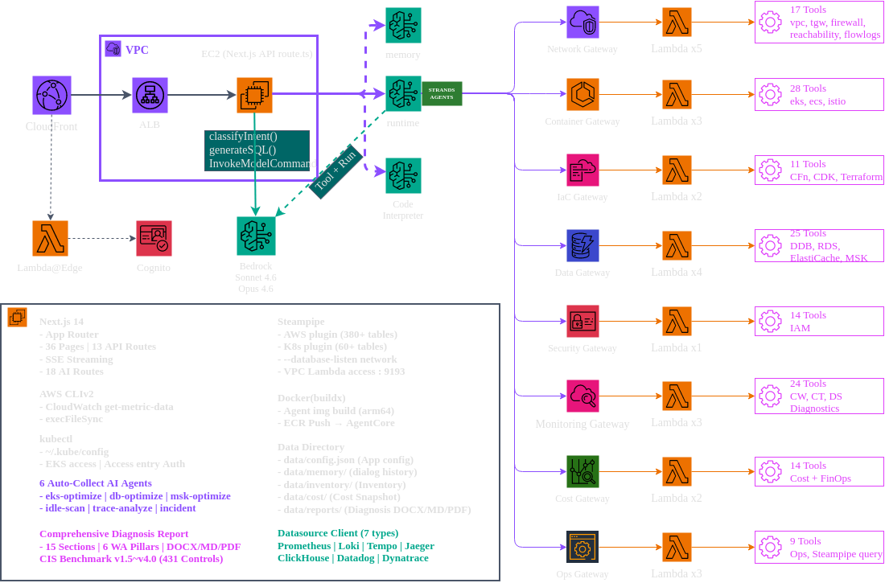

<!-- Slide 1: Block 2 Intro -->

@type: section
@transition: fade

# Architecture Deep Dive
## AWSops 기술 아키텍처

:::notes
{timing: 1min}
이제 AWSops가 어떻게 만들어졌는지, 기술 아키텍처를 상세히 살펴보겠습니다.
인프라부터 데이터 레이어, AI 엔진, 보안까지 순서대로 진행합니다.
Level 300 세션답게 내부 구현 디테일까지 다루겠습니다.
{cue: transition}
전체 아키텍처 다이어그램부터 보겠습니다.
:::

---

<!-- Slide 2: Overall Architecture Diagram -->

@type: content
@transition: slide

# Overall Architecture

:::html
<div style="display:flex;justify-content:center;align-items:center;width:100%;height:100%;">
  
</div>
:::

:::notes
{timing: 3min}
전체 아키텍처는 4개 계층입니다.

클라이언트 브라우저에서 시작하여 CloudFront를 거칩니다. CloudFront에는 Lambda@Edge가 붙어있고, 여기서 Cognito JWT 토큰을 검증합니다. 인증되지 않은 요청은 여기서 차단됩니다.

{cue: pause}

인증을 통과하면 Internal ALB로 라우팅됩니다. ALB 뒤에는 Private Subnet의 EC2 인스턴스가 있고, Next.js 14 App Router가 실행됩니다. EC2는 t4g.2xlarge ARM 인스턴스를 사용합니다. Graviton 기반이라 x86 대비 20% 가격 절감이 있습니다.

데이터는 Steampipe의 내장 PostgreSQL에서 조회하고, AI 분석은 Bedrock AgentCore를 통해 처리합니다.

{cue: question}
중요한 포인트는, EC2에 Public IP가 없습니다. CloudFront + ALB를 통해서만 접근 가능하고, ALB의 Security Group은 CloudFront Managed Prefix List만 허용합니다.

{cue: transition}
CDK로 이 전체 인프라를 코드로 관리합니다.
:::

---

<!-- Slide 3: CDK Infrastructure -->

@type: content
@transition: slide

# CDK Infrastructure-as-Code

::: left

### `infra-cdk/` 구조

- **awsops-stack.ts** — VPC, EC2, ALB, CloudFront
- **cognito-stack.ts** — User Pool, Lambda@Edge
- `cdk deploy` 한 번에 전체 인프라 생성

### 네트워크 설계

- VPC — 기존 VPC 사용 또는 자동 생성
- EC2 — **Private Subnet** (Public IP 없음)
- ALB — Internal, CloudFront Prefix List만 허용
- CloudFront — **CACHING_DISABLED** (실시간 데이터)

:::

::: right

### EC2 인스턴스 설정

- **t4g.2xlarge** (8 vCPU, 32GB, ARM64)
- Steampipe + Next.js + Powerpipe 동시 실행
- IMDSv2 강제 (Hop Limit 2)
- SSM Session Manager 접근 (SSH 불필요)

### CloudFront 설정

- X-Custom-Secret 헤더로 ALB 원본 검증
- CACHING_DISABLED 정책 (실시간 데이터)
- Lambda@Edge Python 3.12 (us-east-1)

:::

:::notes
{timing: 2min}
인프라는 CDK 두 개의 스택으로 관리합니다.

awsops-stack.ts가 핵심인데, VPC, EC2, ALB, CloudFront를 하나의 스택으로 생성합니다. 기존 VPC가 있으면 파라미터로 전달해서 재사용할 수 있고, 없으면 자동으로 새 VPC를 만듭니다.

중요한 설계 결정이 CloudFront의 CACHING_DISABLED입니다. 일반적으로 CloudFront는 캐싱을 위해 사용하지만, AWSops는 실시간 데이터 대시보드라서 캐싱을 끄고, 순수하게 보안과 글로벌 엣지 접근을 위해 사용합니다.

{cue: transition}
이제 데이터 레이어를 보겠습니다.
:::

---

<!-- Slide 4: Data Layer — Steampipe -->

@type: content
@transition: slide

# Data Layer: Steampipe

:::html
<div class="tab-bar" style="display:flex;gap:8px;margin-bottom:16px;flex-wrap:wrap;">
  <button class="tab-btn" style="padding:8px 16px;border:none;border-radius:6px;background:#00d4ff;color:#0a0e1a;font-weight:bold;cursor:pointer;font-size:14px;" onclick="(function(b,i){var p=b.closest('.slide-body')||b.parentNode.parentNode.parentNode;p.querySelectorAll('.tc').forEach(function(c,j){c.style.display=j===i?'block':'none'});var btns=b.parentNode.querySelectorAll('.tab-btn');btns.forEach(function(x){x.style.background='#1a2540';x.style.color='#b0b0b0';x.classList.remove('active')});b.style.background='#00d4ff';b.style.color='#0a0e1a';b.classList.add('active')})(this,0)">Architecture</button>
  <button class="tab-btn" style="padding:8px 16px;border:none;border-radius:6px;background:#1a2540;color:#b0b0b0;font-weight:bold;cursor:pointer;font-size:14px;" onclick="(function(b,i){var p=b.closest('.slide-body')||b.parentNode.parentNode.parentNode;p.querySelectorAll('.tc').forEach(function(c,j){c.style.display=j===i?'block':'none'});var btns=b.parentNode.querySelectorAll('.tab-btn');btns.forEach(function(x){x.style.background='#1a2540';x.style.color='#b0b0b0';x.classList.remove('active')});b.style.background='#00d4ff';b.style.color='#0a0e1a';b.classList.add('active')})(this,1)">Performance</button>
  <button class="tab-btn" style="padding:8px 16px;border:none;border-radius:6px;background:#1a2540;color:#b0b0b0;font-weight:bold;cursor:pointer;font-size:14px;" onclick="(function(b,i){var p=b.closest('.slide-body')||b.parentNode.parentNode.parentNode;p.querySelectorAll('.tc').forEach(function(c,j){c.style.display=j===i?'block':'none'});var btns=b.parentNode.querySelectorAll('.tab-btn');btns.forEach(function(x){x.style.background='#1a2540';x.style.color='#b0b0b0';x.classList.remove('active')});b.style.background='#00d4ff';b.style.color='#0a0e1a';b.classList.add('active')})(this,2)">Multi-Account</button>
</div>
<div class="tc" style="display:block;padding:12px;background:rgba(15,22,41,0.5);border-radius:8px;">
<div style="display:grid;grid-template-columns:1fr 1fr;gap:16px;">
  <div style="background:rgba(0,212,255,0.1);border:1px solid rgba(0,212,255,0.3);border-radius:8px;padding:16px;">
    <div style="color:#00d4ff;font-weight:bold;font-size:16px;margin-bottom:8px;">AWS APIs → Steampipe</div>
    <div style="color:#b0b0b0;">FDW Plugin이 AWS API를 PostgreSQL 테이블로 변환</div>
    <div style="margin-top:8px;color:#8b95a5;font-size:13px;">380+ AWS 테이블 | 60+ K8s 테이블</div>
  </div>
  <div style="background:rgba(0,255,136,0.1);border:1px solid rgba(0,255,136,0.3);border-radius:8px;padding:16px;">
    <div style="color:#00ff88;font-weight:bold;font-size:16px;margin-bottom:8px;">Embedded PostgreSQL</div>
    <div style="color:#b0b0b0;">Port 9193, 외부 DB 설치 불필요</div>
    <div style="margin-top:8px;color:#8b95a5;font-size:13px;">SELECT * FROM aws_ec2_instance</div>
  </div>
</div>
</div>
<div class="tc" style="display:none;padding:12px;background:rgba(15,22,41,0.5);border-radius:8px;">
<div style="display:grid;grid-template-columns:1fr 1fr;gap:16px;">
  <div style="background:rgba(245,158,11,0.1);border:1px solid rgba(245,158,11,0.3);border-radius:8px;padding:16px;">
    <div style="color:#f59e0b;font-weight:bold;font-size:16px;margin-bottom:8px;">pg Pool vs CLI — 660x 차이</div>
    <div style="color:#b0b0b0;">Steampipe CLI: 프로세스 기동 + 플러그인 로드 + 연결</div>
    <div style="color:#b0b0b0;">pg Pool: 이미 떠있는 PostgreSQL에 SQL 전송</div>
  </div>
  <div style="background:rgba(168,85,247,0.1);border:1px solid rgba(168,85,247,0.3);border-radius:8px;padding:16px;">
    <div style="color:#a855f7;font-weight:bold;font-size:16px;margin-bottom:8px;">Cache & Batch</div>
    <div style="color:#b0b0b0;">node-cache: 5분 TTL (대시보드 23개 쿼리 프리워밍)</div>
    <div style="color:#b0b0b0;">batchQuery: 8개씩 병렬, pool 슬롯 2개 여유</div>
  </div>
</div>
</div>
<div class="tc" style="display:none;padding:12px;background:rgba(15,22,41,0.5);border-radius:8px;">
<div style="display:grid;grid-template-columns:1fr 1fr;gap:16px;">
  <div style="background:rgba(0,212,255,0.1);border:1px solid rgba(0,212,255,0.3);border-radius:8px;padding:16px;">
    <div style="color:#00d4ff;font-weight:bold;font-size:16px;margin-bottom:8px;">Aggregator Pattern</div>
    <div style="color:#b0b0b0;"><code>aws</code> — 모든 계정 통합 조회</div>
    <div style="color:#b0b0b0;"><code>aws_123456789012</code> — 개별 계정</div>
  </div>
  <div style="background:rgba(0,255,136,0.1);border:1px solid rgba(0,255,136,0.3);border-radius:8px;padding:16px;">
    <div style="color:#00ff88;font-weight:bold;font-size:16px;margin-bottom:8px;">buildSearchPath()</div>
    <div style="color:#b0b0b0;">동적 search_path 생성</div>
    <div style="color:#b0b0b0;"><code>public, aws_{{id}}, kubernetes, trivy</code></div>
    <div style="color:#b0b0b0;">캐시키에 accountId 접두사 → 계정별 분리</div>
  </div>
</div>
</div>
:::

:::notes
{timing: 3min}
데이터 레이어의 핵심은 Steampipe입니다.

Steampipe는 AWS API를 PostgreSQL 테이블로 변환하는 오픈소스 도구입니다. EC2 인스턴스 목록을 보려면 SELECT * FROM aws_ec2_instance 하면 됩니다. AWS CLI로 describe-instances를 호출하는 것보다 660배 빠릅니다.

{cue: pause}

왜 그렇게 빠르냐면, Steampipe CLI를 쓰면 매번 프로세스를 띄우고, 플러그인을 로드하고, 연결을 맺어야 합니다. 하지만 pg Pool로 직접 연결하면 이미 떠있는 PostgreSQL에 SQL을 보내기만 하면 됩니다. 이것이 아키텍처의 핵심 결정 중 하나였습니다.

멀티 어카운트는 Aggregator 패턴을 사용합니다. aws라는 연결명은 모든 계정을 통합 조회하고, aws_123456789012처럼 계정 ID를 붙이면 개별 계정만 조회합니다. buildSearchPath 함수가 search_path를 동적으로 생성합니다.

캐시는 node-cache로 5분 TTL을 적용합니다. 멀티 어카운트 환경에서는 캐시 키에 accountId를 접두사로 붙여서 계정별로 분리합니다.

{cue: transition}
다음은 AI 엔진입니다.
:::

---

<!-- Slide 5: AI Engine — Bedrock AgentCore -->

@type: content
@transition: slide

# AI Engine: Bedrock AgentCore

:::html
<div class="tab-bar" style="display:flex;gap:8px;margin-bottom:16px;flex-wrap:wrap;">
  <button class="tab-btn" style="padding:8px 16px;border:none;border-radius:6px;background:#00d4ff;color:#0a0e1a;font-weight:bold;cursor:pointer;font-size:14px;" onclick="(function(b,i){var p=b.closest('.slide-body')||b.parentNode.parentNode.parentNode;p.querySelectorAll('.tc').forEach(function(c,j){c.style.display=j===i?'block':'none'});var btns=b.parentNode.querySelectorAll('.tab-btn');btns.forEach(function(x){x.style.background='#1a2540';x.style.color='#b0b0b0';x.classList.remove('active')});b.style.background='#00d4ff';b.style.color='#0a0e1a';b.classList.add('active')})(this,0)">Runtime</button>
  <button class="tab-btn" style="padding:8px 16px;border:none;border-radius:6px;background:#1a2540;color:#b0b0b0;font-weight:bold;cursor:pointer;font-size:14px;" onclick="(function(b,i){var p=b.closest('.slide-body')||b.parentNode.parentNode.parentNode;p.querySelectorAll('.tc').forEach(function(c,j){c.style.display=j===i?'block':'none'});var btns=b.parentNode.querySelectorAll('.tab-btn');btns.forEach(function(x){x.style.background='#1a2540';x.style.color='#b0b0b0';x.classList.remove('active')});b.style.background='#00d4ff';b.style.color='#0a0e1a';b.classList.add('active')})(this,1)">8 Gateways</button>
  <button class="tab-btn" style="padding:8px 16px;border:none;border-radius:6px;background:#1a2540;color:#b0b0b0;font-weight:bold;cursor:pointer;font-size:14px;" onclick="(function(b,i){var p=b.closest('.slide-body')||b.parentNode.parentNode.parentNode;p.querySelectorAll('.tc').forEach(function(c,j){c.style.display=j===i?'block':'none'});var btns=b.parentNode.querySelectorAll('.tab-btn');btns.forEach(function(x){x.style.background='#1a2540';x.style.color='#b0b0b0';x.classList.remove('active')});b.style.background='#00d4ff';b.style.color='#0a0e1a';b.classList.add('active')})(this,2)">19 Lambda</button>
</div>
<div class="tc" style="display:block;padding:12px;background:rgba(15,22,41,0.5);border-radius:8px;">
<div style="display:grid;grid-template-columns:1fr 1fr 1fr;gap:16px;">
  <div style="background:rgba(0,212,255,0.1);border:1px solid rgba(0,212,255,0.3);border-radius:8px;padding:16px;text-align:center;">
    <div style="font-size:32px;margin-bottom:8px;">🐍</div>
    <div style="color:#00d4ff;font-weight:bold;margin-bottom:4px;">Strands Agent</div>
    <div style="color:#8b95a5;font-size:13px;">Python 에이전트 프레임워크</div>
  </div>
  <div style="background:rgba(0,255,136,0.1);border:1px solid rgba(0,255,136,0.3);border-radius:8px;padding:16px;text-align:center;">
    <div style="font-size:32px;margin-bottom:8px;">🧠</div>
    <div style="color:#00ff88;font-weight:bold;margin-bottom:4px;">Claude Opus 4.6</div>
    <div style="color:#8b95a5;font-size:13px;">Bedrock 모델 (서울 리전)</div>
  </div>
  <div style="background:rgba(168,85,247,0.1);border:1px solid rgba(168,85,247,0.3);border-radius:8px;padding:16px;text-align:center;">
    <div style="font-size:32px;margin-bottom:8px;">🐳</div>
    <div style="color:#a855f7;font-weight:bold;margin-bottom:4px;">Docker ARM64</div>
    <div style="color:#8b95a5;font-size:13px;">ECR → AgentCore Runtime</div>
  </div>
</div>
</div>
<div class="tc" style="display:none;padding:12px;background:rgba(15,22,41,0.5);border-radius:8px;">
<div style="display:grid;grid-template-columns:1fr 1fr;gap:12px;">
  <div style="background:rgba(0,212,255,0.1);border:1px solid rgba(0,212,255,0.3);border-radius:8px;padding:12px;">
    <div style="display:flex;justify-content:space-between;"><span style="color:#00d4ff;font-weight:bold;">Network</span><span style="color:#8b95a5;">17 tools</span></div>
    <div style="color:#8b95a5;font-size:12px;margin-top:4px;">VPC, TGW, Firewall, Reachability, Flow Logs</div>
  </div>
  <div style="background:rgba(0,255,136,0.1);border:1px solid rgba(0,255,136,0.3);border-radius:8px;padding:12px;">
    <div style="display:flex;justify-content:space-between;"><span style="color:#00ff88;font-weight:bold;">Container</span><span style="color:#8b95a5;">24 tools</span></div>
    <div style="color:#8b95a5;font-size:12px;margin-top:4px;">EKS, ECS, Istio 서비스 메시</div>
  </div>
  <div style="background:rgba(168,85,247,0.1);border:1px solid rgba(168,85,247,0.3);border-radius:8px;padding:12px;">
    <div style="display:flex;justify-content:space-between;"><span style="color:#a855f7;font-weight:bold;">IaC</span><span style="color:#8b95a5;">12 tools</span></div>
    <div style="color:#8b95a5;font-size:12px;margin-top:4px;">CDK, CloudFormation, Terraform</div>
  </div>
  <div style="background:rgba(245,158,11,0.1);border:1px solid rgba(245,158,11,0.3);border-radius:8px;padding:12px;">
    <div style="display:flex;justify-content:space-between;"><span style="color:#f59e0b;font-weight:bold;">Data</span><span style="color:#8b95a5;">24 tools</span></div>
    <div style="color:#8b95a5;font-size:12px;margin-top:4px;">DynamoDB, RDS, ElastiCache, MSK</div>
  </div>
  <div style="background:rgba(139,92,246,0.1);border:1px solid rgba(139,92,246,0.3);border-radius:8px;padding:12px;">
    <div style="display:flex;justify-content:space-between;"><span style="color:#8b5cf6;font-weight:bold;">Security</span><span style="color:#8b95a5;">14 tools</span></div>
    <div style="color:#8b95a5;font-size:12px;margin-top:4px;">IAM, 정책 시뮬레이션</div>
  </div>
  <div style="background:rgba(245,158,11,0.1);border:1px solid rgba(245,158,11,0.3);border-radius:8px;padding:12px;">
    <div style="display:flex;justify-content:space-between;"><span style="color:#f59e0b;font-weight:bold;">Monitoring</span><span style="color:#8b95a5;">16 tools</span></div>
    <div style="color:#8b95a5;font-size:12px;margin-top:4px;">CloudWatch, CloudTrail, Log Insights</div>
  </div>
  <div style="background:rgba(239,68,68,0.1);border:1px solid rgba(239,68,68,0.3);border-radius:8px;padding:12px;">
    <div style="display:flex;justify-content:space-between;"><span style="color:#ef4444;font-weight:bold;">Cost</span><span style="color:#8b95a5;">9 tools</span></div>
    <div style="color:#8b95a5;font-size:12px;margin-top:4px;">비용 분석, 예측, 예산</div>
  </div>
  <div style="background:rgba(59,130,246,0.1);border:1px solid rgba(59,130,246,0.3);border-radius:8px;padding:12px;">
    <div style="display:flex;justify-content:space-between;"><span style="color:#3b82f6;font-weight:bold;">Ops</span><span style="color:#8b95a5;">9 tools</span></div>
    <div style="color:#8b95a5;font-size:12px;margin-top:4px;">AWS 문서, API 호출, Steampipe SQL</div>
  </div>
</div>
</div>
<div class="tc" style="display:none;padding:12px;background:rgba(15,22,41,0.5);border-radius:8px;">
<div style="display:grid;grid-template-columns:1fr 1fr;gap:12px;">
  <div style="background:rgba(0,212,255,0.1);border:1px solid rgba(0,212,255,0.3);border-radius:8px;padding:12px;">
    <div style="color:#00d4ff;font-weight:bold;margin-bottom:4px;">Network Lambda (x5)</div>
    <div style="color:#8b95a5;font-size:12px;">VPC Reachability, Flow Log Query, TGW Analysis, Firewall Rules, Path Trace</div>
  </div>
  <div style="background:rgba(0,255,136,0.1);border:1px solid rgba(0,255,136,0.3);border-radius:8px;padding:12px;">
    <div style="color:#00ff88;font-weight:bold;margin-bottom:4px;">Container Lambda (x3)</div>
    <div style="color:#8b95a5;font-size:12px;">EKS Insights, ECS Troubleshoot, Istio Mesh</div>
  </div>
  <div style="background:rgba(168,85,247,0.1);border:1px solid rgba(168,85,247,0.3);border-radius:8px;padding:12px;">
    <div style="color:#a855f7;font-weight:bold;margin-bottom:4px;">IaC Lambda (x2)</div>
    <div style="color:#8b95a5;font-size:12px;">CFN Validate, CDK/Terraform Docs</div>
  </div>
  <div style="background:rgba(245,158,11,0.1);border:1px solid rgba(245,158,11,0.3);border-radius:8px;padding:12px;">
    <div style="color:#f59e0b;font-weight:bold;margin-bottom:4px;">Data Lambda (x4)</div>
    <div style="color:#8b95a5;font-size:12px;">DynamoDB, RDS, ElastiCache, MSK</div>
  </div>
  <div style="background:rgba(139,92,246,0.1);border:1px solid rgba(139,92,246,0.3);border-radius:8px;padding:12px;">
    <div style="color:#8b5cf6;font-weight:bold;margin-bottom:4px;">Security Lambda (x1)</div>
    <div style="color:#8b95a5;font-size:12px;">IAM Policy Simulator</div>
  </div>
  <div style="background:rgba(59,130,246,0.1);border:1px solid rgba(59,130,246,0.3);border-radius:8px;padding:12px;">
    <div style="color:#3b82f6;font-weight:bold;margin-bottom:4px;">Others (x4)</div>
    <div style="color:#8b95a5;font-size:12px;">Monitoring x2, Cost x1, Ops x1</div>
  </div>
</div>
</div>
:::

:::notes
{timing: 3min}
AI 엔진의 핵심은 Bedrock AgentCore입니다.

AgentCore Runtime에서 Strands Agent가 실행됩니다. Python으로 작성된 에이전트가 Docker ARM64 이미지로 패키징되어 AgentCore 관리형 서비스에서 실행됩니다. EC2에서는 Docker 이미지를 빌드만 하고, 실제 실행은 AgentCore가 담당합니다.

{cue: pause}

8개의 MCP Gateway가 전문 영역별로 나뉘어 있습니다. Network Gateway는 VPC, TGW, VPN, Reachability Analyzer 등 17개 도구를 제공합니다. Container Gateway는 EKS, ECS, Istio 관련 24개 도구를 가지고 있습니다.

각 Gateway 뒤에는 19개의 Lambda 함수가 실제 작업을 수행합니다. 예를 들어 VPC Reachability Analyzer는 Lambda에서 Network Insights Path를 생성하고 분석 결과를 반환합니다.

총 125개의 도구가 이 구조를 통해 AI 에이전트에 제공됩니다.

{cue: transition}
이 125개의 도구를 어떻게 자동으로 선택하느냐가 다음 주제입니다.
:::

---

<!-- Slide 5b: Gateway Tool Explorer -->

@type: content
@transition: slide

# Gateway Tool Explorer

:::html
<style>
:root {
            --bg-color: #0f1629;
            --text-color: white;
            --accent-cyan: #00d4ff;
            --accent-green: #00ff88;
            --accent-purple: #a855f7;
            --accent-orange: #ED7100;
            --button-bg: #1c2a4a;
            --button-hover-bg: #2a3d63;
        }

        body {
            font-family: 'Segoe UI', Tahoma, Geneva, Verdana, sans-serif;
            background-color: var(--bg-color);
            color: var(--text-color);
            margin: 0;
            padding: 20px;
            display: flex;
            justify-content: center;
            align-items: flex-start;
            min-height: 100vh;
            box-sizing: border-box;
        }

        .mcp-gateway-component {
            width: 100%;
            max-width: 1200px; /* A reasonable max-width for content */
            max-height: 550px;
            background-color: var(--bg-color);
            border-radius: 10px;
            box-shadow: 0 4px 20px rgba(0, 0, 0, 0.4);
            padding: 20px;
            display: flex;
            flex-direction: column;
            overflow: hidden; /* Ensures max-height is respected with scroll */
            box-sizing: border-box;
        }

        .gateway-buttons {
            display: flex;
            flex-wrap: wrap;
            gap: 15px;
            margin-bottom: 20px;
            justify-content: center;
        }

        .gateway-button {
            flex: 1 1 calc(25% - 15px); /* 4 items per row, with gap */
            max-width: calc(25% - 15px);
            background-color: var(--button-bg);
            border: none;
            border-radius: 8px;
            padding: 15px 10px;
            color: var(--text-color);
            font-size: 1rem;
            font-weight: 600;
            cursor: pointer;
            transition: background-color 0.2s ease, transform 0.1s ease, box-shadow 0.2s ease;
            display: flex;
            flex-direction: column;
            align-items: center;
            text-align: center;
            position: relative;
            box-shadow: 0 2px 5px rgba(0, 0, 0, 0.2);
            min-width: 120px; /* Ensure buttons don't get too small */
            box-sizing: border-box;
        }

        .gateway-button:hover {
            background-color: var(--button-hover-bg);
            transform: translateY(-2px);
            box-shadow: 0 4px 10px rgba(0, 0, 0, 0.3);
        }

        .gateway-button.active {
            background-color: var(--accent-cyan);
            color: var(--bg-color);
            box-shadow: 0 0 15px var(--accent-cyan), 0 0 5px rgba(0, 0, 0, 0.5);
            transform: translateY(-2px);
        }

        .gateway-button-icon {
            width: 30px;
            height: 30px;
            border-radius: 50%;
            margin-bottom: 8px;
            display: flex;
            align-items: center;
            justify-content: center;
            font-size: 1.2rem;
            font-weight: bold;
            color: var(--text-color); /* Fallback for default, overridden by specific colors */
        }

        .gateway-button.active .gateway-button-icon {
            color: var(--bg-color); /* Icon text color when button is active */
        }

        .gateway-button-label {
            margin-bottom: 5px;
        }

        .gateway-tool-count {
            font-size: 0.85rem;
            opacity: 0.8;
        }

        /* Specific icon colors */
        .gateway-button[data-gateway-name="Network"] .gateway-button-icon { background-color: var(--accent-cyan); }
        .gateway-button[data-gateway-name="Container"] .gateway-button-icon { background-color: var(--accent-green); }
        .gateway-button[data-gateway-name="IaC"] .gateway-button-icon { background-color: var(--accent-purple); }
        .gateway-button[data-gateway-name="Data"] .gateway-button-icon { background-color: var(--accent-orange); }
        .gateway-button[data-gateway-name="Security"] .gateway-button-icon { background-color: #8b5cf6; /* Deeper purple */ }
        .gateway-button[data-gateway-name="Monitoring"] .gateway-button-icon { background-color: #f59e0b; /* Yellow-orange */ }
        .gateway-button[data-gateway-name="Cost"] .gateway-button-icon { background-color: #ef4444; /* Red */ }
        .gateway-button[data-gateway-name="Ops"] .gateway-button-icon { background-color: #3b82f6; /* Blue */ }

        .tools-display-area {
            flex-grow: 1;
            background-color: #1a243a;
            border-radius: 8px;
            padding: 15px;
            overflow-y: auto; /* Enable scrolling for tools list */
            box-shadow: inset 0 2px 5px rgba(0, 0, 0, 0.3);
            min-height: 150px; /* Ensure space for tools even if initially empty */
            box-sizing: border-box;
            display: flex;
            flex-wrap: wrap;
            gap: 8px;
            align-content: flex-start; /* Align content to top */
        }

        .tool-badge {
            background-color: #33446a;
            color: white;
            padding: 8px 12px;
            border-radius: 20px;
            font-size: 0.9rem;
            white-space: nowrap;
            transition: background-color 0.2s ease;
        }

        .tool-badge:hover {
            background-color: var(--accent-cyan);
            color: var(--bg-color);
        }

        .no-tools-message {
            font-style: italic;
            opacity: 0.7;
            text-align: center;
            width: 100%;
            padding: 20px;
        }

        /* Responsive adjustments */
        @media (max-width: 900px) {
            .gateway-button {
                flex: 1 1 calc(33.333% - 15px); /* 3 items per row */
                max-width: calc(33.333% - 15px);
            }
        }

        @media (max-width: 600px) {
            .gateway-button {
                flex: 1 1 calc(50% - 15px); /* 2 items per row */
                max-width: calc(50% - 15px);
            }
        }

        @media (max-width: 400px) {
            .gateway-button {
                flex: 1 1 100%; /* 1 item per row */
                max-width: 100%;
            }
            .mcp-gateway-component {
                padding: 10px;
            }
            .gateway-buttons {
                gap: 10px;
            }
        }
</style>
<div class="mcp-gateway-component">
        <div class="gateway-buttons" id="gatewayButtonsContainer">
            <!-- Gateway buttons will be dynamically inserted here -->
        </div>
        <div class="tools-display-area" id="toolsDisplayArea">
            <p class="no-tools-message">게이트웨이를 클릭하여 사용 가능한 도구를 확인하세요.</p>
        </div>
    </div>

    <script>
        const gatewaysData = [
            {
                name: "Network",
                koreanLabel: "네트워크",
                iconText: "NW",
                tools: [
                    "get_path_trace_methodology", "find_ip_address", "get_eni_details", "list_vpcs",
                    "get_vpc_network_details", "get_vpc_flow_logs", "describe_network",
                    "list_transit_gateways", "get_tgw_details", "get_tgw_routes", "get_all_tgw_routes",
                    "list_tgw_peerings", "list_vpn_connections", "list_network_firewalls", "get_firewall_rules",
                    "analyze_reachability", "query_flow_logs"
                ]
            },
            {
                name: "Container",
                koreanLabel: "컨테이너",
                iconText: "CT",
                tools: [
                    "list_eks_clusters", "get_eks_vpc_config", "get_eks_insights", "get_cloudwatch_logs",
                    "get_cloudwatch_metrics", "get_eks_metrics_guidance", "get_policies_for_role",
                    "search_eks_troubleshoot_guide", "generate_app_manifest",
                    "ecs_resource_management", "ecs_troubleshooting_tool", "wait_for_service_ready",
                    "istio_overview", "list_virtual_services", "list_destination_rules",
                    "list_istio_gateways", "list_service_entries", "list_authorization_policies",
                    "list_peer_authentications", "check_sidecar_injection", "list_envoy_filters",
                    "list_istio_crds", "istio_troubleshooting", "query_istio_resource"
                ]
            },
            {
                name: "IaC",
                koreanLabel: "코드형 인프라",
                iconText: "IaC",
                tools: [
                    "validate_cloudformation_template", "check_cloudformation_template_compliance",
                    "troubleshoot_cloudformation_deployment", "search_cdk_documentation",
                    "search_cloudformation_documentation", "cdk_best_practices", "read_iac_documentation_page",
                    "SearchAwsProviderDocs", "SearchAwsccProviderDocs",
                    "SearchSpecificAwsIaModules", "SearchUserProvidedModule", "terraform_best_practices"
                ]
            },
            {
                name: "Data",
                koreanLabel: "데이터",
                iconText: "DB",
                tools: [
                    "list_tables", "describe_table", "query_table", "get_item",
                    "dynamodb_data_modeling", "compute_performances_and_costs",
                    "list_db_instances", "list_db_clusters", "describe_db_instance",
                    "describe_db_cluster", "execute_sql", "list_snapshots",
                    "list_cache_clusters", "describe_cache_cluster", "list_replication_groups",
                    "describe_replication_group", "list_serverless_caches", "elasticache_best_practices",
                    "list_clusters", "get_cluster_info", "get_configuration_info",
                    "get_bootstrap_brokers", "list_nodes", "msk_best_practices"
                ]
            },
            {
                name: "Security",
                koreanLabel: "보안",
                iconText: "SC",
                tools: [
                    "list_users", "get_user", "list_roles", "get_role_details",
                    "list_groups", "get_group", "list_policies", "list_user_policies",
                    "list_role_policies", "get_user_policy", "get_role_policy",
                    "list_access_keys", "simulate_principal_policy", "get_account_security_summary"
                ]
            },
            {
                name: "Monitoring",
                koreanLabel: "모니터링",
                iconText: "MO",
                tools: [
                    "get_metric_data", "get_metric_metadata", "analyze_metric",
                    "get_recommended_metric_alarms", "get_active_alarms", "get_alarm_history",
                    "describe_log_groups", "analyze_log_group", "execute_log_insights_query",
                    "get_logs_insight_query_results", "cancel_logs_insight_query",
                    "lookup_events", "list_event_data_stores", "lake_query",
                    "get_query_status", "get_query_results"
                ]
            },
            {
                name: "Cost",
                koreanLabel: "비용",
                iconText: "CO",
                tools: [
                    "get_today_date", "get_cost_and_usage", "get_cost_and_usage_comparisons",
                    "get_cost_comparison_drivers", "get_cost_forecast", "get_dimension_values",
                    "get_tag_values", "get_pricing", "list_budgets"
                ]
            },
            {
                name: "Ops",
                koreanLabel: "운영",
                iconText: "OP",
                tools: [
                    "search_documentation", "read_documentation", "recommend", "list_regions",
                    "get_regional_availability", "prompt_understanding", "call_aws",
                    "suggest_aws_commands", "run_steampipe_query"
                ]
            }
        ];

        const gatewayButtonsContainer = document.getElementById('gatewayButtonsContainer');
        const toolsDisplayArea = document.getElementById('toolsDisplayArea');

        function renderGatewayButtons() {
            gatewayButtonsContainer.innerHTML = '';
            gatewaysData.forEach(gateway => {
                const button = document.createElement('button');
                button.className = 'gateway-button';
                button.dataset.gatewayName = gateway.name;
                button.innerHTML = `
                    <div class="gateway-button-icon">${gateway.iconText}</div>
                    <div class="gateway-button-label">${gateway.koreanLabel}</div>
                    <div class="gateway-tool-count">${gateway.tools.length} tools</div>
                `;
                button.addEventListener('click', () => handleGatewayClick(gateway));
                gatewayButtonsContainer.appendChild(button);
            });
        }

        function handleGatewayClick(selectedGateway) {
            // Remove 'active' class from all buttons
            document.querySelectorAll('.gateway-button').forEach(button => {
                button.classList.remove('active');
            });

            // Add 'active' class to the clicked button
            const clickedButton = document.querySelector(`.gateway-button[data-gateway-name="${selectedGateway.name}"]`);
            if (clickedButton) {
                clickedButton.classList.add('active');
            }

            // Render tools for the selected gateway
            toolsDisplayArea.innerHTML = '';
            if (selectedGateway.tools && selectedGateway.tools.length > 0) {
                selectedGateway.tools.forEach(tool => {
                    const badge = document.createElement('span');
                    badge.className = 'tool-badge';
                    badge.textContent = tool;
                    toolsDisplayArea.appendChild(badge);
                });
            } else {
                toolsDisplayArea.innerHTML = '<p class="no-tools-message">선택된 게이트웨이에 대한 도구가 없습니다.</p>';
            }
        }

        // Initial rendering of buttons
        renderGatewayButtons();
    </script>
:::

:::notes
{timing: 2min}
8개 Gateway를 클릭하면 각 Gateway의 도구 목록을 볼 수 있습니다.
:::

<!-- Slide 6: AI Route Classification -->

@type: content
@transition: slide

# AI Route Classification

:::html
<div class="tab-bar" style="display:flex;gap:8px;margin-bottom:16px;flex-wrap:wrap;">
  <button class="tab-btn" style="padding:8px 16px;border:none;border-radius:6px;background:#00d4ff;color:#0a0e1a;font-weight:bold;cursor:pointer;font-size:14px;" onclick="(function(b,i){var p=b.closest('.slide-body')||b.parentNode.parentNode.parentNode;p.querySelectorAll('.tc').forEach(function(c,j){c.style.display=j===i?'block':'none'});var btns=b.parentNode.querySelectorAll('.tab-btn');btns.forEach(function(x){x.style.background='#1a2540';x.style.color='#b0b0b0';x.classList.remove('active')});b.style.background='#00d4ff';b.style.color='#0a0e1a';b.classList.add('active')})(this,0)">Classification Flow</button>
  <button class="tab-btn" style="padding:8px 16px;border:none;border-radius:6px;background:#1a2540;color:#b0b0b0;font-weight:bold;cursor:pointer;font-size:14px;" onclick="(function(b,i){var p=b.closest('.slide-body')||b.parentNode.parentNode.parentNode;p.querySelectorAll('.tc').forEach(function(c,j){c.style.display=j===i?'block':'none'});var btns=b.parentNode.querySelectorAll('.tab-btn');btns.forEach(function(x){x.style.background='#1a2540';x.style.color='#b0b0b0';x.classList.remove('active')});b.style.background='#00d4ff';b.style.color='#0a0e1a';b.classList.add('active')})(this,1)">18 Routes</button>
  <button class="tab-btn" style="padding:8px 16px;border:none;border-radius:6px;background:#1a2540;color:#b0b0b0;font-weight:bold;cursor:pointer;font-size:14px;" onclick="(function(b,i){var p=b.closest('.slide-body')||b.parentNode.parentNode.parentNode;p.querySelectorAll('.tc').forEach(function(c,j){c.style.display=j===i?'block':'none'});var btns=b.parentNode.querySelectorAll('.tab-btn');btns.forEach(function(x){x.style.background='#1a2540';x.style.color='#b0b0b0';x.classList.remove('active')});b.style.background='#00d4ff';b.style.color='#0a0e1a';b.classList.add('active')})(this,2)">Handler Types</button>
</div>
<div class="tc" style="display:block;padding:12px;background:rgba(15,22,41,0.5);border-radius:8px;">
<div style="display:flex;align-items:center;gap:16px;justify-content:center;flex-wrap:wrap;">
  <div style="background:rgba(0,212,255,0.1);border:1px solid rgba(0,212,255,0.3);border-radius:8px;padding:16px;text-align:center;min-width:160px;">
    <div style="color:#00d4ff;font-weight:bold;margin-bottom:4px;">User Input</div>
    <div style="color:#8b95a5;font-size:13px;">"EKS 비용 개선점 찾아줘"</div>
  </div>
  <div style="color:#00d4ff;font-size:24px;">→</div>
  <div style="background:rgba(245,158,11,0.1);border:1px solid rgba(245,158,11,0.3);border-radius:8px;padding:16px;text-align:center;min-width:160px;">
    <div style="color:#f59e0b;font-weight:bold;margin-bottom:4px;">Sonnet 4.6</div>
    <div style="color:#8b95a5;font-size:13px;">Intent Classification</div>
  </div>
  <div style="color:#00d4ff;font-size:24px;">→</div>
  <div style="background:rgba(0,255,136,0.1);border:1px solid rgba(0,255,136,0.3);border-radius:8px;padding:16px;text-align:center;min-width:160px;">
    <div style="color:#00ff88;font-weight:bold;margin-bottom:4px;">eks-optimize</div>
    <div style="color:#8b95a5;font-size:13px;">auto-collect handler</div>
  </div>
  <div style="color:#00d4ff;font-size:24px;">→</div>
  <div style="background:rgba(168,85,247,0.1);border:1px solid rgba(168,85,247,0.3);border-radius:8px;padding:16px;text-align:center;min-width:160px;">
    <div style="color:#a855f7;font-weight:bold;margin-bottom:4px;">SSE Streaming</div>
    <div style="color:#8b95a5;font-size:13px;">실시간 응답 + 도구 표시</div>
  </div>
</div>
</div>
<div class="tc" style="display:none;padding:12px;background:rgba(15,22,41,0.5);border-radius:8px;">
<div style="display:grid;grid-template-columns:1fr 1fr 1fr;gap:8px;font-size:13px;">
  <div style="background:rgba(0,212,255,0.15);border-radius:6px;padding:8px;"><span style="color:#00d4ff;">code</span> — Code Interpreter</div>
  <div style="background:rgba(0,212,255,0.15);border-radius:6px;padding:8px;"><span style="color:#00d4ff;">network</span> — VPC/TGW/VPN</div>
  <div style="background:rgba(0,212,255,0.15);border-radius:6px;padding:8px;"><span style="color:#00d4ff;">container</span> — EKS/ECS</div>
  <div style="background:rgba(0,212,255,0.15);border-radius:6px;padding:8px;"><span style="color:#00d4ff;">iac</span> — CDK/CFn/TF</div>
  <div style="background:rgba(0,212,255,0.15);border-radius:6px;padding:8px;"><span style="color:#00d4ff;">data</span> — DB Services</div>
  <div style="background:rgba(0,212,255,0.15);border-radius:6px;padding:8px;"><span style="color:#00d4ff;">security</span> — IAM/Policy</div>
  <div style="background:rgba(245,158,11,0.15);border-radius:6px;padding:8px;"><span style="color:#f59e0b;">monitoring</span> — CW/CT</div>
  <div style="background:rgba(245,158,11,0.15);border-radius:6px;padding:8px;"><span style="color:#f59e0b;">cost</span> — Billing</div>
  <div style="background:rgba(245,158,11,0.15);border-radius:6px;padding:8px;"><span style="color:#f59e0b;">aws-data</span> — Steampipe SQL</div>
  <div style="background:rgba(0,255,136,0.15);border-radius:6px;padding:8px;"><span style="color:#00ff88;">eks-optimize</span></div>
  <div style="background:rgba(0,255,136,0.15);border-radius:6px;padding:8px;"><span style="color:#00ff88;">db-optimize</span></div>
  <div style="background:rgba(0,255,136,0.15);border-radius:6px;padding:8px;"><span style="color:#00ff88;">msk-optimize</span></div>
  <div style="background:rgba(0,255,136,0.15);border-radius:6px;padding:8px;"><span style="color:#00ff88;">idle-scan</span></div>
  <div style="background:rgba(0,255,136,0.15);border-radius:6px;padding:8px;"><span style="color:#00ff88;">trace-analyze</span></div>
  <div style="background:rgba(0,255,136,0.15);border-radius:6px;padding:8px;"><span style="color:#00ff88;">incident</span></div>
  <div style="background:rgba(168,85,247,0.15);border-radius:6px;padding:8px;"><span style="color:#a855f7;">datasource</span></div>
  <div style="background:rgba(168,85,247,0.15);border-radius:6px;padding:8px;"><span style="color:#a855f7;">general</span></div>
  <div style="background:rgba(168,85,247,0.15);border-radius:6px;padding:8px;"><span style="color:#a855f7;">multi-route</span></div>
</div>
</div>
<div class="tc" style="display:none;padding:12px;background:rgba(15,22,41,0.5);border-radius:8px;">
<div style="display:grid;grid-template-columns:1fr 1fr;gap:12px;">
  <div style="background:rgba(0,255,136,0.1);border:1px solid rgba(0,255,136,0.3);border-radius:8px;padding:12px;">
    <div style="color:#00ff88;font-weight:bold;margin-bottom:4px;">auto-collect</div>
    <div style="color:#8b95a5;font-size:13px;">데이터 자동 수집 → Bedrock 분석<br>eks-optimize, db-optimize, msk-optimize, idle-scan, trace-analyze, incident</div>
  </div>
  <div style="background:rgba(0,212,255,0.1);border:1px solid rgba(0,212,255,0.3);border-radius:8px;padding:12px;">
    <div style="color:#00d4ff;font-weight:bold;margin-bottom:4px;">sql</div>
    <div style="color:#8b95a5;font-size:13px;">Steampipe SQL 생성 → 실행 → 분석<br>aws-data 라우트</div>
  </div>
  <div style="background:rgba(168,85,247,0.1);border:1px solid rgba(168,85,247,0.3);border-radius:8px;padding:12px;">
    <div style="color:#a855f7;font-weight:bold;margin-bottom:4px;">datasource</div>
    <div style="color:#8b95a5;font-size:13px;">외부 데이터소스 쿼리 (PromQL/LogQL)<br>datasource 라우트</div>
  </div>
  <div style="background:rgba(245,158,11,0.1);border:1px solid rgba(245,158,11,0.3);border-radius:8px;padding:12px;">
    <div style="color:#f59e0b;font-weight:bold;margin-bottom:4px;">gateway</div>
    <div style="color:#8b95a5;font-size:13px;">AgentCore MCP Gateway 호출<br>network, container, data, security 등</div>
  </div>
</div>
</div>
:::

:::notes
{timing: 3min}
AI 라우팅의 핵심은 ROUTE_REGISTRY라는 단일 소스입니다.

18개의 라우트가 등록되어 있고, 각 라우트에는 gateway, display name, description, tools, examples가 정의되어 있습니다. 새로운 도구를 추가하면 분류 프롬프트, UI 표시, 게이트웨이 매핑이 자동으로 업데이트됩니다.

{cue: pause}

분류 흐름을 보면, 사용자가 자연어로 질문하면 Sonnet 4.6 모델이 18개 라우트 중 1-3개를 선택합니다. 멀티 라우트도 지원합니다. 예를 들어 "VPC 보안그룹과 비용을 분석해줘"라고 하면 network과 cost 두 라우트가 선택됩니다.

핸들러 타입이 5가지 있습니다. auto-collect는 자동 데이터 수집 에이전트, sql은 Steampipe 직접 쿼리, datasource는 Prometheus 같은 외부 데이터소스, code는 Python 코드 인터프리터, gateway는 MCP Gateway 호출입니다.

{cue: transition}
auto-collect가 가장 흥미로운 부분입니다.
:::

---

<!-- Slide 7: Auto-Collect Agents -->

@type: content
@transition: slide

# Auto-Collect Agents

::: left

### 6 Collectors

| Agent | Target |
|-------|--------|
| **eks-optimize** | EKS rightsizing |
| **db-optimize** | RDS/ElastiCache/OpenSearch |
| **msk-optimize** | MSK Kafka brokers |
| **idle-scan** | Unused resources |
| **trace-analyze** | Distributed traces |
| **incident** | Multi-source incidents |

:::

::: right

### 4-Phase Architecture

1. **Detect** -- 데이터소스 자동 탐지
   - Prometheus, Loki, Tempo, CloudWatch
2. **Collect** -- 병렬 데이터 수집
   - PromQL + Steampipe SQL + CloudWatch
3. **Format** -- Bedrock 컨텍스트 포맷팅
   - `formatContext()` 메서드
4. **Analyze** -- Opus 4.6 심층 분석
   - `analysisPrompt` 시스템 프롬프트

### Collector Interface

```
interface Collector {
  collect(send, accountId?)
  formatContext(data)
  analysisPrompt: string
  displayName: string
}
```

:::

:::notes
{timing: 3min}
Auto-Collect Agent는 AWSops의 가장 강력한 기능입니다.

6개의 Collector가 있고, 모두 같은 인터페이스를 구현합니다. collect 메서드로 데이터를 수집하고, formatContext로 Bedrock에 전달할 컨텍스트를 만들고, analysisPrompt로 분석 프롬프트를 제공합니다.

{cue: pause}

4단계 아키텍처를 보면, 첫 번째 Detect 단계에서 사용 가능한 데이터소스를 자동 탐지합니다. Prometheus가 연결되어 있으면 PromQL을 사용하고, 없으면 CloudWatch와 Steampipe만으로 분석합니다. 이 Graceful Degradation이 핵심입니다.

예를 들어 eks-optimize는 Prometheus에서 CPU/Memory 사용량, CPU Throttling, Pod 재시작, HTTP 에러율을 수집하고, Steampipe에서 K8s 리소스 request/limit를 수집합니다. 없는 메트릭은 건너뜁니다. 이를 MetricCandidate 패턴이라고 합니다. 여러 PromQL 쿼리를 순서대로 시도하고, 첫 번째로 데이터가 반환되는 쿼리를 사용합니다.

{cue: transition}
데이터소스 통합을 좀 더 자세히 보겠습니다.
:::

---

<!-- Slide 8: Datasource Integration -->

@type: content
@transition: slide

# Datasource Integration

:::html
<div class="tab-bar" style="display:flex;gap:8px;margin-bottom:16px;flex-wrap:wrap;">
  <button class="tab-btn" style="padding:8px 16px;border:none;border-radius:6px;background:#00d4ff;color:#0a0e1a;font-weight:bold;cursor:pointer;font-size:14px;" onclick="(function(b,i){var p=b.closest('.slide-body')||b.parentNode.parentNode.parentNode;p.querySelectorAll('.tc').forEach(function(c,j){c.style.display=j===i?'block':'none'});var btns=b.parentNode.querySelectorAll('.tab-btn');btns.forEach(function(x){x.style.background='#1a2540';x.style.color='#b0b0b0';x.classList.remove('active')});b.style.background='#00d4ff';b.style.color='#0a0e1a';b.classList.add('active')})(this,0)">Metrics</button>
  <button class="tab-btn" style="padding:8px 16px;border:none;border-radius:6px;background:#1a2540;color:#b0b0b0;font-weight:bold;cursor:pointer;font-size:14px;" onclick="(function(b,i){var p=b.closest('.slide-body')||b.parentNode.parentNode.parentNode;p.querySelectorAll('.tc').forEach(function(c,j){c.style.display=j===i?'block':'none'});var btns=b.parentNode.querySelectorAll('.tab-btn');btns.forEach(function(x){x.style.background='#1a2540';x.style.color='#b0b0b0';x.classList.remove('active')});b.style.background='#00d4ff';b.style.color='#0a0e1a';b.classList.add('active')})(this,1)">Logs</button>
  <button class="tab-btn" style="padding:8px 16px;border:none;border-radius:6px;background:#1a2540;color:#b0b0b0;font-weight:bold;cursor:pointer;font-size:14px;" onclick="(function(b,i){var p=b.closest('.slide-body')||b.parentNode.parentNode.parentNode;p.querySelectorAll('.tc').forEach(function(c,j){c.style.display=j===i?'block':'none'});var btns=b.parentNode.querySelectorAll('.tab-btn');btns.forEach(function(x){x.style.background='#1a2540';x.style.color='#b0b0b0';x.classList.remove('active')});b.style.background='#00d4ff';b.style.color='#0a0e1a';b.classList.add('active')})(this,2)">Traces</button>
  <button class="tab-btn" style="padding:8px 16px;border:none;border-radius:6px;background:#1a2540;color:#b0b0b0;font-weight:bold;cursor:pointer;font-size:14px;" onclick="(function(b,i){var p=b.closest('.slide-body')||b.parentNode.parentNode.parentNode;p.querySelectorAll('.tc').forEach(function(c,j){c.style.display=j===i?'block':'none'});var btns=b.parentNode.querySelectorAll('.tab-btn');btns.forEach(function(x){x.style.background='#1a2540';x.style.color='#b0b0b0';x.classList.remove('active')});b.style.background='#00d4ff';b.style.color='#0a0e1a';b.classList.add('active')})(this,3)">Unified Client</button>
</div>
<div class="tc" style="display:block;padding:12px;background:rgba(15,22,41,0.5);border-radius:8px;">
<div style="display:grid;grid-template-columns:1fr 1fr 1fr;gap:16px;">
  <div style="background:rgba(245,158,11,0.1);border:1px solid rgba(245,158,11,0.3);border-radius:8px;padding:16px;text-align:center;">
    <div style="color:#f59e0b;font-weight:bold;font-size:18px;margin-bottom:8px;">Prometheus</div>
    <div style="color:#8b95a5;font-size:13px;">PromQL</div>
    <div style="color:#b0b0b0;font-size:12px;margin-top:8px;">rate(http_requests_total[5m])</div>
  </div>
  <div style="background:rgba(245,158,11,0.1);border:1px solid rgba(245,158,11,0.3);border-radius:8px;padding:16px;text-align:center;">
    <div style="color:#f59e0b;font-weight:bold;font-size:18px;margin-bottom:8px;">Datadog</div>
    <div style="color:#8b95a5;font-size:13px;">Query API</div>
    <div style="color:#b0b0b0;font-size:12px;margin-top:8px;">avg:system.cpu.user</div>
  </div>
  <div style="background:rgba(245,158,11,0.1);border:1px solid rgba(245,158,11,0.3);border-radius:8px;padding:16px;text-align:center;">
    <div style="color:#f59e0b;font-weight:bold;font-size:18px;margin-bottom:8px;">Dynatrace</div>
    <div style="color:#8b95a5;font-size:13px;">Metrics v2 API</div>
    <div style="color:#b0b0b0;font-size:12px;margin-top:8px;">builtin:host.cpu.usage</div>
  </div>
</div>
</div>
<div class="tc" style="display:none;padding:12px;background:rgba(15,22,41,0.5);border-radius:8px;">
<div style="display:grid;grid-template-columns:1fr 1fr;gap:16px;">
  <div style="background:rgba(0,255,136,0.1);border:1px solid rgba(0,255,136,0.3);border-radius:8px;padding:16px;text-align:center;">
    <div style="color:#00ff88;font-weight:bold;font-size:18px;margin-bottom:8px;">Loki</div>
    <div style="color:#8b95a5;font-size:13px;">LogQL</div>
    <div style="color:#b0b0b0;font-size:12px;margin-top:8px;">{{level="error"}} | json</div>
  </div>
  <div style="background:rgba(0,255,136,0.1);border:1px solid rgba(0,255,136,0.3);border-radius:8px;padding:16px;text-align:center;">
    <div style="color:#00ff88;font-weight:bold;font-size:18px;margin-bottom:8px;">ClickHouse</div>
    <div style="color:#8b95a5;font-size:13px;">SQL</div>
    <div style="color:#b0b0b0;font-size:12px;margin-top:8px;">SELECT * FROM logs WHERE level='error'</div>
  </div>
</div>
</div>
<div class="tc" style="display:none;padding:12px;background:rgba(15,22,41,0.5);border-radius:8px;">
<div style="display:grid;grid-template-columns:1fr 1fr 1fr;gap:16px;">
  <div style="background:rgba(0,212,255,0.1);border:1px solid rgba(0,212,255,0.3);border-radius:8px;padding:16px;text-align:center;">
    <div style="color:#00d4ff;font-weight:bold;font-size:18px;margin-bottom:8px;">Tempo</div>
    <div style="color:#8b95a5;font-size:13px;">TraceQL</div>
    <div style="color:#b0b0b0;font-size:12px;margin-top:8px;">{{ status = error }}</div>
  </div>
  <div style="background:rgba(0,212,255,0.1);border:1px solid rgba(0,212,255,0.3);border-radius:8px;padding:16px;text-align:center;">
    <div style="color:#00d4ff;font-weight:bold;font-size:18px;margin-bottom:8px;">Jaeger</div>
    <div style="color:#8b95a5;font-size:13px;">gRPC API</div>
    <div style="color:#b0b0b0;font-size:12px;margin-top:8px;">/api/traces?service=payment</div>
  </div>
  <div style="background:rgba(0,212,255,0.1);border:1px solid rgba(0,212,255,0.3);border-radius:8px;padding:16px;text-align:center;">
    <div style="color:#00d4ff;font-weight:bold;font-size:18px;margin-bottom:8px;">ClickHouse</div>
    <div style="color:#8b95a5;font-size:13px;">SQL (Trace Backend)</div>
    <div style="color:#b0b0b0;font-size:12px;margin-top:8px;">SELECT * FROM otel_traces</div>
  </div>
</div>
</div>
<div class="tc" style="display:none;padding:12px;background:rgba(15,22,41,0.5);border-radius:8px;">
<div style="display:grid;grid-template-columns:1fr 1fr;gap:16px;">
  <div style="background:rgba(168,85,247,0.1);border:1px solid rgba(168,85,247,0.3);border-radius:8px;padding:16px;">
    <div style="color:#a855f7;font-weight:bold;margin-bottom:8px;">datasource-client.ts</div>
    <div style="color:#8b95a5;font-size:13px;">통합 쿼리 인터페이스<br><code>queryDatasource(type, query, range)</code><br>하나의 함수로 7개 데이터소스 쿼리</div>
  </div>
  <div style="background:rgba(168,85,247,0.1);border:1px solid rgba(168,85,247,0.3);border-radius:8px;padding:16px;">
    <div style="color:#a855f7;font-weight:bold;margin-bottom:8px;">Auto-Discovery</div>
    <div style="color:#8b95a5;font-size:13px;">config.json에 URL 등록 → 헬스체크 자동 감지<br>키워드 분석으로 적절한 데이터소스 자동 라우팅</div>
  </div>
</div>
</div>
:::

:::notes
{timing: 2min}
AWSops는 7가지 외부 데이터소스를 지원합니다.

메트릭은 Prometheus, Datadog, Dynatrace. 로그는 Loki와 ClickHouse. 트레이스는 Tempo와 Jaeger입니다.

{cue: pause}

모든 데이터소스는 datasource-registry.ts에 메타데이터가 등록되어 있습니다. 쿼리 언어, 헬스체크 엔드포인트, 기본 포트, 예제 쿼리가 포함됩니다. datasource-client.ts가 통합 쿼리 인터페이스를 제공해서, queryDatasource 함수 하나로 어떤 데이터소스든 쿼리할 수 있습니다.

Auto-Discovery 기능이 있어서, data/config.json에 URL만 등록하면 헬스체크로 연결 가능 여부를 자동 감지합니다. 사용자 질문에서 키워드를 분석해서 적절한 데이터소스로 자동 라우팅합니다.

{cue: transition}
마지막으로 보안 아키텍처를 보겠습니다.
:::

---

<!-- Slide 9: Security Architecture -->

@type: content
@transition: slide

# Security Architecture

:::html
<div class="flow-h">
  <div class="flow-group bg-blue" data-fragment-index="1">
    <div class="flow-group-label">Authentication</div>
    <div class="flow-box">Cognito User Pool</div>
    <div class="flow-box">Lambda@Edge (Python)</div>
    <div class="flow-box">JWT Verification</div>
    <div class="flow-box">HttpOnly Cookie</div>
  </div>
  <div class="flow-arrow">&rarr;</div>
  <div class="flow-group bg-orange" data-fragment-index="2">
    <div class="flow-group-label">Network Security</div>
    <div class="flow-box">Private Subnet Only</div>
    <div class="flow-box">No Public IP</div>
    <div class="flow-box">CF Prefix List &rarr; ALB SG</div>
    <div class="flow-box">X-Custom-Secret Header</div>
  </div>
  <div class="flow-arrow">&rarr;</div>
  <div class="flow-group bg-green" data-fragment-index="3">
    <div class="flow-group-label">Access Control</div>
    <div class="flow-box">IMDSv2 (Hop Limit 2)</div>
    <div class="flow-box">SSM Session Manager</div>
    <div class="flow-box">Admin Email List</div>
    <div class="flow-box">Per-User Memory</div>
  </div>
</div>
:::

:::notes
{timing: 2min}
보안은 3계층 방어입니다.

인증 계층에서는 Cognito User Pool과 Lambda@Edge를 사용합니다. Lambda@Edge가 CloudFront에서 모든 요청의 JWT 토큰을 검증합니다. 토큰이 없거나 만료되면 Cognito 로그인 페이지로 리다이렉트합니다. 로그아웃 시 HttpOnly 쿠키는 브라우저 JavaScript로 삭제할 수 없기 때문에 서버 사이드 API를 통해 삭제합니다.

{cue: pause}

네트워크 계층에서는 EC2가 Private Subnet에만 있고 Public IP가 없습니다. ALB Security Group은 CloudFront Managed Prefix List만 허용합니다. 추가로 X-Custom-Secret 헤더로 ALB가 CloudFront를 통한 요청인지 검증합니다. 이 헤더가 없는 직접 ALB 접근은 차단됩니다.

접근 제어 계층에서는 IMDSv2를 강제하고 Hop Limit 2로 컨테이너 환경에서의 메타데이터 접근도 차단합니다. SSH 대신 SSM Session Manager를 사용하고, Accounts 페이지 같은 관리 기능은 adminEmails 설정으로 접근을 제한합니다.

{cue: transition}
정리하겠습니다.
:::

---

<!-- Slide 10: Architecture Decisions -->

@type: content
@transition: slide

# Key Architecture Decisions

::: left

### Performance Decisions

- **pg Pool > Steampipe CLI** -- 660x faster
- **node-cache 5min TTL** -- 대시보드 23개 쿼리 프리워밍
- **batchQuery (5 sequential)** -- 동시 연결 제한 준수
- **cache-warmer** -- 4분 주기 백그라운드 워밍

### AI Decisions

- **Sonnet 4.6** -- 라우트 분류 (빠르고 정확)
- **Opus 4.6** -- 종합진단 리포트 (깊은 분석)
- **MetricCandidate** -- PromQL 자동 탐색 패턴

:::

::: right

### Resilience Decisions

- **Graceful Degradation** -- 데이터소스 없으면 Skip
- **Cost Availability Probe** -- MSP 환경 자동 감지
- **Snapshot Fallback** -- Cost API 실패 시 로컬 스냅샷
- **Inventory Snapshot** -- 추가 쿼리 0건으로 추이 추적

### Multi-Account Decisions

- **config.json** -- 코드 수정 없이 계정 추가
- **Aggregator** -- 통합/개별 조회 모두 지원
- **buildSearchPath()** -- 동적 search_path 생성
- **Per-Account Cache** -- accountId 접두사 캐시키

:::

:::notes
{timing: 2min}
주요 아키텍처 결정을 정리합니다.

성능 측면에서 가장 중요한 결정은 Steampipe CLI 대신 pg Pool을 사용한 것입니다. 660배 차이는 대시보드 사용성에 결정적이었습니다.

AI 측면에서는 분류에 빠른 Sonnet을, 심층 분석에 강력한 Opus를 분리해서 사용합니다. MetricCandidate 패턴은 다양한 Prometheus 환경에서 호환성을 보장합니다.

{cue: pause}

복원력 측면에서 Graceful Degradation이 핵심입니다. Prometheus가 없어도 CloudWatch와 Steampipe만으로 분석합니다. Cost API가 차단된 MSP 환경에서도 로컬 스냅샷으로 동작합니다.

멀티 어카운트는 config.json 하나만 수정하면 코드 변경 없이 계정을 추가할 수 있습니다.

{cue: transition}
마지막 슬라이드입니다.
:::

---

<!-- Slide 11: Technology Stack Summary -->

@type: content
@transition: fade

# Technology Stack

| Layer | Technology | Details |
|-------|-----------|---------|
| **Frontend** | Next.js 14 | App Router, Tailwind, Recharts, React Flow |
| **Data** | Steampipe | 380+ AWS, 60+ K8s tables, pg Pool |
| **AI Model** | Bedrock Claude | Sonnet 4.6 (classify), Opus 4.6 (analyze) |
| **AI Runtime** | AgentCore | Strands Agent, 8 Gateways, 125 Tools |
| **Functions** | Lambda | 19 functions (MCP tool implementations) |
| **Auth** | Cognito | User Pool + Lambda@Edge + CloudFront |
| **Infra** | CDK | VPC, EC2, ALB, CloudFront as Code |
| **Observability** | Multi-Source | Prometheus, Loki, Tempo, Jaeger, Datadog, Dynatrace, ClickHouse |

:::notes
{timing: 1min}
기술 스택을 한 눈에 보여드리는 정리 슬라이드입니다.

프론트엔드는 Next.js 14, 데이터는 Steampipe, AI는 Bedrock과 AgentCore, 인증은 Cognito, 인프라는 CDK입니다.

특히 Observability 계층에서 7가지 외부 데이터소스를 통합 지원하는 것이 AWSops의 차별점입니다.

{cue: transition}
핵심 내용을 정리하겠습니다.
:::

---

<!-- Slide 12: Key Takeaways -->

@type: content
@transition: fade

# Key Takeaways -- Architecture

- **Steampipe pg Pool** -- AWS API를 SQL로, CLI 대비 660x 성능
- **AgentCore + 8 MCP Gateway** -- 125 도구를 전문 영역별로 분리
- **Route Registry** -- 18 라우트 단일 소스, Sonnet 자동 분류
- **Auto-Collect 4-Phase** -- Detect → Collect → Format → Analyze
- **7 Datasource Integration** -- Prometheus, Loki, Tempo, Jaeger, ClickHouse, Datadog, Dynatrace
- **Zero Trust Network** -- Private Subnet + CloudFront + Lambda@Edge

:::notes
{timing: 2min}
아키텍처 파트를 6가지로 정리합니다.

첫째, Steampipe pg Pool로 AWS 리소스를 SQL로 빠르게 조회합니다.
둘째, AgentCore와 8개 MCP Gateway로 125개 도구를 전문 영역별로 관리합니다.
셋째, Route Registry 하나로 18개 라우트를 자동 분류합니다.
넷째, Auto-Collect Agent는 4단계로 데이터를 자동 수집하고 분석합니다.
다섯째, 7가지 외부 데이터소스를 통합 지원합니다.
여섯째, Private Subnet 기반 Zero Trust 네트워크입니다.

{cue: transition}
이제 실제 데모와 종합진단 리포트를 보여드리겠습니다.
:::
